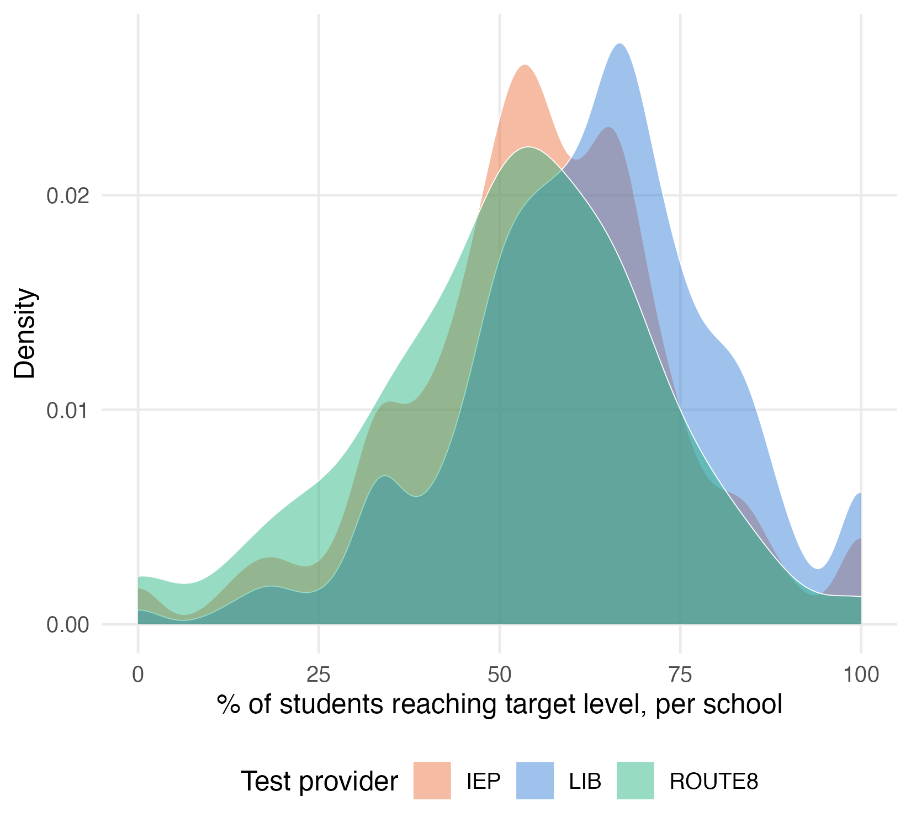
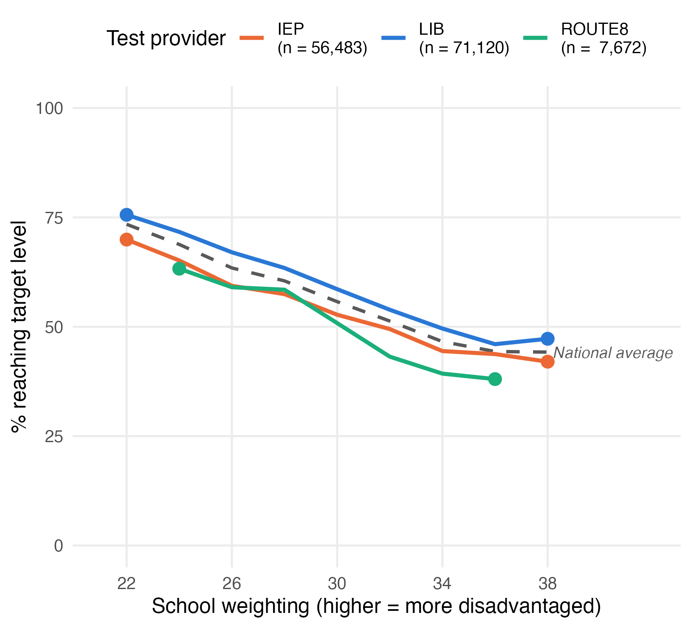
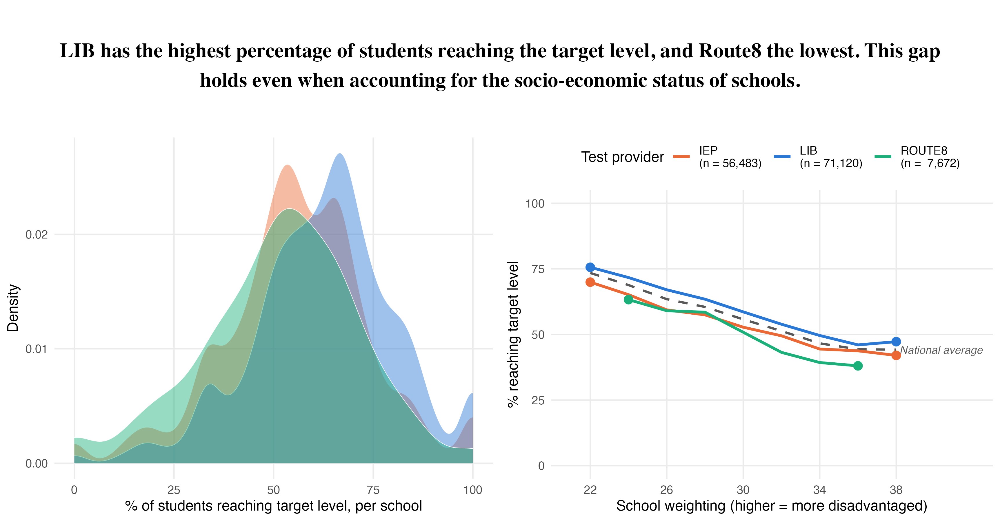
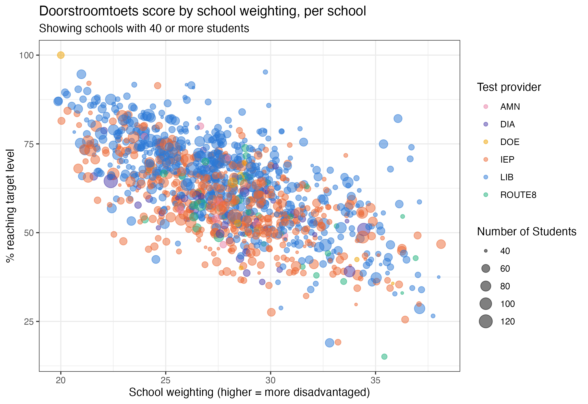

```{r actual-setup, include = FALSE}
knitr::opts_chunk$set(eval = FALSE)
rm(list = ls())
```

## Instructions

Download the templates for part 1 of this assignment in the [Github Repository](https://github.com/ann1ejohansson/data-visualization-2026) (templates \> assignment-1).

This is the first assignment for the Data Visualization module. The aim here is to get acquainted with real, public education data, practice with some ggplot basics, and to get you started with working with your visualizations for the final assignment.

With this assignment, you can gain 14 points (14.5 with bonus in part 1A). The points are awarded as following:

Individual part:

-   4 points (plus 0.5 bonus point) for Part 1A
-   2 points for Part 1B
-   0.5 point for R code that runs and 0.5 point for lintr-proof code

Group part:

-   6 points for visualization
-   0.5 point for R code that runs and 0.5 point for lintr-proof code

Part 1 is completed, and thus also graded, individually. Part 2 should be completed with your assigned group. Please make sure to clearly indicate your group number and names of all group members in your submission. One person should submit the assignment on behalf of the group. If more than one person submits the group assignment, we will only look at one of them.

The assignment is due on **Sunday October 4th, 2026 at 23:59**. Submit your assignment to Canvas, under "DV Assignment 1".

Your submission for Part 1 should contain the following files:

-   R code (style checked & working) in a `.Rmd` file\
-   Your assignment, including both the replicated plot and the interactive plot, compiled to `.html`

with file names in the following structure: `DV-Assignment1-Firstname-Lastname-PartA.Rmd` and `DV-Assignment1-Firstname-Lastname-PartA.html`.

Your group submission (Part 2) should contain the following files:

-   R code (style checked & working) in a `.Rmd` file\
-   Your plot and short description, compiled to `.html`

with file names in the following structure: `DV-Assignment1-GroupX-PartB.Rmd` (or `.R`), `DV-Assignment1-GroupX-PartB.pdf` (or `.html`). When uploading an html file, make sure that it can be opened and the plots are readable. We will not compile the html for you!

### ⚠️ Please read this before submitting

We want to be able to understand and run your code. This will help us to give you a fair grade. Therefore we ask that - before you submit your code - you:

-   Run the Code Style check (i.e. the lintr) with the following code & resolve any issues. If you don't know what an error means, internet is your best friend! Also, study the lecture slides of the code styling session. Remember that you can win a full point by making sure your code styling is correct.

```{r eval=FALSE}
lint(rstudioapi::getSourceEditorContext()$path)
```

-   Clear your environment (`rm(list = ls())`) and re-run your code. We won't have anything stored in memory that is not created/retrieved in the script, therefore clearing your environment is a great way to detect any bugs that might accidentally be present.

-   Don't install packages in your code. If we need to install a package that you used, state which packages need to be installed at the beginning of your code.

## Getting the data

This assignment uses real, public data about the **doorstroomtoets** - the standardized test Dutch primary school pupils take in their final year (groep 8), which feeds into their secondary-school advice. Before starting, read `data/doorstroomtoetsen-context.md` in the course repository for the background on why this data is interesting (it's the subject of an active public debate about fairness), and `data/data-context.md` for a glossary of the Dutch terms you'll run into plus a full codebook of every column in the data files below - useful if you're not familiar with the Dutch education system or language.

Download `get-data.R` from the [course GitHub repository](https://github.com/ann1ejohansson/data-visualization-2026/blob/main/data/get-data.R) and run it once in your project folder - it downloads everything this assignment needs into `data/raw/`.

## Part 1: Doorstroomtoets Data & Basic ggplot (Individual)

### A. Replicate this plot

The following code will give you the data necessary to create the plot at the end of this section. Your task is to replicate the plot using `ggplot2`.\
Don't worry if you cannot reproduce the plots exactly. You can, for example, use different colors and font families.

**Grading:**

-   **Does the data show the same pattern? \[2 pt\]**
-   **Is the styling the same? \[2 pt\]**
-   **BONUS: Was a meaningful explanatory element added to one of the plots? \[0.5 pt\]**

**Bonus points**

Every plot in this assignment shows the data accurately, but none of them *explains itself* - a reader still has to do some work to find the result that matters most. For the bonus point, add ONE explanatory element to either plot that helps a reader find that result faster. Simply changing colors or a theme will not be rewarded on its own, unless it's clearly in service of highlighting a specific result. See the Solution below for a list of ideas if you're stuck.

```{r setup environment, include = TRUE, eval=FALSE}
knitr::opts_chunk$set(echo = TRUE) # set default echo = TRUE for all code blocks
rm(list = ls()) # Remove any existing objects in memory
```

```{r 1A setup-2}
# Install Packages
all_installed_packages <- installed.packages()[, "Package"]
# nolint start -- trick to omit some lines from the lintr checker, only if you have a good reason!
if (!"tidyverse" %in% all_installed_packages) {install.packages("tidyverse")}
if (!"cowplot" %in% all_installed_packages) {install.packages("cowplot")}
if (!"readODS" %in% all_installed_packages) {install.packages("readODS")}
if (!"lintr" %in% all_installed_packages) {install.packages("lintr")}
# nolint end

library(tidyverse)
library(cowplot)
library(readODS)
```

For this assignment, we look at the doorstroomtoets results published by DUO, alongside two other public files: the reference-level attainment per school, and the school weighting ("schoolweging" - a school-level disadvantage score) published by the Education Inspectorate.

```{r 1A data}
eindscores <- read_delim(
  "data/raw/eindscores_2024-2025.csv",
  delim = ";", locale = locale(decimal_mark = ",", encoding = "UTF-8"),
  show_col_types = FALSE
)

referentieniveaus <- read_delim(
  "data/raw/referentieniveaus_2024-2025.csv",
  delim = ";", quote = '"', show_col_types = FALSE
)

schoolweging_raw <- read_ods("data/raw/schoolweging_2022-2025.ods", sheet = "2024-2025")
```

Now that we have the "raw" data, we can start to filter and prepare it. `eindscores` has one row per school with a pair of columns per test provider (`IEP_AANTAL`/`IEP_GEM`, and so on) - we need one row per (school, provider actually used) instead, so we `pivot_longer()` those pairs.

```{r 1A data-prep-1}
school_provider <- eindscores %>%
  select(INSTELLINGSCODE, matches("_(AANTAL|GEM)$")) %>%
  pivot_longer(
    cols = matches("_(AANTAL|GEM)$"),
    names_to = c("provider", ".value"),
    names_pattern = "(.+)_(AANTAL|GEM)"
  ) %>%
  mutate(AANTAL = as.numeric(AANTAL)) %>% # DUO writes "<5" for small counts -> NA
  filter(!is.na(AANTAL), AANTAL > 0, !is.na(GEM), GEM > 0) %>%
  group_by(INSTELLINGSCODE, provider) %>%
  summarise(AANTAL = sum(AANTAL), .groups = "drop")

# most schools only use one provider - take whichever tested the most pupils
primary_provider <- school_provider %>%
  group_by(INSTELLINGSCODE) %>%
  slice_max(AANTAL, n = 1, with_ties = FALSE) %>%
  ungroup() %>%
  select(INSTELLINGSCODE, provider)
```

Next, the school weighting. That file identifies schools slightly differently (an `OVT` column like `"00AP|C1"` instead of separate `INSTELLINGSCODE`/`VESTIGINGSCODE` columns), so a bit of string splitting is needed before it can be joined to anything else.

```{r 1A data-prep-2}
schoolweging <- schoolweging_raw %>%
  mutate(INSTELLINGSCODE = str_remove(OVT, "\\|.*$")) %>%
  group_by(INSTELLINGSCODE) %>%
  summarise(schoolweging = weighted.mean(schoolweging, w = aantal_leerlingen), .groups = "drop")
```

Finally, the outcome we'll actually plot. Raw scores aren't comparable across providers (an IEP score and an AMN score are not the same kind of number), but the **percentage of pupils reaching the target reference level** (1S for maths, 2F for language) is - that's the one number CvTE's shared framework is designed to make provider-independent.

```{r 1A data-prep-3}
count_cols <- c("REKENEN_LAGER1F", "REKENEN_1F", "REKENEN_1S",
                "LV_LAGER1F", "LV_1F", "LV_2F",
                "TV_LAGER1F", "TV_1F", "TV_2F")

ref_levels <- referentieniveaus %>%
  mutate(across(all_of(count_cols), ~ suppressWarnings(as.numeric(.)))) %>%
  group_by(INSTELLINGSCODE) %>%
  summarise(across(all_of(count_cols), ~ sum(.x, na.rm = TRUE)), .groups = "drop") %>%
  mutate(
    rekenen_n = REKENEN_LAGER1F + REKENEN_1F + REKENEN_1S,
    taal_lv_n = LV_LAGER1F + LV_1F + LV_2F,
    taal_tv_n = TV_LAGER1F + TV_1F + TV_2F,
    score = ( 100 * REKENEN_1S / rekenen_n
            + 100 * LV_2F      / taal_lv_n
            + 100 * TV_2F      / taal_tv_n ) / 3,
    n_pupils = rekenen_n
  ) %>%
  filter(rekenen_n > 0, taal_lv_n > 0, taal_tv_n > 0) %>%
  select(INSTELLINGSCODE, score, n_pupils)

school_data <- ref_levels %>%
  inner_join(primary_provider, by = "INSTELLINGSCODE") %>%
  left_join(schoolweging, by = "INSTELLINGSCODE")
```

Now we can make the first plot: an overlapping density curve of every school's score, one per provider, for **LIB, IEP and Route8**. `geom_density()` normalizes each curve to its own area, so LIB (far more schools behind it) and Route8 stay comparable on *shape*. I used these settings in my rMarkdown code chunk: `fig.height = 5, fig.width = 5.5, fig.align = "center"`



For the second plot, take those same three providers, plus the national average, and check whether their gap survives once you're comparing schools with the same school weighting. Give the three providers a proper legend, with each provider's total pupil count included in the label (e.g. `"LIB (n = 71,120)"`) - so a reader can see at a glance how much data is actually behind each line. The national average doesn't belong in that legend (it isn't "a test"), so it gets no points and no legend entry - just its own dashed line, labeled directly on the plot with a small `geom_label()` layer built from a separate, one-row data frame. I used these settings in my rMarkdown code chunk: `fig.height = 5, fig.width = 5.5, fig.align = "center"`



Finally we make a plot with text, to state in words what both panels show together. I used these settings in my rMarkdown code chunk: `fig.height = 2, fig.width = 11.5, fig.align = "center"`


Finally we combine the three plots (one text plot and two figure plots) into one plot by means of the `plot_grid` function of the `cowplot` package. **This is the visualization that you should replicate in this assignment.** Notice that the density plot's legend is gone in the combined version - once plot 2 has its own legend naming the same three providers, a second legend for plot 1 would just repeat it.

I used these settings in my rMarkdown code chunk: `fig.height = 6, fig.width = 11.5, fig.align = "center"`



The bonus point (0.5 pt) is for adding **one** meaningful explanatory element to either plot - something that helps a reader find the result that matters without reading the code.

Tips:

-   `geom_density()` is already normalized to area = 1 per group by default - that's what keeps LIB's ~2,600 schools and Route8's ~300 comparable on shape without you having to do anything extra.
-   Read `data/doorstroomtoetsen-context.md` section 7 and `data/data-context.md` before you start - they've already profiled this exact dataset (missingness, provider market share, the `"<5"` suppression convention, and what every column/Dutch term means) and will save you re-discovering the same gotchas.
-   To pick good colors, use `node scripts/validate_palette.js` from the `dataviz` skill (or http://colorbrewer2.org) rather than eyeballing whether two colors are colorblind-safe.

### B. Interactive visualizations with Plotly

Copy the code below to prepare the data - the same kind of school-level dataset as Part A, but keeping every provider (not just the three highlighted ones) and bringing in a school's name, municipality and province, useful context for a tooltip but not something Part A's plots needed.

Now, your assignment is to:

-   Build a scatterplot showing every school's doorstroomtoets score against its school weighting - one point per school (only schools with 40 or more pupils tested, to avoid noisy small-sample scores), colored by which test provider it used, sized by how many pupils it tested. See the image below for what you're aiming for.
-   Make this plot interactive using the the `plotly` package. Tip: You can use the `ggplotly()` function to convert a ggplot object to an interactive plotly object.
-   Add a tooltip that displays additional information when you hover over the plot. Customize the tooltip so that it displays the default plot values and additional insights from **two other variables** (choose yourself). Make sure all of this information is visible when you hover over the plot.

**Grading:**

-   **Does the interactive plot work? \[1 pt\]**
-   **Does the tooltip clearly display additional (meaningful) information next to the default plot values? \[1 pt\]**

```{r 1B setup}
library(tidyverse)
library(readODS)
library(plotly)
```

```{r 1B data-prep-1}
eindscores <- read_delim(
  "data/raw/eindscores_2024-2025.csv",
  delim = ";", locale = locale(decimal_mark = ",", encoding = "UTF-8"),
  show_col_types = FALSE
)

referentieniveaus <- read_delim(
  "data/raw/referentieniveaus_2024-2025.csv",
  delim = ";", quote = '"', show_col_types = FALSE
)

schoolweging_raw <- read_ods("data/raw/schoolweging_2022-2025.ods", sheet = "2024-2025")

# one row per (school, provider actually used)
school_provider <- eindscores %>%
  select(INSTELLINGSCODE, matches("_(AANTAL|GEM)$")) %>%
  pivot_longer(
    cols = matches("_(AANTAL|GEM)$"),
    names_to = c("provider", ".value"),
    names_pattern = "(.+)_(AANTAL|GEM)"
  ) %>%
  mutate(AANTAL = as.numeric(AANTAL)) %>% # DUO writes "<5" for small counts -> NA
  filter(!is.na(AANTAL), AANTAL > 0, !is.na(GEM), GEM > 0) %>%
  group_by(INSTELLINGSCODE, provider) %>%
  summarise(AANTAL = sum(AANTAL), .groups = "drop")

# one row per school: whichever single provider tested the most of its pupils
primary_provider <- school_provider %>%
  group_by(INSTELLINGSCODE) %>%
  slice_max(AANTAL, n = 1, with_ties = FALSE) %>%
  ungroup() %>%
  select(INSTELLINGSCODE, provider)
```

`eindscores` also carries the columns a tooltip needs later: a school's name, province and municipality. Unlike province/municipality (always the same across a school's locations), a school's name sometimes isn't - its different physical locations can have different names. Grouping by school code and taking just the first location's row (name included) guarantees exactly one row per school, without silently duplicating any school whose locations disagree on a name.

```{r 1B data-prep-2}
school_location <- eindscores %>%
  select(INSTELLINGSCODE, INSTELLINGSNAAM_VESTIGING, PROVINCIE, GEMEENTENAAM) %>%
  group_by(INSTELLINGSCODE) %>%
  slice(1) %>%
  ungroup()

schoolweging <- schoolweging_raw %>%
  mutate(INSTELLINGSCODE = str_remove(OVT, "\\|.*$")) %>%
  group_by(INSTELLINGSCODE) %>%
  summarise(schoolweging = weighted.mean(schoolweging, w = aantal_leerlingen), .groups = "drop")
```

```{r 1B data-prep-3}
count_cols <- c("REKENEN_LAGER1F", "REKENEN_1F", "REKENEN_1S",
                "LV_LAGER1F", "LV_1F", "LV_2F",
                "TV_LAGER1F", "TV_1F", "TV_2F")

ref_levels <- referentieniveaus %>%
  mutate(across(all_of(count_cols), ~ suppressWarnings(as.numeric(.)))) %>%
  group_by(INSTELLINGSCODE) %>%
  summarise(across(all_of(count_cols), ~ sum(.x, na.rm = TRUE)), .groups = "drop") %>%
  mutate(
    rekenen_n = REKENEN_LAGER1F + REKENEN_1F + REKENEN_1S,
    taal_lv_n = LV_LAGER1F + LV_1F + LV_2F,
    taal_tv_n = TV_LAGER1F + TV_1F + TV_2F,
    score = ( 100 * REKENEN_1S / rekenen_n
            + 100 * LV_2F      / taal_lv_n
            + 100 * TV_2F      / taal_tv_n ) / 3,
    n_pupils = rekenen_n
  ) %>%
  filter(rekenen_n > 0, taal_lv_n > 0, taal_tv_n > 0) %>%
  select(INSTELLINGSCODE, score, n_pupils)

# a school needs a known provider, a computable score, AND a schoolweging
# value to appear on this chart - unlike Part A's school_data, which kept
# schoolweging-less schools around for its density plot, this scatter has
# no use for a school it can't place on the x-axis
school_data <- ref_levels %>%
  inner_join(primary_provider, by = "INSTELLINGSCODE") %>%
  inner_join(school_location, by = "INSTELLINGSCODE") %>%
  inner_join(schoolweging, by = "INSTELLINGSCODE") %>%
  filter(!is.na(schoolweging))
```

**Now it's your turn! Build the scatterplot described above from `school_data`, then turn it into an interactive plotly object with a customized tooltip that shows additional context next to the default values when you hover over the plot.**



## Part 2: Start on Final DV Project (Group)

### A. Specify your research question

In class 1 you indicated your preference for a research question for the final project, and were assigned a group to work with. You were also assigned one of the GitHub repositories from the Oefenweb GitHub account, which you can use to collaborate on your research project. Together with your group, read the instructions for your assigned research question in [Assignment 2](assignment-2.qmd) again.

-   Does your project take an analytical, inference, or predictive approach? Is it clear what is expected in the final data visualization with regards to the approach?\
-   Who is your target audience? How might this influence choices for your final visualization?

### B. Connect to Git and load data

For this project, you will collaborate using Git. Connect your server environment to GitHub and clone your assigned GitHub repository into your online RStudio account by following these instructions: [Connecting RStudio Server to GitHub](../documents/git-workflow.qmd). If this is done correctly, the resulting repository should have the following folder structure:

```
your-project-name/
├── .gitignore
├── README.md
├── your-project-name.Rproj
├── code/
|   └── 00-load-data.R
└── report/
    └── DV-Assignment2-GroupX.Rmd
    └── DV-Assignment2-GroupX.html
```

All group members should clone the assigned group repository to their server environment. Once you have cloned the repo and initialized Git, make a first commit and push it. Check that the other group members can pull these changes. If this works, you should be properly set up to work together using Git!

Feel free to add folders or files within the repository if necessary. Make sure that you maintain the structure such that you follow a [reproducible workflow](https://tellingstorieswithdata.com/03-workflow.html#r-projects-and-file-structure). Additionally, it is important that you **never push data to GitHub**. If you have to store data, do this in a separate folder outside of your Git repository.

Now, load in the necessary data for your visualization. The code for this is available in [Assignment 2](assignment-2.qmd). Use the script `00-load-data.R` in the `code/` folder to load in the data. Examine the data. Discuss with your group:

-   What is the structure of the data?\
-   What are the main variables? Can you already make some exploratory plots to understand these variables better?\
-   What data cleaning steps are necessary? Do you, for example, need to filter out some observations to obtain reliable results?

### C. Make your first visualization

For this assignment you can make any visualization about the chosen theme of the final project with these minimal requirements:

-   use multiple plots
-   change the theme (you can use a default theme or create your own)
-   use a good color-scheme, for example colorblind proof
-   highlight some interesting data points, for example using color or text

Include a description of what you want to communicate, and how you did that. Really work towards making a data visualization that highlights or substantiates a single conclusion. This plot does not have to be the plot for your final project (it probably is not), but use this assignment to get feedback from us on your current ideas.

**Grading:**

-   **Aesthetics**
    -   Is the plot legible? \[1pt\]
    -   Do the colors add to the interpretability? \[1pt\]
    -   Is the plot simple? \[0.5 pt\]
-   **Communication**
    -   Is it clear what the plots tries to communicate? \[1pt\]
    -   Does the plot communicate the described conclusions/description? \[1pt\]
    -   The plot requires minimal explanation \[0.5 pt\]
-   **Creative/complexity**
    -   Is the plot creative? \[0.5 pt\]
    -   Is the plot/analysis complex? \[0.5 pt\]

**Clearly state your group members in your document. And please make sure ONE team member submits the assignment on behalf of the group.**
