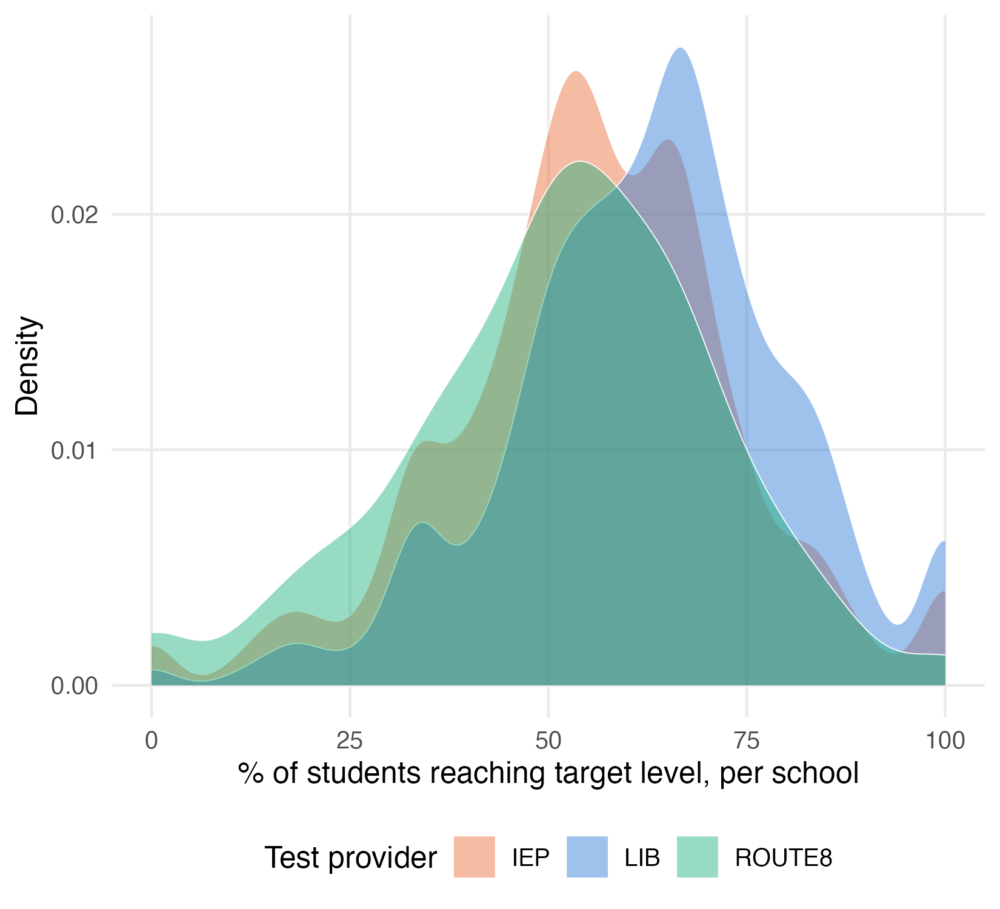
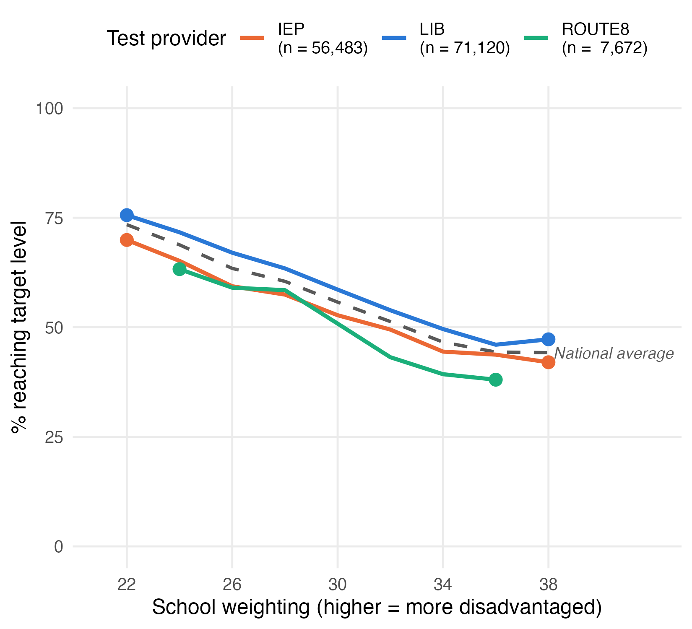
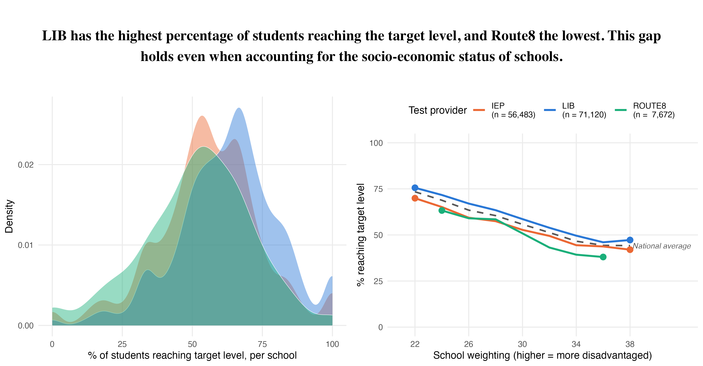
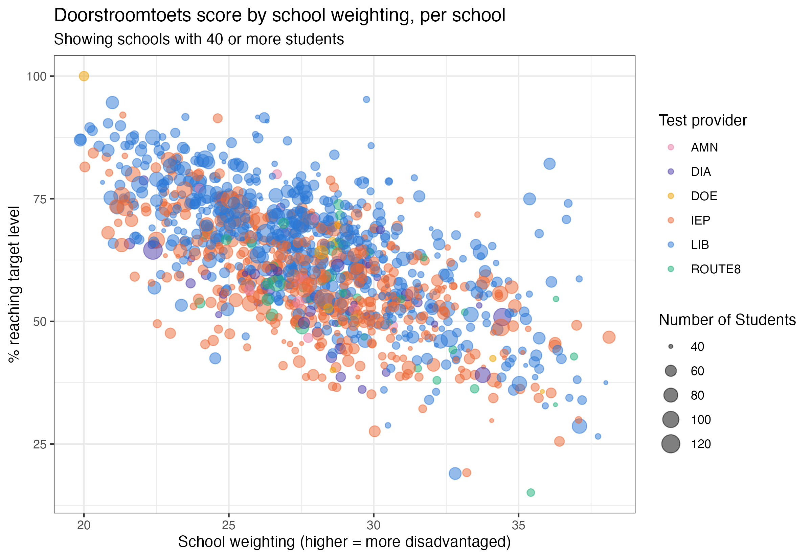

```{r actual-setup, include = FALSE}
knitr::opts_chunk$set(eval = FALSE)
rm(list = ls())
```

## Instructions

Download the template for this assignment, `DV-Assignment1-Firstname-Lastname.Rmd`, from Canvas, and replace `Firstname-Lastname` with your own name. Save it in the `assignment-1/` folder of your group's project for [Assignment 2](assignment-2.qmd) (see [Working with Git](../documents/git-workflow.qmd) for how to set up that project). There, it uses the same scripts to load packages and data as your group project. The `assignment-1/` folder is ignored by Git, so your individual work (including the knitted `.html`) stays on your own computer, and is never pushed to your group's repository.

This is the first assignment for the Data Visualization module, and it is **individual**. The aim here is to get acquainted with real, public education data and to practice with some ggplot and plotly basics. Your work on the final project is a separate, group assignment: see [Assignment 2](assignment-2.qmd). Note that the first part of Assignment 2 is due on the same day as this assignment.

With this assignment, you can gain 7 points (7.5 with the bonus in Part A). The points are awarded as follows:

-   4 points (plus 0.5 bonus point) for Part A
-   2 points for Part B
-   0.5 point for R code that runs and 0.5 point for lintr-proof code

The assignment is due on **Sunday October 4th, 2026 at 23:59**. Submit your assignment to Canvas, under "DV Assignment 1".

Your submission should contain the following files:

-   R code (style checked & working) in a `.Rmd` file\
-   Your assignment, including both the replicated plot and the interactive plot, compiled to `.html`

with file names in the following structure: `DV-Assignment1-Firstname-Lastname.Rmd` and `DV-Assignment1-Firstname-Lastname.html`. When uploading an html file, make sure that it can be opened and the plots are readable. We will not compile the html for you!

### ⚠️ Please read this before submitting

We want to be able to understand and run your code. This will help us to give you a fair grade. Therefore we ask that - before you submit your code - you:

-   Run the Code Style check (i.e. the lintr) with the following code & resolve any issues. If you don't know what an error means, internet is your best friend! Also, study the lecture slides of the code styling session. Remember that you can win a full point by making sure your code styling is correct.

```{r eval=FALSE}
lint(rstudioapi::getSourceEditorContext()$path)
```

-   Clear your environment (`rm(list = ls())`) and re-run your code. We won't have anything stored in memory that is not created/retrieved in the script, therefore clearing your environment is a great way to detect any bugs that might accidentally be present.

-   Don't install packages in your code. If we need to install a package that you used, state which packages need to be installed at the beginning of your code.

## Getting the data

This assignment uses real, public data about the **doorstroomtoets** - the standardized test Dutch primary school students take in their final year (groep 8), which feeds into their secondary-school advice. Before starting, read [The data: background & codebook](../documents/data-resources.qmd) for the background on why this data is interesting (it's the subject of an active public debate about fairness), a glossary of the Dutch terms you'll run into, and a full codebook of every column in the data files below.

You don't need to download the data yourself. The setup chunk at the top of the template sources your project's `scripts/00-packages.R` (which loads all packages you need) and `scripts/01-get-data.R` (which downloads the data into `data/raw/` and loads it as `eindscores`, `referentieniveaus`, `schooladviezen` and `schoolweging`).

## Part A: Replicate this plot

The following code will give you the data necessary to create the plot at the end of this section. Your task is to replicate the plot using `ggplot2`.\
Don't worry if you cannot reproduce the plots exactly. You can, for example, use different colors and font families.

**Grading:**

-   **Does the data show the same pattern? \[2 pt\]**
-   **Is the styling the same? \[2 pt\]**
-   **BONUS: Was a meaningful explanatory element added to one of the plots? \[0.5 pt\]**

**Bonus points**

Every plot in this assignment shows the data accurately, but none of them *explains itself* - a reader still has to do some work to find the result that matters most. For the bonus point, add ONE explanatory element to either plot that helps a reader find that result faster. Simply changing colors or a theme will not be rewarded on its own, unless it's clearly in service of highlighting a specific result. 

The setup chunk of the template loads all packages and data:

```{r setup}
knitr::opts_chunk$set(echo = TRUE) # set default echo = TRUE for all code blocks
rm(list = ls()) # Remove any existing objects in memory

# installs (if missing) and loads every package - add any new packages to
# scripts/00-packages.R, not here
source("../scripts/00-packages.R")

# downloads the data into data/raw/ if you don't already have it, then loads
# eindscores, referentieniveaus, schooladviezen and schoolweging
source(here("scripts", "01-get-data.R"))
```

For this assignment, we look at the doorstroomtoets results published by DUO, alongside two other public files: the reference-level attainment per school (`referentieniveaus`), and the school weighting (`schoolweging`, a school-level disadvantage score) published by the Education Inspectorate. All three are already loaded by the setup chunk.


Now that we have the "raw" data, we can start to filter and prepare it. `eindscores` has one row per school with a pair of columns per test provider (`IEP_AANTAL`/`IEP_GEM`, and so on) - we need one row per (school, provider actually used) instead, so we `pivot_longer()` those pairs.

```{r 1A data-prep-1}
school_provider <- eindscores |>
  select(INSTELLINGSCODE, matches("_(AANTAL|GEM)$")) |>
  pivot_longer(
    cols = matches("_(AANTAL|GEM)$"),
    names_to = c("provider", ".value"),
    names_pattern = "(.+)_(AANTAL|GEM)"
  ) |>
  # DUO writes "<5" for small counts -> NA
  mutate(AANTAL = as.numeric(AANTAL)) |>
  filter(!is.na(AANTAL), AANTAL > 0, !is.na(GEM), GEM > 0) |>
  group_by(INSTELLINGSCODE, provider) |>
  summarise(AANTAL = sum(AANTAL), .groups = "drop")

# most schools only use one provider - take whichever tested the most students
primary_provider <- school_provider |>
  group_by(INSTELLINGSCODE) |>
  slice_max(AANTAL, n = 1, with_ties = FALSE) |>
  ungroup() |>
  select(INSTELLINGSCODE, provider)
```

Next, the school weighting. That file identifies schools slightly differently (an `OVT` column like `"00AP|C1"` instead of separate `INSTELLINGSCODE`/`VESTIGINGSCODE` columns), so a bit of string splitting is needed before it can be joined to anything else.

```{r 1A data-prep-2}
school_weights <- schoolweging |>
  mutate(INSTELLINGSCODE = str_remove(OVT, "\\|.*$")) |>
  group_by(INSTELLINGSCODE) |>
  summarise(
    schoolweging = weighted.mean(schoolweging, w = aantal_leerlingen),
    .groups = "drop"
  )
```

Finally, the outcome we'll actually plot. Raw scores aren't comparable across providers (an IEP score and an AMN score are not the same kind of number), but the **percentage of students reaching the target reference level** (1S for maths, 2F for language) is - that's the one number CvTE's shared framework is designed to make provider-independent.

```{r 1A data-prep-3}
count_cols <- c(
  "REKENEN_LAGER1F", "REKENEN_1F", "REKENEN_1S",
  "LV_LAGER1F", "LV_1F", "LV_2F",
  "TV_LAGER1F", "TV_1F", "TV_2F"
)

ref_levels <- referentieniveaus |>
  mutate(across(all_of(count_cols), ~ suppressWarnings(as.numeric(.)))) |>
  group_by(INSTELLINGSCODE) |>
  summarise(
    across(all_of(count_cols), ~ sum(.x, na.rm = TRUE)),
    .groups = "drop"
  ) |>
  mutate(
    rekenen_n = REKENEN_LAGER1F + REKENEN_1F + REKENEN_1S,
    taal_lv_n = LV_LAGER1F + LV_1F + LV_2F,
    taal_tv_n = TV_LAGER1F + TV_1F + TV_2F,
    score = (
      100 * REKENEN_1S / rekenen_n +
        100 * LV_2F / taal_lv_n +
        100 * TV_2F / taal_tv_n
    ) / 3,
    n_students = rekenen_n
  ) |>
  filter(rekenen_n > 0, taal_lv_n > 0, taal_tv_n > 0) |>
  select(INSTELLINGSCODE, score, n_students)

school_data <- ref_levels |>
  inner_join(primary_provider, by = "INSTELLINGSCODE") |>
  left_join(school_weights, by = "INSTELLINGSCODE")
```

Now we can make the first plot: an overlapping density curve of every school's score, one per provider, for **LIB, IEP and Route8**. `geom_density()` normalizes each curve to its own area, so LIB (far more schools behind it) and Route8 stay comparable on *shape*. I used these settings in my rMarkdown code chunk: `fig.height = 5, fig.width = 5.5, fig.align = "center"`



For the second plot, take those same three providers, plus the national average, and check whether their gap survives once you're comparing schools with the same school weighting. Give the three providers a proper legend, with each provider's total student count included in the label (e.g. `"LIB (n = 71,120)"`) - so a reader can see at a glance how much data is actually behind each line. The national average doesn't belong in that legend (it isn't "a test"), so it gets no points and no legend entry - just its own dashed line, labeled directly on the plot with a small `geom_label()` layer built from a separate, one-row data frame. I used these settings in my rMarkdown code chunk: `fig.height = 5, fig.width = 5.5, fig.align = "center"`



Finally we make a plot with text, to state in words what both panels show together. I used these settings in my rMarkdown code chunk: `fig.height = 2, fig.width = 11.5, fig.align = "center"`


Finally we combine the three plots (one text plot and two figure plots) into one plot by means of the `plot_grid` function of the `cowplot` package. **This is the visualization that you should replicate in this assignment.** Notice that the density plot's legend is gone in the combined version - once plot 2 has its own legend naming the same three providers, a second legend for plot 1 would just repeat it.

I used these settings in my rMarkdown code chunk: `fig.height = 6, fig.width = 11.5, fig.align = "center"`

::: {.panel-tabset}

## Plot



## Solution

#### Plot 1:

```{r 1A plot-1, fig.align = "center", fig.height=5, fig.width=5.5}
highlighted_providers <- c("LIB", "IEP", "ROUTE8")
provider_colors <- c(LIB = "#2a78d6", IEP = "#eb6834", ROUTE8 = "#1baf7a")

school_data_3 <- school_data |>
  filter(provider %in% highlighted_providers)

# color for the national average line/label in plot 2
national_color <- "grey35"

plot1 <- ggplot(
  school_data_3,
  aes(x = score, fill = provider, color = provider)
) +
  geom_density(alpha = 0.45, linewidth = 0.2, color = "white") +
  scale_fill_manual(values = provider_colors, name = "Test provider") +
  scale_color_manual(values = provider_colors, guide = "none") +
  scale_x_continuous(limits = c(0, 100)) +
  labs(x = "% of students reaching target level, per school", y = "Density") +
  theme_minimal(base_size = 12) +
  theme(panel.grid.minor = element_blank(), legend.position = "bottom")
plot(plot1)
```

#### Plot 2:

```{r 1A plot-2, fig.align = "center", fig.height=5, fig.width=5.5}
plotted_schools <- school_data |>
  filter(provider %in% highlighted_providers, !is.na(schoolweging)) |>
  mutate(weging_bin = floor(schoolweging / 2) * 2) |>
  filter(weging_bin >= 22, weging_bin <= 38) # drop the near-empty tail bins

provider_lines <- plotted_schools |>
  group_by(provider, weging_bin) |>
  summarise(score = weighted.mean(score, w = n_students), .groups = "drop")

# one row per weging_bin, averaging across all three providers together -
# this is the dashed "national average" line
national_line <- plotted_schools |>
  group_by(weging_bin) |>
  summarise(score = weighted.mean(score, w = n_students), .groups = "drop")
national_label <- national_line |>
  filter(weging_bin == max(weging_bin))

# how many students sit behind each provider's line - shown in the legend
# labels below
provider_n <- plotted_schools |>
  group_by(provider) |>
  summarise(n_students = sum(n_students), .groups = "drop")

legend_labels <- setNames(
  paste0(
    provider_n$provider,
    " \n(n = ",
    format(provider_n$n_students, big.mark = ","),
    ")"
  ),
  provider_n$provider
)

# the first and last point of each provider's line
provider_ends <- provider_lines |>
  group_by(provider) |>
  filter(weging_bin %in% range(weging_bin)) |>
  ungroup()

plot2 <- ggplot() +
  geom_line(
    data = national_line, aes(x = weging_bin, y = score),
    color = national_color, linetype = "dashed", linewidth = 0.9
  ) +
  geom_label(
    data = national_label, aes(
      x = weging_bin,
      y = score,
      label = "National average"
    ),
    color = national_color, fill = "white", linewidth = 0, hjust = 0,
    size = 3.2, fontface = "italic"
  ) +
  geom_line(
    data = provider_lines,
    aes(x = weging_bin, y = score, color = provider),
    linewidth = 1.1
  ) +
  geom_point(
    data = provider_ends,
    aes(x = weging_bin, y = score, color = provider),
    size = 3,
    show.legend = FALSE
  ) +
  scale_color_manual(
    values = provider_colors,
    labels = legend_labels,
    name = "Test provider"
  ) +
  scale_x_continuous(limits = c(21, 42), breaks = seq(22, 38, 4)) +
  scale_y_continuous(limits = c(0, 100)) +
  labs(
    x = "School weighting (higher = more disadvantaged)",
    y = "% reaching target level"
  ) +
  theme_minimal(base_size = 12) +
  theme(panel.grid.minor = element_blank(), legend.position = "top")
plot(plot2)
```

#### Plot 3:

```{r 1A plot-3, fig.align = "center", fig.height=2, fig.width=11.5}
# plain text, not built from the data - the two plots already show the
# numbers; the title states the conclusion in words
title_text <- paste(
  "LIB has the highest percentage of students reaching the target level,",
  "and Route8 the lowest. This gap holds even when accounting for the",
  "socio-economic status of schools."
)

title_plot <- ggplot() +
  annotate("text",
    x = 0, y = 0, label = str_wrap(title_text, width = 105),
    size = 6, fontface = "bold", family = "Times", hjust = 0.5
  ) +
  theme_void()
plot(title_plot)
```

#### Combined:

```{r 1A plot-4, fig.height = 6, fig.width = 11.5, fig.align = "center"}
# plot1 keeps its legend when shown on its own (above), but not here: with
# plot2's legend right next to it, a second one for plot1 would just repeat
# the same three names
plot1_no_legend <- plot1 + theme(legend.position = "none")

bottom_row <- suppressMessages(plot_grid(plot1_no_legend, plot2))
combined <- suppressWarnings(
  plot_grid(title_plot, bottom_row, ncol = 1, rel_heights = c(1, 3))
)
print(combined)
```

#### Bonus

*   Show only the highest- and lowest-performing provider, and highlight the difference between them directly (e.g. a bracket, a shaded gap, or a labeled arrow spanning it).
*   Add text and/or an arrow that points at the specific part of the plot it's explaining, rather than a caption floating nearby with no visual connection.
*   Use color and/or opacity (alpha) to pull one specific result forward, paired with a short written conclusion about what it means.
*   Add a title to a sub-plot - but only if it says something the shared title above doesn't already say.
*   Mark a "risk zone": a shaded band flagging where a result crosses into concerning territory (e.g. a score below some minimum standard).
*   Label a specific data point directly with its value, instead of making the reader read it off the axis.
*   Flag where the data is thin (e.g. Route8 has far fewer schools behind it at high school weighting) so a reader doesn't over-trust the wobbliest part of a line.

:::

The bonus point (0.5 pt) is for adding one meaningful explanatory element to either plot - something that helps a reader find the result that matters without reading the code.


## Part B: Interactive visualizations with Plotly

Copy the code below to prepare the data (the packages and data are already loaded by the setup chunk) - the same kind of school-level dataset as Part A, but keeping every provider (not just the three highlighted ones) and bringing in a school's name, municipality and province, useful context for a tooltip but not something Part A's plots needed.

Now, your assignment is to:

-   Build a scatterplot showing every school's doorstroomtoets score against its school weighting - one point per school, filtered to display only schools with at least 40 students, and colored by which test provider it used. Use size of the points to visualize how many students were tested. See the image below for what you're aiming for.
-   Make this plot interactive using the the `plotly` package. Tip: You can use the `ggplotly()` function to convert a ggplot object to an interactive plotly object.
-   Add a tooltip that displays additional information when you hover over the plot. Customize the tooltip so that it displays the default plot values and additional insights from **two other variables** (choose yourself). Make sure all of this information is visible when you hover over the plot.

**Grading:**

-   **Does the interactive plot work? \[1 pt\]**
-   **Does the tooltip clearly display additional (meaningful) information next to the default plot values? \[1 pt\]**

```{r 1B data-prep-1}
# one row per (school, provider actually used)
school_provider <- eindscores |>
  select(INSTELLINGSCODE, matches("_(AANTAL|GEM)$")) |>
  pivot_longer(
    cols = matches("_(AANTAL|GEM)$"),
    names_to = c("provider", ".value"),
    names_pattern = "(.+)_(AANTAL|GEM)"
  ) |>
  # DUO writes "<5" for small counts -> NA
  mutate(AANTAL = as.numeric(AANTAL)) |>
  filter(!is.na(AANTAL), AANTAL > 0, !is.na(GEM), GEM > 0) |>
  group_by(INSTELLINGSCODE, provider) |>
  summarise(AANTAL = sum(AANTAL), .groups = "drop")

# one row per school: whichever single provider tested the most of its students
primary_provider <- school_provider |>
  group_by(INSTELLINGSCODE) |>
  slice_max(AANTAL, n = 1, with_ties = FALSE) |>
  ungroup() |>
  select(INSTELLINGSCODE, provider)
```

`eindscores` also carries the columns a tooltip needs later: a school's name, province and municipality. Unlike province/municipality (always the same across a school's locations), a school's name sometimes isn't - its different physical locations can have different names. Grouping by school code and taking just the first location's row (name included) guarantees exactly one row per school, without silently duplicating any school whose locations disagree on a name.

```{r 1B data-prep-2}
school_location <- eindscores |>
  select(INSTELLINGSCODE, INSTELLINGSNAAM_VESTIGING, PROVINCIE, GEMEENTENAAM) |>
  group_by(INSTELLINGSCODE) |>
  slice(1) |>
  ungroup()

school_weights <- schoolweging |>
  mutate(INSTELLINGSCODE = str_remove(OVT, "\\|.*$")) |>
  group_by(INSTELLINGSCODE) |>
  summarise(
    schoolweging = weighted.mean(schoolweging, w = aantal_leerlingen),
    .groups = "drop"
  )
```

```{r 1B data-prep-3}
count_cols <- c(
  "REKENEN_LAGER1F", "REKENEN_1F", "REKENEN_1S",
  "LV_LAGER1F", "LV_1F", "LV_2F",
  "TV_LAGER1F", "TV_1F", "TV_2F"
)

ref_levels <- referentieniveaus |>
  mutate(across(all_of(count_cols), ~ suppressWarnings(as.numeric(.)))) |>
  group_by(INSTELLINGSCODE) |>
  summarise(
    across(all_of(count_cols), ~ sum(.x, na.rm = TRUE)),
    .groups = "drop"
  ) |>
  mutate(
    rekenen_n = REKENEN_LAGER1F + REKENEN_1F + REKENEN_1S,
    taal_lv_n = LV_LAGER1F + LV_1F + LV_2F,
    taal_tv_n = TV_LAGER1F + TV_1F + TV_2F,
    score = (
      100 * REKENEN_1S / rekenen_n +
        100 * LV_2F / taal_lv_n +
        100 * TV_2F / taal_tv_n
    ) / 3,
    n_students = rekenen_n
  ) |>
  filter(rekenen_n > 0, taal_lv_n > 0, taal_tv_n > 0) |>
  select(INSTELLINGSCODE, score, n_students)

# a school needs a known provider, a computable score, AND a schoolweging
# value to appear on this chart - unlike Part A's school_data, which kept
# schoolweging-less schools around for its density plot, this scatter has
# no use for a school it can't place on the x-axis
school_data <- ref_levels |>
  inner_join(primary_provider, by = "INSTELLINGSCODE") |>
  inner_join(school_location, by = "INSTELLINGSCODE") |>
  inner_join(school_weights, by = "INSTELLINGSCODE") |>
  filter(!is.na(schoolweging))
```

**Now it's your turn! Build the scatterplot described above from `school_data`, then turn it into an interactive plotly object with a customized tooltip that shows additional context next to the default values when you hover over the plot.**

::: {.panel-tabset}

## Plot



## Solution

```{r 1B solution}
provider_colors <- c(
  LIB = "#2a78d6", IEP = "#eb6834", ROUTE8 = "#1baf7a",
  DIA = "#4a3aa7", AMN = "#e87ba4", DOE = "#eda100"
)

# only schools with a reasonably sized cohort - a school with a handful of
# students produces a very noisy score, not worth its own point on this chart
plot_data <- school_data |>
  filter(n_students >= 40)

plot_data_with_tooltip <- plot_data |>
  mutate(
    tooltip_text = paste0(
      "<b>", INSTELLINGSNAAM_VESTIGING, "</b>",
      "<br>", GEMEENTENAAM, ", ", PROVINCIE,
      "<br>Test provider: ", provider,
      "<br>School weighting: ", round(schoolweging, 1),
      "<br>% reaching target level: ", round(score, 1), "%",
      "<br>Students tested: ", n_students
    )
  )

interactive_plot <- ggplot(
  plot_data_with_tooltip,
  aes(x = schoolweging, y = score, color = provider, text = tooltip_text)
) +
  geom_point(aes(size = n_students), alpha = 0.5) +
  scale_color_manual(values = provider_colors) +
  labs(
    title = "Doorstroomtoets score by school weighting, per school",
    subtitle = "Showing schools with 40 or more students",
    x = "School weighting (higher = more disadvantaged)",
    y = "% reaching target level",
    color = "Test provider",
    size = "Number of Students"
  ) +
  theme_bw()

# tooltip = "text" - show ONLY the custom tooltip_text column on hover, not
# ggplotly's default (which would otherwise list every aesthetic separately:
# x, y, colour, size, text, all stacked in one ugly box)
ggplotly(interactive_plot, tooltip = "text") |>
  # nice trick to left align content in tooltip:
  layout(hoverlabel = list(align = "left"))
```

Full points were given for the interactive plot if the interactivity was working, and a tooltip with the two default variables plus two extra variables were added. If default or extra variables were missing, or if the tooltip was not formatted in a legible way, 0.5 pts were deducted.

:::
