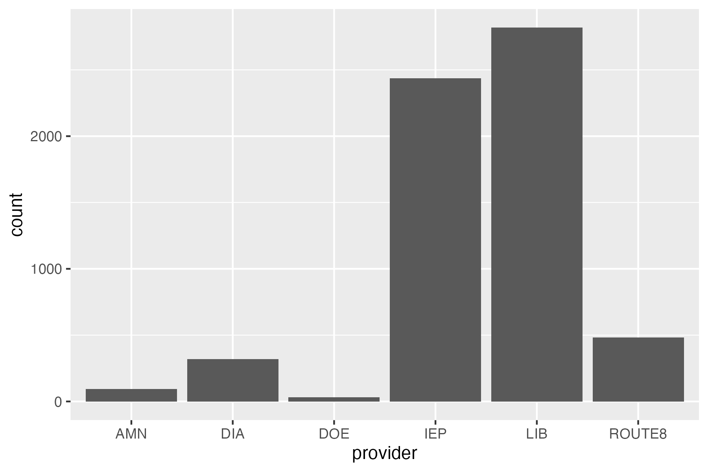
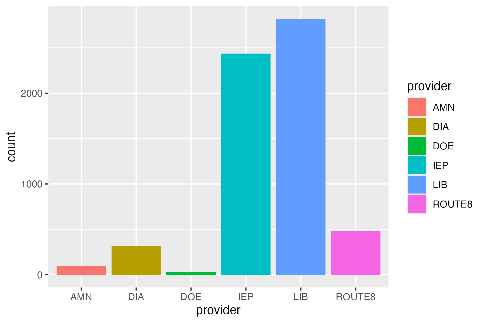
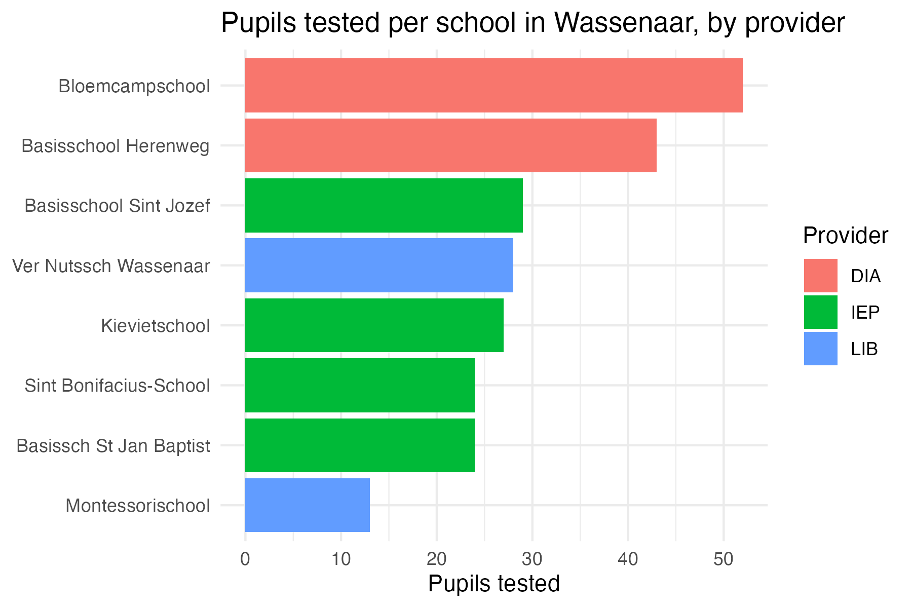

::: {.callout-note}
This worksheet is meant to get you started with the DUO data you'll be working with throughout this module. Use the worksheet to get acquainted with the data, and refresh your ggplot skills. Solutions are already provided. 
:::

## Setup

This module uses **DUO's open onderwijsdata**. This data is public, from the Dutch government. The necessary code to load in the data is available in the github repository:

1.  Download this course's GitHub repository: go to [github.com/ann1ejohansson/data-visualization-2026](https://github.com/ann1ejohansson/data-visualization-2026), click the green **Code** button, and choose **Download ZIP** (no git needed — if you're already comfortable with git, cloning works too). Unzip it and open `data-visualization-2026.Rproj` in RStudio.
2.  The script you need is `data/get-data.R`. Run it once — it downloads four DUO source files into `data/raw/`. Skim the comments at the top of that script first; they explain what each file is and why it's there.

## Part 1 — Load and inspect the data

We'll focus on one of those four files, `eindscores`. This shows the average transfer test score per primary school, broken down by which of the six test providers (IEP, Route8, DIA, AMN, DOE, LIB) that school used.

```{r}
#| eval: false
library(tidyverse)

eindscores <- read_delim(
  "data/raw/eindscores_2024-2025.csv",
  delim = ";",                                 # DUO's files are ;-separated
  locale = locale(decimal_mark = ",", encoding = "UTF-8"), # NL uses , as decimal point
  show_col_types = FALSE
)
```

Run `glimpse(eindscores)` yourself and notice the shape: **one row per school**, with a separate pair of columns *per provider* — `IEP_AANTAL`/`IEP_GEM`, `ROUTE8_AANTAL`/`ROUTE8_GEM`, and so on (`AANTAL` = number of pupils tested, `GEM` = their average score). Most schools use exactly one provider, so five of those six `AANTAL` columns will be `0` for any given row.

## Part 2 — Tidy it (minimal fuss)

To plot "which provider did each school use," we need one `provider` column instead of six. The code below does that in one pipe — read the comments, don't worry about memorizing the functions yet:

```{r}
#| eval: false
school_provider <- eindscores |>
  # keep just the ID/label columns, plus the six *_AANTAL columns
  select(INSTELLINGSCODE, VESTIGINGSCODE, INSTELLINGSNAAM_VESTIGING,
         GEMEENTENAAM, PROVINCIE, SOORT_PO, ends_with("_AANTAL")) |>
  # stack the six AANTAL columns into two: which provider, how many pupils
  pivot_longer(
    cols = ends_with("_AANTAL"),
    names_to = "provider",
    values_to = "n_pupils"
  ) |>
  mutate(
    provider = sub("_AANTAL$", "", provider),  # "IEP_AANTAL" -> "IEP"
    # DUO writes "<5" instead of an exact count when it's under 5 (privacy
    # rule) - as.numeric() turns those into NA, which we then drop below
    n_pupils = as.numeric(n_pupils)
  ) |>
  filter(!is.na(n_pupils), n_pupils > 0) |>           # drop unused/suppressed providers
  group_by(INSTELLINGSCODE, VESTIGINGSCODE) |>
  slice_max(n_pupils, n = 1, with_ties = FALSE) |>    # handles rare mixed-provider schools
  ungroup()
```

`school_provider` now has one row per school: its name, municipality, and which single provider it used. This is the shape `ggplot2` wants.

## Part 3 — ggplot basics

Every `ggplot2` plot answers three questions: **what data**, **which variables map to which visual properties** (`aes()`), and **what shape represents each observation** (a `geom`, added with `+`).

```{r}
#| eval: false
ggplot(data = <DATASET>, mapping = aes(<AESTHETIC MAPPINGS>)) +
  geom_<SOMETHING>()
```

### Exercise 1 — Your first plot

`geom_bar()` counts rows for you automatically — perfect for "how many schools use each provider?"

::: {.panel-tabset}

## Try it

```{r}
#| eval: false
ggplot(school_provider, aes(x = ____)) +
  geom_____()
```

## Plot

{width="70%"}

## Solution

```{r}
#| eval: false
ggplot(school_provider, aes(x = provider)) +
  geom_bar()
```

:::

### Exercise 2 — Mapping vs. setting

An aesthetic **mapped** to a variable goes *inside* `aes()` and varies per observation; an aesthetic just **set** to a fixed value goes *outside* `aes()`. Fix the mistake below (it's trying to make every bar steelblue, but puts the color where a mapping would go), then extend it to map `fill` to `provider` instead.

::: {.panel-tabset}

## Try it

```{r}
#| eval: false
ggplot(school_provider, aes(x = provider, fill = "steelblue")) +
  geom_bar()
```

## Plot

{width="70%"}

## Solution

```{r}
#| eval: false
# fix: "steelblue" must be set, not mapped
ggplot(school_provider, aes(x = provider)) +
  geom_bar(fill = "steelblue")

# extended: fill mapped to a variable instead
ggplot(school_provider, aes(x = provider, fill = provider)) +
  geom_bar()
```

:::

### Picking a geom for the question you're asking

| Question | Reach for |
|---|---|
| How do two continuous variables relate? | `geom_point()` |
| How does a value compare across categories? | `geom_col()` / `geom_bar()` |
| How is a continuous variable distributed? | `geom_histogram()` |
| How does a distribution differ across groups? | `geom_boxplot()` |

`geom_bar()` counts rows for you; `geom_col()` expects you to already have a column of heights to plot (like `n_pupils`) — mixing them up is a very common bug.

### Exercise 3 — A different geom

Plot the distribution of `n_pupils` across all schools with a histogram.

::: {.panel-tabset}

## Try it

```{r}
#| eval: false
ggplot(school_provider, aes(x = ____)) +
  geom_____()
```

## Plot

{width="70%"}

## Solution

```{r}
#| eval: false
ggplot(school_provider, aes(x = n_pupils)) +
  geom_histogram(binwidth = 5)
```

:::

### Labels & themes

-   `labs()` controls *text*: title, axis titles, legend title.
-   `theme_*()` controls *look*: `theme_minimal()`, `theme_bw()`, etc.

```{r}
#| eval: false
ggplot(school_provider, aes(x = provider, fill = provider)) +
  geom_bar() +
  labs(title = "Schools per transfer test provider", x = "Provider", y = "Number of schools", fill = "Provider") +
  theme_minimal()
```

## Part 4 — Put it together

Now the real plot: **number of pupils per school, colored by the provider that school used** — for one municipality, so it stays readable.

::: {.panel-tabset}

## Try it

```{r}
#| eval: false
school_provider |>
  filter(GEMEENTENAAM == "____") |>
  ggplot(aes(x = reorder(INSTELLINGSNAAM_VESTIGING, n_pupils), y = ____, fill = ____)) +
  geom_col() +
  coord_flip() +
  labs(____) +
  theme_____()
```

## Plot

e.g., for Wassenaar: 

{width="70%"}

## Solution

```{r}
#| eval: false
school_provider |>
  filter(GEMEENTENAAM == "Wassenaar") |>
  ggplot(aes(x = reorder(INSTELLINGSNAAM_VESTIGING, n_pupils), y = n_pupils, fill = provider)) +
  geom_col() +
  coord_flip() +                     # horizontal bars so school names stay legible
  labs(
    title = "Pupils tested per school in Wassenaar, by provider",
    x = NULL, y = "Pupils tested", fill = "Provider"
  ) +
  theme_minimal()
```

:::

Swap `"Wassenaar"` for another municipality of interest. Some are large enough that the bar chart gets crowded — if that happens, try `facet_wrap(~ provider)` instead of `fill`, or filter to `PROVINCIE` instead of `GEMEENTENAAM`.

::: {.callout-tip}
Save any plot with `ggsave("path-to-your-plot/filename.png", width = 6, height = 4, dpi = 300)`.
:::


## More practice

-   Kieran Healy, [*Data Visualization: A Practical Introduction*, ch. 3](https://socviz.co/03-ggplot-basics.html)
-   Kieran Healy, [*Data Visualization: A Practical Introduction*, ch. 8](https://socviz.co/08-polishing.html)
-   OSU Code Club's ggplot series: [part 1](https://osu-codeclub.github.io/posts/S09E01_ggplot_01/), [part 2](https://osu-codeclub.github.io/posts/S09E02_ggplot_02/), [part 3](https://osu-codeclub.github.io/posts/S09E03_ggplot_03/)  
-   [A curated list of all ggplot packages, tutorials, etc. ](https://github.com/erikgahner/awesome-ggplot2)
-   [ggplot cheatsheet](https://rstudio.github.io/cheatsheets/html/data-visualization.html)