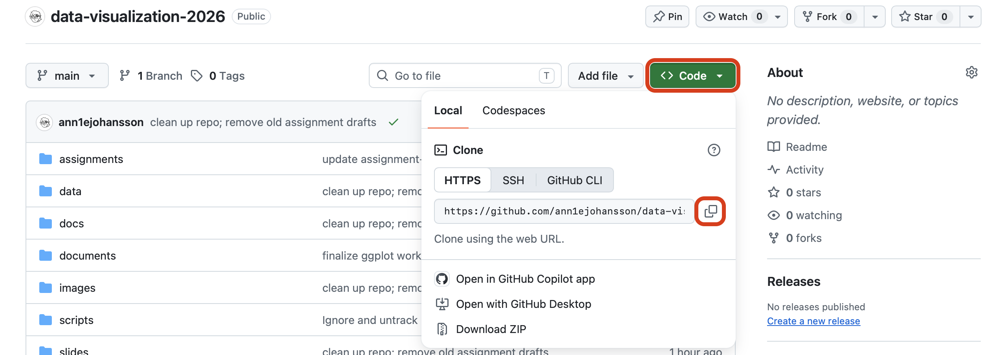
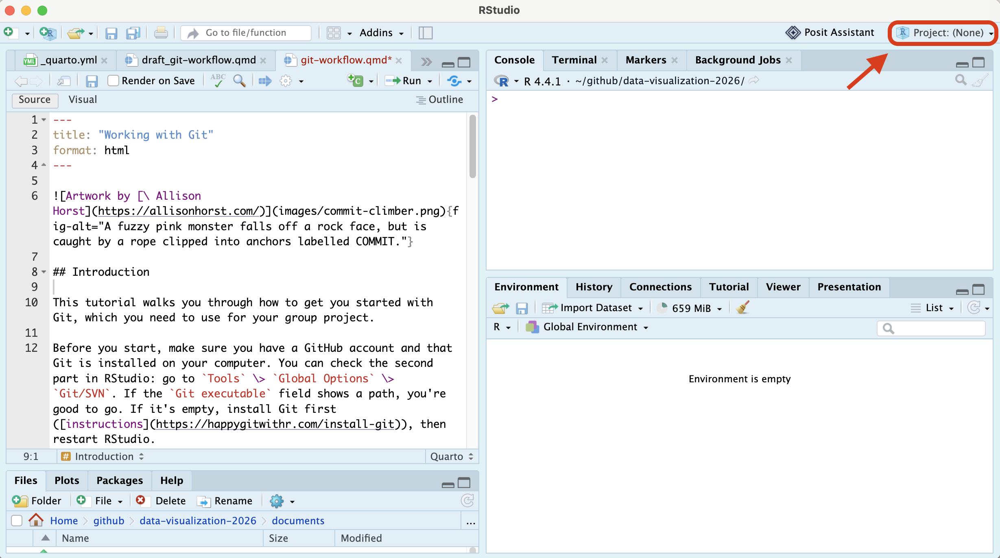
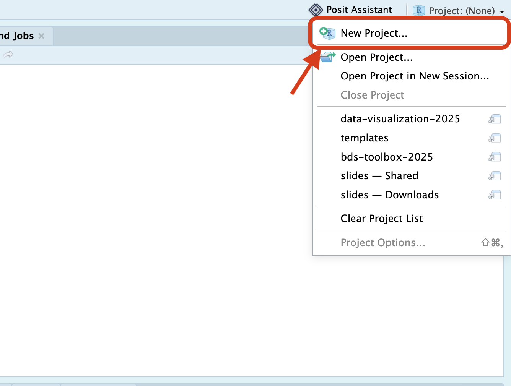
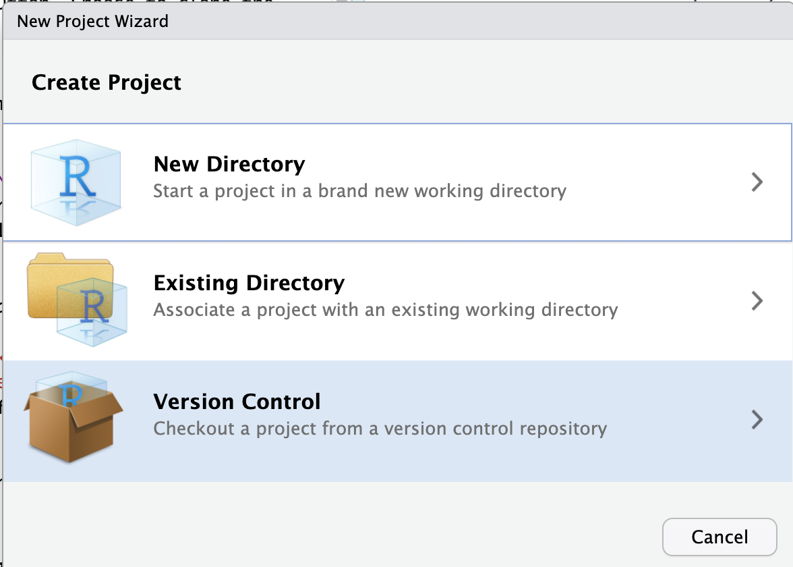
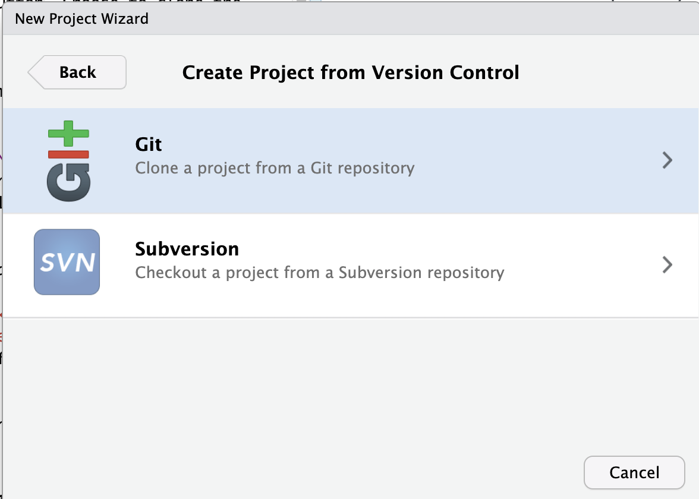
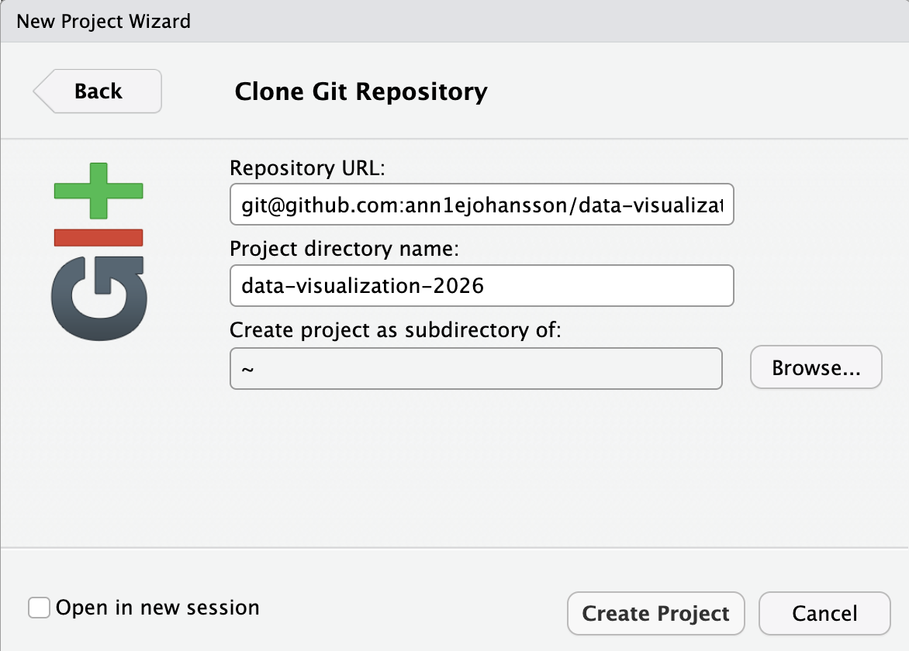

](images/commit-climber.png){fig-alt="A fuzzy pink monster falls off a rock face, but is caught by a rope clipped into anchors labelled COMMIT."}

## Introduction

This tutorial walks you through how to get you started with Git, which you need to use for your group project. 

Before you start, make sure you have a GitHub account and that Git is installed on your computer. You can check the second part in RStudio: go to `Tools` \> `Global Options` \> `Git/SVN`. If the `Git executable` field shows a path, you're good to go. If it's empty, install Git first ([instructions](https://happygitwithr.com/install-git)), then restart RStudio.

## Repo structure

Your group repo should look like this (this template is available in `templates/assignment-2/`):

```
your-project-name/
├── .gitignore
├── README.md
├── your-project-name.Rproj
├── scripts/
│   ├── 00-packages.R
│   └── 01-get-data.R
└── report/
    └── DV-Assignment2-GroupX.Rmd
```

-   `scripts/00-packages.R` — installs (if missing) and loads every package the project uses.
-   `scripts/01-get-data.R` — downloads/loads the DUO data your group is using. 
-   All external R scripts used to build dataframes, visualizations, etc, and are sourced for your final report, belong in `scripts/`. Use logical naming conventions here.  
-   `report/` — your group's report and final visualization.  
-   `README` is a short, summarized description of your project goals and outcomes. You can also use this file to guide readers through your speciifc files, and how to run them.   
-   `.gitignore` is a list of all files that won't be git-tracked. Make sure you ignore `data/` — even though we work with public data, it is good practice to never push data to github. This data is always reproducible by re-running `01-get-data.R`, so a copy in version control is not necessary.  

This is based on the [reproducible workflows described in Telling Stories with Data](https://tellingstorieswithdata.com/03-workflow.html). We expect you to stick to this workflow and structure throughout the assignment. Points can be deducted if it is not clear which script we should run, and how. 

## Connecting GitHub to RStudio

### Step 1: Adding git-tracked R projects

1.  Go to your group's GitHub repository and click on the green `<> Code` button. Choose to clone the repository via **HTTPS** and copy the URL.

    {fig-alt="GitHub repository page with the Code dropdown open, the HTTPS tab selected and the copy button highlighted."}

2.  Now go to RStudio. On the top right (sort of cubical icon) you can find a project overview `Project: (none)`. **Make sure this is in fact set to no project**, if you see the name of a different repository/project, click it and select `Close Project`.

    {fig-alt="RStudio window with the Project: (None) button in the top right corner highlighted."}

3.  Make a new R project for your group assignment: click on `New Project` \> `Version Control` \> `Git`. Paste the URL you just copied from GitHub into `Repository URL`, choose where on your computer the project should live, and create the project (the Project directory name will automatically be filled in for you).

    {width="60%" fig-alt="The Project dropdown menu in RStudio with New Project highlighted."}

    ::: {layout-ncol=3}
    {fig-alt="New Project Wizard with Version Control selected."}

    {fig-alt="Create Project from Version Control dialog with Git selected."}

    {fig-alt="Clone Git Repository dialog with fields for the repository URL, project directory name and parent folder."}
    :::

4.  The first time you do this, RStudio may ask for your GitHub username and password. GitHub does not accept your normal password here - use a **personal access token** instead. You can create one on GitHub under `Settings` \> `Developer settings` \> `Personal access tokens` \> `Tokens (classic)` \> `Generate new token (classic)`. Give it a name (for example, `Data viz`), tick the `repo` scope, generate it, and copy it - GitHub only shows it once. Paste the token wherever RStudio asks for your password.

It will now appear as if your RStudio is re-starting; don't be feared, this is what is supposed to be happening. Projects are temporary representations of your RStudio environment, so that you can work on different projects with different data to keep your work structure clear.

If you look in your `Files` pane, you will see that the folder was selected, which holds all the information that was on the GitHub repository.

If you look in your `Environment` pane, you can now see an extra tab called `Git`. You have now successfully cloned your repository and let Git track your changes!

### Step 2: Configure Git (only the first time)

Git needs to know who you are, so it can keep track of who made which changes. You only have to do this once per computer. Go to the `Terminal` tab in RStudio and type the following commands (replace `<your-name>` and `<your-email>` with your actual name and the email address that you use for GitHub):

```bash
git config --global user.email "<your-email>"
git config --global user.name "<your-name>"
```

Enter each command separately. The lines should be entered exactly like this, including the quotation marks, and you should see no output after entering the commands.

## Now you can work in your project

Open this project whenever you are working on the group assignments. You do this by either clicking on the `Project: <your-repo-name>` button in the top right corner, or by double-clicking the `.Rproj` file in your project directory.

Commit, push, and pull changes via the terminal in RStudio, in the tab called `Git`, or in GitHub Desktop if you have that downloaded. 

A few habits to enforce:

1.  **Pull before you start working, every single time** (`git pull`, or the ⬇ button in the `Git` tab) — even if you were "just working on it five minutes ago." A groupmate may have pushed since.
2.  **Commit small and often**, with messages that say *what changed* (`"add school-provider tidying step"`, not `"updates"`). Small commits are much easier to understand — and undo — than one giant one at the end.
3.  **Push when you're done working**, don't sit on local changes overnight.  
4.  **Close the project when you're done working**, to avoid accidentally making changes to the wrong project the next time you open RStudio.  
4.  **Coordinate on who's editing what.** With a small group, it's usually enough to communicate with each other to decide who is working in which script/document. Two people editing the *same file* at the same time is the main thing that causes trouble. **Tip:** If you do want to work on different versions of the same code, create subfolders with your names, and duplicate the code from the main folder that you want to edit. That way, you work "locally", then decide together on the final code.  
5.  You do **not** need feature branches for a project this size — working directly on `main`, carefully, is simpler and easier to reason about for a two-week group project.

## If you do get a merge conflict

It's not a disaster — git is telling you it found two different versions of the same lines and needs you to pick. Open the file; git marks the conflicting section like this:

```
<<<<<<< HEAD
your version
=======
your groupmate's version
>>>>>>> their-commit
```

Decide (with them, if it's not obvious) which lines should stay, delete the `<<<<<<<`/`=======`/`>>>>>>>` markers, save the file, then `git add` it and finish the commit. Ask for help if you're stuck!

](images/git-hug.png)
