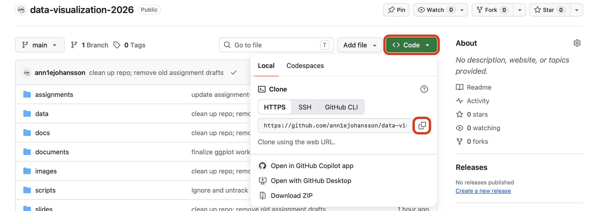
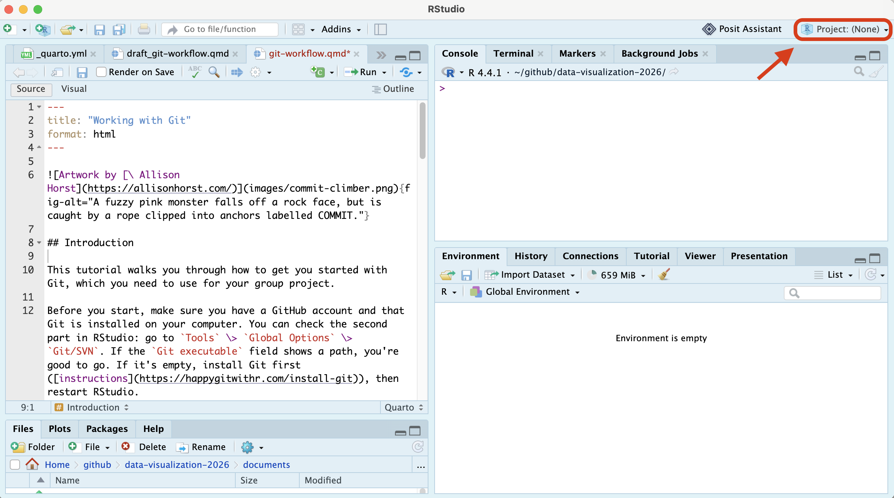
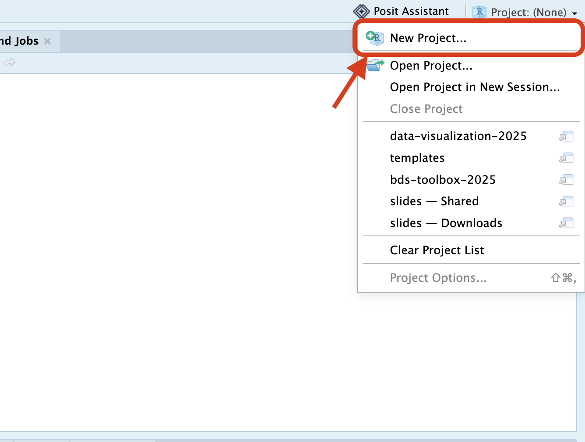
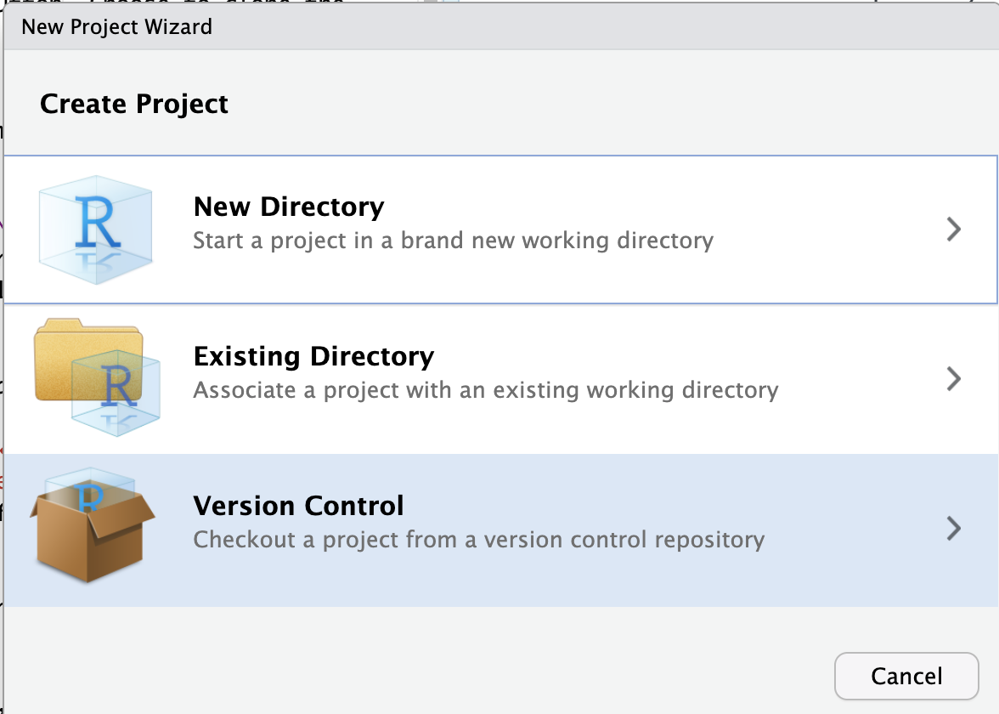
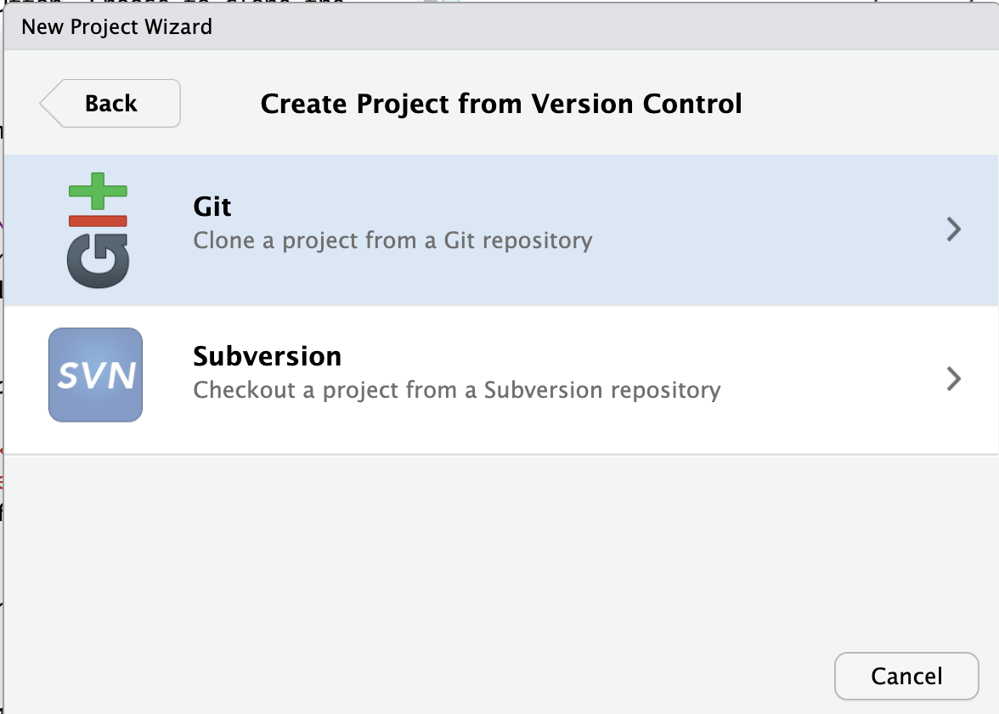
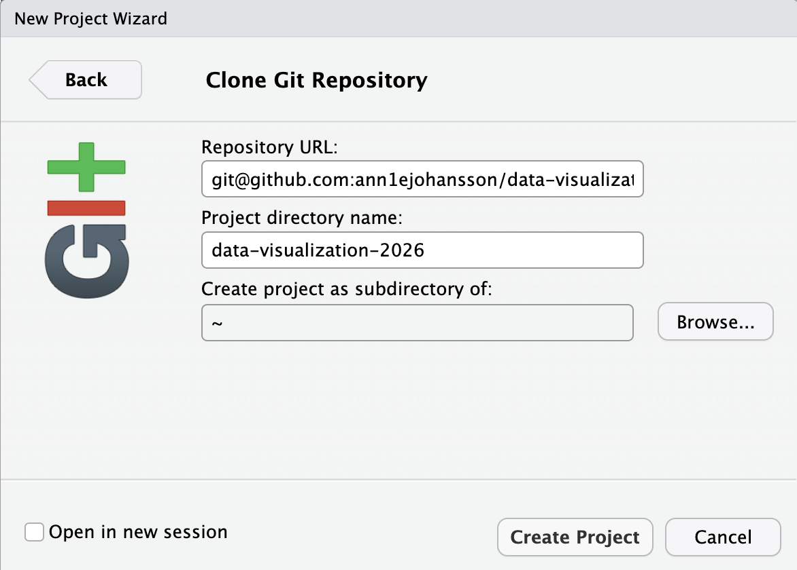

](images/commit-climber.png){fig-alt="A fuzzy pink monster falls off a rock face, but is caught by a rope clipped into anchors labelled COMMIT."}

## Introduction

This tutorial walks you through how to get you started with Git, which you need to use for your group project. In short:

1.  Everyone sets up Git and GitHub on their own computer ([Step 1](#step-1-set-up-git-on-your-computer-everyone)).
2.  One group member creates the group repository from our template ([Step 2](#step-2-create-your-group-repository-one-group-member)).
3.  Everyone clones the repository into RStudio, and makes a first commit ([Step 3](#step-3-clone-the-repository-into-rstudio) and [Step 4](#step-4-your-first-commit-everyone-one-at-a-time)).

## Repo structure

Your group repo should look like this:

```
<your-repo-name>/
├── .gitignore
├── README.md
├── <your-repo-name>.Rproj <- created when you clone (Step 3)
├── assignment-1/              
│   └── DV-Assignment1-Firstname-Lastname.Rmd
├── data/
│   └── raw/      <- appears after running 01-get-data.R
├── scripts/
│   ├── 00-packages.R
│   └── 01-get-data.R
└── report/
    ├── DV-Assignment2-Part1-GroupX.Rmd
    └── DV-Assignment2-Part2-GroupX.Rmd
```

-   `scripts/00-packages.R` — installs (if missing) and loads every package the project uses.
-   `scripts/01-get-data.R` — downloads/loads the DUO data your group is using.
-   All external R scripts used to build dataframes, visualizations, etc, and are sourced for your final report, belong in `scripts/`. Use logical naming conventions here.
-   `report/` — your group's report and final visualization.
-   `data/raw/` — the DUO data, downloaded by `01-get-data.R`. This folder does not exist until you run that script, and it is ignored by Git.
-   `README` is a short, summarized description of your project goals and outcomes. You can also use this file to guide readers through your specific files, and how to run them.
-   `.gitignore` is a list of all files that won't be git-tracked.
-   `<your-repo-name>.Rproj` is the RStudio project file. It is not in the template: RStudio creates it for you when you clone the repository.

::: {.callout-note}
## About pushing data

It is good practice to never push raw data to GitHub. In this case, we are already working with public data so pushing it would not violate privacy concerns. However, the data can easily be accessed by running a few lines of code, avoiding the need to store this data on GitHub, and it keeps the project cleaner. In many other projects, you will likely work with private data, making this step extra important. For this reason, we build the habit to keep the data files untracked by Git (check how this is done in the `.gitignore` file). If you produce specific data-cleaning code, make sure you push this to Git and document it clearly, so that your collaborators can reproduce your aggregated data tables.
:::

This is based on the [reproducible workflows described in Telling Stories with Data](https://tellingstorieswithdata.com/03-workflow.html). We expect you to stick to this workflow and structure throughout the assignment. Points can be deducted if it is not clear which script we should run, and how.

## Step 1: Set up Git on your computer (everyone)

Every group member does this once, on their own computer.

1.  **Make a GitHub account** at [github.com](https://github.com), if you don't have one yet.

2.  **Check that Git is installed.** In RStudio, go to `Tools` \> `Global Options` \> `Git/SVN`. If the `Git executable` field shows a path, you're good to go. If it's empty, install Git first ([instructions](https://happygitwithr.com/install-git)), then restart RStudio.

3.  **Tell Git who you are**, so it can keep track of who made which changes. Go to the `Terminal` tab in RStudio and type the following commands (replace `<your-name>` and `<your-email>` with your actual name and the email address that you use for GitHub):

    ```bash
    git config --global user.name "<your-name>"
    git config --global user.email "<your-email>"
    ```

    Enter each command separately. The lines should be entered exactly like this, including the quotation marks, and you should see no output after entering the commands.

4.  **Give RStudio permission to push to GitHub.** GitHub does not accept your normal password from RStudio; it needs a *personal access token* instead. Run the following in the RStudio `Console` (not the Terminal):

    ```r
    install.packages(c("usethis", "gitcreds"))
    usethis::create_github_token()
    ```

    This opens GitHub in your browser, with the right settings already filled in. Give the token a name (for example, `Data viz`), scroll down, click `Generate token`, and copy it — GitHub only shows it once. Then, back in the RStudio `Console`, run:

    ```r
    gitcreds::gitcreds_set()
    ```

    and paste the token when it asks for a password or token. Git now remembers it, and you won't be asked again.

## Step 2: Create your group repository (one group member)

**One** group member does this. The others wait until Step 3.

1.  Go to the [template repository](https://github.com/ann1ejohansson/dv-2026-group-template) and click the green `Use this template` button \> `Create a new repository`.

2.  Choose yourself as the `Owner`, and give the repository a name, for example `dv-2026-group3` (use your own group number). This name will also be the name of your project folder.

3.  Set the repository to **Public**, and click `Create repository`. Your repository is public so that we can see it for grading. Your individual assignment also lives here, but is not tracked by git and will not be visible. 

4.  Add your groupmates: in your new repository, go to `Settings` \> `Collaborators` \> `Add people`, and add each groupmate by their GitHub username. They receive an invitation by email (or at [github.com/notifications](https://github.com/notifications)), which they need to **accept** before they can push.

## Step 3: Clone the repository into RStudio

The group member who created the repository does this first, followed by Step 4. The others do Steps 3 and 4 afterwards, one at a time (see [Step 4](#step-4-your-first-commit-everyone-one-at-a-time) for why).

1.  Go to your group's GitHub repository and click on the green `<> Code` button. Choose to clone the repository via **HTTPS** and copy the URL.

    {fig-alt="GitHub repository page with the Code dropdown open, the HTTPS tab selected and the copy button highlighted."}

2.  Now go to RStudio. On the top right (sort of cubical icon) you can find a project overview `Project: (none)`. **Make sure this is in fact set to no project**, if you see the name of a different repository/project, click it and select `Close Project`.

    {fig-alt="RStudio window with the Project: (None) button in the top right corner highlighted."}

3.  Make a new R project for your group assignment: click on `New Project` \> `Version Control` \> `Git`. Paste the URL you just copied from GitHub into `Repository URL`, choose where on your computer the project should live, and create the project (the Project directory name will automatically be filled in for you).

    {width="60%" fig-alt="The Project dropdown menu in RStudio with New Project highlighted."}

    ::: {layout-ncol=3}
    {fig-alt="New Project Wizard with Version Control selected."}

    {fig-alt="Create Project from Version Control dialog with Git selected."}

    {fig-alt="Clone Git Repository dialog with fields for the repository URL, project directory name and parent folder."}
    :::

It will now appear as if your RStudio is re-starting; don't be feared, this is what is supposed to be happening. Projects are temporary representations of your RStudio environment, so that you can work on different projects with different data to keep your work structure clear.

If you look in your `Files` pane, you will see that the folder was selected, which holds all the information that was on the GitHub repository, plus a new `<your-repo-name>.Rproj` file that RStudio just created.

If you look in your `Environment` pane, you can now see an extra tab called `Git`. You have now successfully cloned your repository and let Git track your changes!

## Step 4: Your first commit (everyone, one at a time)

To check that everything works, every group member adds their name to the project's `README.md`, one after the other.

**The group member who created the repository goes first:**

1.  Open `README.md`, and replace `Firstname Lastname` under **Group members** with your name. Save the file.
2.  In the `Git` tab, tick the boxes next to `README.md` and `<your-repo-name>.Rproj`, and click `Commit`. Write a commit message (for example `"add name to README, add project file"`), and click `Commit` again.
3.  Click `Push` (the green ⬆ arrow).
4.  Check on GitHub that your name, and the `.Rproj` file, are now in the repository.

**Then each groupmate, one at a time:**

1.  Accept the invitation from Step 2, if you haven't done so yet.
2.  Clone the repository, following [Step 3](#step-3-clone-the-repository-into-rstudio). Because the `.Rproj` file is already in the repository, RStudio uses that one instead of making a new one.
3.  Add your name on a new line under **Group members** in `README.md`, save, commit only `README.md`, and push.

Wait until the previous person has pushed before you clone or push. If two people push changes to the same lines at the same time, Git can't combine them, and you get a [merge conflict](#if-you-do-get-a-merge-conflict). That's no disaster, and you're welcome to try it on purpose, but it's easier to get started without one!

When everyone has pushed, everyone clicks `Pull` (the blue ⬇ arrow). If `README.md` on everyone's computer now lists all group members, you are properly set up to work together using Git!

## Now you can work in your project

Open this project whenever you are working on the group assignments. You do this by either clicking on the `Project: <your-repo-name>` button in the top right corner, or by double-clicking the `.Rproj` file in your project directory.

Commit, push, and pull changes via the terminal in RStudio, in the tab called `Git`, or in GitHub Desktop if you have that downloaded.

A few habits to enforce:

1.  **Pull before you start working, every single time** (`git pull`, or the ⬇ button in the `Git` tab) — even if you were "just working on it five minutes ago." A groupmate may have pushed since.
2.  **Commit small and often**, with messages that say *what changed* (`"add school-provider tidying step"`, not `"updates"`). Small commits are much easier to understand — and undo — than one giant one at the end.
3.  **Push when you're done working**, don't sit on local changes overnight.
4.  **Close the project when you're done working**, to avoid accidentally making changes to the wrong project the next time you open RStudio.
5.  **Coordinate on who's editing what.** With a small group, it's usually enough to communicate with each other to decide who is working in which script/document. Two people editing the *same file* at the same time is the main thing that causes trouble. **Tip:** If you do want to work on different versions of the same code, create subfolders with your names, and duplicate the code from the main folder that you want to edit. That way, you work "locally", then decide together on the final code.
6.  You do **not** need feature branches for a project this size — working directly on `main`, carefully, is simpler and easier to reason about for a two-week group project.

## If you do get a merge conflict

It's not a disaster — git is telling you it found two different versions of the same lines and needs you to pick. Open the file; git marks the conflicting section like this:

```
<<<<<<< HEAD
your version
=======
your groupmate's version
>>>>>>> their-commit
```

Decide (with them, if it's not obvious) which lines should stay, delete the `<<<<<<<`/`=======`/`>>>>>>>` markers, save the file, then `git add` it and finish the commit. Ask for help if you're stuck!

](images/git-hug.png)
