```{r, include=FALSE}
# Install Packages
# Find everything that the user currently has installed
all_installed_packages <- installed.packages()[, "Package"]
# Install any missing, but required packages
# nolint start -- trick to omit some lines from the lintr checker, only if you have a good reason!
if (!"tidyverse" %in% all_installed_packages) {
  install.packages("tidyverse")
}
if (!"devtools" %in% all_installed_packages) {
  install.packages("devtools")
}
if (!"cowplot" %in% all_installed_packages) {
  install.packages("cowplot")
}
if (!"ggplot2" %in% all_installed_packages) {
  install.packages("ggplot2")
}
if (!"datasauRus" %in% all_installed_packages) {
  install.packages("datasauRus")
}
if (!"gt" %in% all_installed_packages) {
  install.packages("gt")
}
# if (!"ggimage" %in% all_installed_packages) {install.packages("ggimage")}
if (!"RXKCD" %in% all_installed_packages) {
  install.packages("RXKCD")
}
if (!"plotly" %in% all_installed_packages) {
  install.packages("plotly")
}
if (!"viridis" %in% all_installed_packages) {
  install.packages("viridis")
}
if (!"ggtext" %in% all_installed_packages) {
  install.packages("ggtext")
}
# nolint end

# Load Required Packages
library(tidyverse)
library(cowplot)
library(ggplot2)
library(datasauRus)
library(gt)
# the ggimage package is needed for this slide
library(RXKCD)
library(plotly)
library(viridis)
```

# Welcome to BDS Toolbox: Data Visualization 

::: notes

:::

## About these slides

:::::: columns
:::: {.column width="50%"}
::: columns
Slides made using [quarto](https://quarto.org){target="_blank"}

Cover photo made in R by [Danielle Navarro](https://art.djnavarro.net){target="_blank"}
:::
::::

::: {.column width="50%"}
{fig-align="center" width="80%"}
:::
::::::

::: notes
- Quick housekeeping: these slides are built with Quarto, from the same repository as the course site.
- The cover art is generative art made in R by Danielle Navarro, a nice reminder that R and ggplot can go far beyond default charts.
:::

## 📌 Course website

### [**data-visualization-2026**](https://ann1ejohansson.github.io/data-visualization-2026){target="_blank"}

This is our central hub! Access slides, textbook, worksheets, assignments and other resources here.

💡 Tip: press **S** while viewing the slides to open the speaker notes.

::: notes

:::

## Schedule {.smaller .scrollable}

::: {style="font-size: 75%;"}

| When    | Topic    | Preparation / Worksheets / Assignments |
|---------|----------|--------------------------|
| **Session 1.**<br>Tue 29/9, 15.00–18.00<br>GS.11 | Fundamentals of DV | Read: DV ch. 1; ch. 3<br>Worksheet: ggplot recap |
| **Session 2.**<br>Fri 2/10, 12.00–15.00<br>HvA | Exploratory viz | Worksheet: ggplotly<br>Worksheet: working with AI, pt. 1<br>🚨 **Sun 4/10, 23.59**<br>**Deadline Assignment 1 (individual) + Assignment 2, Part 1 (group)** |
| **Session 3.**<br>Tue 6/10, 15.00–18.00<br>GS.11 | Explanatory viz | Worksheet: working with AI, pt. 2<br>Read: DV ch. 8 ||
| **Session 4.**<br>Fri 9/10, 12.00–15.00<br>HvA | Pitches & Q&A | 🚨 **Sun 11/10, 23.59**<br>**Deadline Assignment 2, Part 2 (group)**  |
:::

::: {.fragment .fade-in .absolute .pop top="560" left="480"}
Friday sessions: time to work on group project!\
Bring a (charged) laptop! 💻
:::

::: notes

:::

## {.session-title .center background-color="#343a40"}

[Session 1]{.session-number}
[Tuesday, Sept. 29]{.session-date}
[Fundamentals of Data Visualization]{.session-name}

## Today

-   What is Data Visualization?  
-   Why visualize data?
-   What makes a plot good (and bad)?
-   Guiding principles
-   Data Visualization Project

::: notes
- Roadmap for today: what data visualization is, why we visualize at all, what separates good from bad plots, a set of guiding principles, and finally an introduction to the assignments.
- This session is more conceptual; the hands-on ggplot work comes with the worksheet.
:::

## Data visualization = Data thinking

[There are many skills involved in producing a good data visualization:]{.lead}

::: spaced
-   **Technical** [(how to use particular tools)]{.detail}
-   **Design** [(how to make visual representations that are engaging and appeal aesthetically)]{.detail}
-   **Perception** [(how do certain notions of visual perception and cognition affect data communication)]{.detail}
:::

::: notes
- Making a good visualization draws on several different skill sets.
- Technical: knowing your tools, e.g. ggplot. (covered in the worksheets, and a skill you'll continue to build up over time)
- Design: making it engaging and aesthetically pleasing. (next tuesday's session)
- Perception: knowing how people actually read visual information (we discuss this a little bit, but more information is in your reading).
:::

## Data visualization = Data thinking

[Most important is to be able to **derive reliable information from data using visual representations**.]{.lead}


::: notes
- But underneath all of these, the most important skill is deriving *reliable* information from data.
- Walk through the diagram: the world → data → visualization → someone's understanding.
- Every arrow is a step where information can be lost or distorted: what gets measured, how it's processed, and how it's shown and read.
:::

## Data visualization = Data thinking

[**Your data visualization is effective only if it helps you, and your audience, understand the real world better**]{.lead}

This requires data thinking skills:

::: {.spaced style="font-size: 75%;"}
-   **Understanding** [of what the data represents (and what it doesn't)]{.muted}
-   **Transparency** [about the transformations and aggregations done to the data to produce the visualization]{.muted}
-   **Awareness** [about how different visual representations affect the interpretation of the data, and an ability to justify which choice is most appropriate for your data and audience]{.muted}
-   **Knowledge** [about the context from which the data is taken, and later presented.]{.muted}
:::

::: notes
- The goal is not a pretty plot; the goal is a better understanding of the real world, for you and your audience.
Knowledge about data validty and technical choices is saved for other parts of the course. But you need to think about all of these steps when visualizing. 
:::

## Data visualization = Data thinking

::: {style="font-size: 75%;"}
Especially in our age of AI, these skills are invaluable
:::

{.absolute .nolightbox top="70" left="0" width="660" style="box-shadow: 0 4px 16px rgba(0,0,0,0.25); transform: rotate(-2deg);"}

{.absolute .nolightbox top="150" left="590" width="400" style="box-shadow: 0 4px 16px rgba(0,0,0,0.25); transform: rotate(3deg);"}


::: footer
[text-to-dashboard service](https://other-levels.com/products/custom-ai-dashboard-service){target="_blank"}; [I Stopped Building Dashboards. AI Now Does It Better.](https://medium.com/@cenrunzhe/i-stopped-building-dashboards-ai-now-does-it-better-4005e477cc88){target="_blank"}.
:::

::: notes
- AI tools can now generate polished dashboards and charts from a text prompt in seconds.
- That makes producing a visualization easy, but doesnt judge whether it is correct, honest, or appropriate.
- The data thinking skills from the previous slide are exactly what these tools can't do for you.
- We will come back to working with AI in sessions 2 and 3.
:::

# Why visualize data? [👀]{.header-emoji} {background-color="#343a40"}

::: notes
- Move to the first big question: why visualize data at all?
:::

## 💬 Discussion

### Why visualize data?

::: notes
- Ask the room: why visualize data? Collect a few answers.
- Expected answers: see patterns quickly, communicate results, spot errors and outliers, check assumptions.
- Keep the answers in mind; the next slides make the case for "looking at your data".
:::

## Communicating with the public

::: {style="font-size: 75%;"}
...or boss, or stakeholder, or client
:::

::::: columns
::: {.column width="50%"}
{group="covid" fig-align="center" height="430"}
:::

::: {.column width="50%"}
{group="covid" fig-align="center" height="430"}
:::
:::::

::: notes
- Before the technical reasons to visualize, the bigger picture: visualizations are one of the main ways data reaches the public.
- During COVID-19, maps and case curves were on every news site, updated daily. Millions of people who never read a statistics report looked at these charts to decide how worried to be, whether to travel, or whether policies were justified. "Flatten the curve" was itself a visualization.
- Point to the footnotes on both charts: the data come from Johns Hopkins, collated from sources with different methods, and testing rates differ between countries. Good public-facing charts are transparent about what the data can and can't tell you (link back to the data thinking skills).
- What responsibility comes with making a chart that millions of people will see?
:::

## Why visualize data? {.smaller}

:::::: columns
::: {.column width="40%"}

:::

:::: {.column width="60%"}
::: fragment

:::
::::
::::::

::: notes
- Left: income inequality vs. voter turnout. The negative slope is driven almost entirely by one country, South Africa. Without it, the relationship almost disappears.
- A regression coefficient alone would never tell you that; one look at the plot does.
- (Fragment) Right: sixteen datasets that all produce a similar positive regression line, with very different underlying structures: skew, outliers, non-linear trends, groups, categorical data.
- Message: the same summary statistic can hide very different data. Always look at your data.
- Both figures from Healy, Data Visualization (socviz.co), ch. 1.
:::

## Anscombe's quartet {.smaller}

::::: columns
::: {.column width="50%"}
 
:::

::: {.column width="50%"}
```{r}
#| echo: true
#| code-fold: true
#| fig.height: 10
library("datasauRus")
library(scales)

datasaurus_dozen |>
  ggplot2::ggplot(aes(x = x, y = y, color = dataset)) +
  ggplot2::geom_point() +
  ggplot2::theme_void() +
  ggplot2::geom_smooth(
    method = "lm",
    color = "gray",
    fill = "gray",
    alpha = .5
  ) +
  ggplot2::theme(legend.position = "none", text = element_text(size = 30)) +
  ggplot2::facet_wrap(~dataset, ncol = 4)
```
:::
:::::

::: footer
Packages: [datasauRus](https://jumpingrivers.github.io/datasauRus/), [anscombiser](https://paulnorthrop.github.io/anscombiser/).

More information: [Same Stats, Different Graphs](https://www.autodesk.com/research/publications/same-stats-different-graphs), [socviz.co](https://socviz.co/lookatdata.html#why-look-at-data).
:::

::: notes
- datasets can have with (nearly) identical means, variances, correlations, and regression lines, but they look completely different.
:::

## 💬 Discussion

### What is more important? An eye or an algorithm?

What are the consequences of overrelying on statistical techniques? <br>What are the consequences of overrelying on visualizations?

::: notes
- Discussion: what is more important, an eye or an algorithm?
- Over-relying on statistics: you miss outliers, non-linearity, data errors (Anscombe, Datasaurus).
- Over-relying on visualizations: you see patterns in noise, and plots can be designed to mislead.
- You need both; visualization and statistics verify each other.
:::

# Bad plots [💩]{.header-emoji} {background-color="#343a40"}

::: notes
:::

## What makes a bad plot bad?

::::: columns
::: {.column width="40%"}
-   Aesthetic (ugly)

-   Perceptual (bad)

-   Substantive (wrong)
:::

::: {.column width="60%"}
](images/ugly-bad-wrong.png)
:::
:::::

::: notes
- Claus Wilke's three categories of problems:
  - Ugly: aesthetic problems, but data patterns might still be sound / informative (e.g. illegible colors)
  - Bad: perceptual problems; unclear, confusing, or deceiving (patterns do not lead to correct interpretation).
  - Wrong: objectively, mathematically incorrect (e.g. bars without a meaningful scale).
- We'll use these categories to critique plots in the next exercise.
:::

## 💬 Speed dates

::::: columns
::: {.column width="40%"}
-   What do you think about this plot?

-   What elements can be improved?

-   Are the problems aesthetic, perceptual, or substantive?
:::

::: {.column width="60%"}

:::
:::::

::: {.fragment .fade-in .absolute .pop top="545" left="530"}
Ireland is headed straight for zero? 📉
:::

::: notes
- Speed dates: discuss with your neighbour for 2–3 minutes.
- (Fragment) After the group discussion, click to reveal the pop-up: "Ireland is headed straight for zero?" The line plunges towards 0, but Paris 2024 was actually Ireland's best result.
- Plot: Ireland's position in the Olympic medal table. Lower rank number = better, but on this axis the line goes *down* as Ireland improves, so 14th in Paris looks like a crash.
- Also: does the axis need to include 0? There is no rank 0.
- Classify: mostly a perceptual (bad) problem; you could argue substantive, since it invites the wrong conclusion.
- Fix: reverse the y-axis so up means better, use a barplot or something that better represents discrete values. 
:::

## 💬 Speed dates

:::::: columns
::: {.column width="60%"}
{fig-align="left" height="500"}
:::

:::: {.column width="40%"}
::: fragment
-   Misleading (or missing) information?
-   Many data visualizations might have a hidden agenda, due to e.g. marketing strategies.
:::
::::
::::::

::: footer
Check out the classic from Darrel Huff [How to Lie with Statistics](https://www.penguin.co.uk/books/13565/how-to-lie-with-statistics-by-darrell-huff-with-pictures-by-mel-calman/9780140136296) [Lessions from How to Lie with Statistics.](https://towardsdatascience.com/lessons-from-how-to-lie-with-statistics-57060c0d2f19)
:::

::: notes
- Lidl advertisement comparing the price of a basket of groceries at UK supermarkets.
- (Fragment) Missing baseline and scale: the bars don't start at zero, so a ~£9 difference looks huge; We don't know what's on the axis, when/how it was measured
- Many visualizations have an agenda; always ask who made it and why.
- Footer: Huff's *How to Lie with Statistics* is a classic on this.
:::

## 💬 Speed dates

:::::: columns
::: {.column width="60%"}
](images/data_ink.png){fig-align="left" width="544"}
:::

:::: {.column width="40%"}
::: fragment
-   Data to ink ratio?
:::
::::
::::::

::: footer
[How to maximize the data-to-ink ratio](https://www.codeconquest.com/blog/data-ink-ratio-explained-with-example/)
:::

::: notes
- School shooting incidents by country, 2009–2018.
- Ask: what do you notice about the design?
- (Fragment) Data-to-ink ratio: the proportion of ink used to show data versus everything else.
- Here, most of the chart is spent on bars for countries with 1 incident; the United States dominates, which *is* the story, but a lot of ink carries little information.
- Also worth discussing: counts not normalized by population or number of schools.
:::

## 💬 Speed dates

### Data to ink ratio

::::: columns
::: {.column width="50%"}

:::

::: {.column width="50%"}
{height="500"}
:::
:::::

::: footer
[How to maximize the data-to-ink ratio](https://www.codeconquest.com/blog/data-ink-ratio-explained-with-example/)
:::

::: notes
- Compare the two charts side by side.
- Right: US household gun ownership 1972–2023, one bar per year with a label on each. Lots of ink, and the trend (roughly flat around 40%) is hard to see.
- A simple line chart would show the same information with far less ink.
- Tufte's principle: maximize the share of ink devoted to data; remove what doesn't add information.
:::

## 💬 Speed dates


::: notes
- Treemap of US COVID-19 relief spending by category (NYT).
- Ask: can you compare the sizes? Is Businesses bigger or smaller than Individuals and families?
- Area is hard to compare precisely, especially across differently shaped rectangles. Treemaps are good for showing hierarchy and part-to-whole, not for precise comparison.
- What perceptual element is working to tell the story, and allow an easy conclusion to be drawn?
:::

## 💬 Speed dates

:::::: columns
::: {.column width="60%"}
{width="490"}
:::

:::: {.column width="40%"}
::: fragment
-   Do the colors make sense?
:::
::::
::::::

::: notes
- Safety index by country, 2023.
- Ask: do the colours make sense?
- (Fragment) The index is an ordered, continuous variable, but the colours are categorical hues in no logical order: red, blue, yellow, purple, green. You can't tell at a glance whether a country is safer or less safe.
- A sequential palette (light → dark) would map naturally to the ordering.
:::

## 💬 Speed dates


::: notes
- Another colour example: bar chart of total bill by day.
- Each bar has its own colour, but colour here encodes nothing that the x-axis doesn't already show.
- Colour should map to a relevant attribute; otherwise it adds noise (and a legend people have to decode).
:::

## 💬 Speed dates

:::::: columns
::: {.column width="60%"}
{width="490"}
:::

:::: {.column width="40%"}
::: fragment
-   Are all elements needed?
:::
::::
::::::

::: notes
- Chart might not be wrong, but a person should be able to understand the conclusion within seconds, 

:::

## 💬 Speed dates

:::::: columns
::: {.column width="60%"}
{height="500"}
:::

:::: {.column width="40%"}
::: fragment
-   Are the axes correct?
:::
::::
::::::

::: notes
- Years on axes barely noticable, unclear why these teams are on the bars 
- Also: the Cincinnati bar (54 points, 9 games left) is compared to completed seasons; the chart shows a record chase that hasn't happened yet.
- What is the evidence?
- Decoration competes with the data.
:::

## 💬 Speed dates


::: notes
:::

## 💬 Speed dates

:::::: columns
::: {.column width="60%"}

:::

:::: {.column width="40%"}
::: fragment
-   Is it simple?
:::
::::
::::::

::: notes
- Stacked bar chart of values by type, 2005–2016.
- Ask: is it simple? Can you tell how type B changed over time?
- (Fragment) Only the bottom category (D) and the total share a common baseline. Every other segment floats, so comparing them across years is very hard.
:::

## 💬 Speed dates

### ⚠️ Stacked bar charts ⚠️

::::: columns
::: {.column width="60%"}

:::

::: {.column width="40%"}

:::
:::::

::: notes
- Left: market shares of five companies over three years. Can you see that company A is growing and E is shrinking? Only because they're at the edges.
- Right: Brazil's top Olympic medallists. The stacks mix gold, silver, and bronze, with photos and rotated labels on top; comparing e.g. silver medals across athletes is almost impossible.
- Stacked bars work for showing totals, or with very few categories. Otherwise, consider side-by-side bars or small multiples.
:::

## 💬 Speed dates

### ⚠️ Pie charts ⚠️


::: notes
- CBS News: Americans who have tried marijuana.
- A pie chart shows parts of a whole, but 51%, 43%, and 34% add up to 128%. These are three separate measurements from different years, not parts of a whole.
- This is a *wrong* figure in Wilke's terms.
- A simple bar or line chart over time would be correct.
:::

## 💬 Speed dates

### Visualizing proportions

-   Pie chart, stacked bar, or side-by-side bars?


<https://clauswilke.com/dataviz/visualizing-proportions.html#>

::: notes
- Pie charts are not always wrong. Wilke's table compares pie charts, stacked bars, and side-by-side bars.
- Pie charts: good for simple fractions (1/2, 1/4) and few categories.
- Stacked bars: good for many sets of proportions, e.g. over time.
- Side-by-side bars: best for comparing the relative sizes directly.
- Choose based on what the reader needs to compare.
:::

## 💬 Speed dates


::: footer
Original Source: [Cleveland & McGill (1984). 531-554](https://www.tandfonline.com/doi/abs/10.1080/01621459.1984.10478080); [Further summary and examples](https://bookdown.org/dereksonderegger/141/6-graphing-principles.html)
:::

::: notes
- Cleveland & McGill (1984): ranking of elementary perceptual tasks by how accurately people can read them.
- Most accurate: position along a common scale (dot plots, bar charts, scatter plots). Then position on non-aligned scales, length, direction/angle, area, volume, and least accurate: shading and colour hue.
- This explains many of the problems we saw: pie charts use angle, treemaps use area, the map uses hue.
:::

## 💬 Speed dates

:::::: columns
::: {.column width="60%"}

:::

:::: {.column width="40%"}
::: fragment
-   Does it support one conclusion?
:::
::::
::::::

::: notes
- Warehouse accuracy rates, stacked bars for 19 warehouses.
- Ask: does this chart support one conclusion? What should the reader take away?
- (Fragment) It shows everything with equal weight: red accuracy bars dominate, and the interesting part (error rates) is squashed at the bottom.
:::

## 💬 Speed dates

### Storytelling with data - show just one conclusion!


::: notes
- The same data redesigned to tell a story.
- A headline states the conclusion: "Action needed: 10 warehouses have high error rates".
- Bars sorted, grey for context, orange only for the warehouses that need attention, and text next to the chart that explains what to do.
- With the same data, the reader now instantly knows the point. 
:::


# Guiding principles [🪄]{.header-emoji} {background-color="#343a40"}

::: notes
- Let's summarize everything we've seen into a checklist.
:::

## Tips for the best viz

-   Is it **explaining** data?

-   Is the information **complete and correct**?

-   Are **axes** correct? (+ Should they have a zero-point?)

-   Do the **colors** work? ( + Do they map to a relevant attribute?)

-   Are all **elements** needed?

-   What is the **data to ink ratio?**

-   Is it **understandable & simple?**

-   Does it portray **one conclusion**?

::: notes
- Use this as a checklist for your own plots and for the assignments.
- Each point maps to an example we saw: axes (Ireland), colours (safety map), elements (Cincinnati), data-to-ink (gun ownership), simplicity (stacked bars), one conclusion (warehouses).
- "Explaining data": is this an explanatory plot with a clear message?
- "Complete and correct": the pie chart that didn't add up to 100%.
:::

## [Some good examples]{style="font-size: 0.7em;"} {.smaller .scrollable}

[{width="100%"}](images/good1.png) [Distributions are informative](https://clauswilke.com/dataviz/histograms-density-plots.html)

::::: columns
::: {.column width="50%"}
[{width="100%"}](images/good2.png)
:::

::: {.column width="50%"}
[{width="100%"}](images/good3.png)
:::
:::::

[NYT Graphic - Obamacare spending](https://www.nytimes.com/interactive/2023/09/05/upshot/medicare-budget-threat-receded.html?pgtype=Article&action=click&module=RelatedLinks)

::: notes
- Some examples of good visualizations.
- Butterfat by cow breed (Wilke): overlapping density plots with direct labels instead of a legend; distributions are more informative than just means.
- NYT Medicare spending: projected trend vs. actual spending, with the gap shaded and annotated. One clear message.
- NYT smoking rates: a simple line with a declarative title that states the conclusion.
- Common thread: clear message, direct labels, minimal clutter.
:::

## Making good plots: the BBC way {.smaller}

:::::: columns
:::: {.column width="55%"}
The BBC data journalism team makes its published graphics in R with ggplot, using their own package, `bbplot`.

➡️ [**BBC Visual and Data Journalism cookbook for R graphics**](https://bbc.github.io/rcookbook/){target="_blank"}

```{r}
#| echo: true
#| eval: false
# devtools::install_github("bbc/bbplot")
library(bbplot)

my_plot <- ggplot(data, aes(x = year, y = value)) +
  geom_line(colour = "#1380A1", linewidth = 1) +
  bbc_style() # BBC house style

finalise_plot(
  plot_name = my_plot,
  source_name = "Source: ...",
  save_filepath = "my_plot.png"
)
```
::::

:::: {.column width="45%"}
{target="_blank"}](images/good2.png){width="100%"}

➡️ [**How to reproduce a NYT graphic in ggplot**](https://sean.netlify.app/post/how-to-reproduce-a-nyt-graphic/){target="_blank"}
::::
::::::

::: notes
- A real-world example of the principles we just listed: newsrooms that publish charts to millions of people every day, and make them in R.
- BBC: `bbplot` gives every chart the same house style. `bbc_style()` is a ggplot theme, and `finalise_plot()` adds the source and logo and saves the chart at the right size.
- Open the cookbook and scroll through the examples: line charts, bar charts, small multiples, annotations. Point out the pattern: a declarative title and subtitle, few gridlines, direct labels instead of legends, one clear message.
- NYT (right): Medicare spending per beneficiary, projected trend vs. actual spending, with the gap shaded and annotated. The tutorial shows how to rebuild a NYT-style graphic step by step in ggplot.
- Takeaway for the assignments: a consistent theme and a few deliberate choices go a long way. Students can borrow ideas (or code) from both for their own plots.
:::

## Making good plots: the BBC way

{fig-align="center" height="600"}

{.absolute .nolightbox top="20" left="60" width="350"}

::: footer
de Volkskrant, 27 March 2025: *Het maakt wél uit welke doorstroomtoets een school kiest*
:::

## Break

```{r}
#| echo: true
#| code-fold: true
#| results: false
library("RXKCD")
RXKCD::getXKCD(which = "833")
```

::: notes
- Break time.
- XKCD 833 "Convincing": a reminder to label your axes!
:::

# Data Visualization Project [📊]{.header-emoji} {background-color="#343a40"}


## Assignment 📝

[Assignment 1](../assignments/assignment-1.html){target="_blank"}


# {.session-title .center background-color="#343a40"}

[Session 2]{.session-number}
[Friday, Oct. 2]{.session-date}
[Exploratory Data Visualization]{.session-name}

## Today

::: spaced
-  Exploratory data visualization 
-  Brief introduction to interactive plots
-  [Worksheet:]{.muted} `ggplotly`
-  Using AI for exploratory data viz
-  [Worksheet:]{.muted} Working with AI, pt. 1
-  Work on your group assignment
:::

## 💬 What makes exploration useful? {.smaller}

](images/youre-not-normal.png){height="460px" fig-align="center"}


## Exploratory versus explanatory {.smaller}

::: notes
Exploratory in the sense of data exploration. Exploratory in the sense of visualization exploration (as in previous example, where the same data can be plotted in several ways). In both cases, you can create ugly plots.

assignment 2 = explanatory data viz (also bridge to next). Here we want beautiful plots!
:::

::::: columns
::: {.column width="30%"}
](images/exploratory-explanatory-01.png){height="470px" fig-align="center"}
:::

::: {.column width="70%"}
](images/exploratory-explanatory-02.gif){width="85%"}

::: spaced
-   **Exploratory:** [examine the structure of your data.]{.muted}
-   **Explanatory:** [tell a story with your data.]{.muted}
:::
:::
:::::

::: footer
More resources: [clauswilke.com](https://clauswilke.com/dataviz/telling-a-story.html) (telling a story and making a point), [susielu.com](https://www.susielu.com/data-viz/storytelling-in-dashboards) (different interpretation of exploratory/explanatory).
:::

## Exploratory versus explanatory {.smaller}

::::: columns
::: {.column width="50%"}
**Exploratory**

{.framed width="100%"}
:::

::: {.column width="50%"}
**Explanatory**

{.framed width="100%"}
:::
:::::

[Source: [storytellingwithdata.com](https://www.storytellingwithdata.com/blog/2014/04/exploratory-vs-explanatory-analysis)]{.detail}

::: footer
More resources: [clauswilke.com](https://clauswilke.com/dataviz/telling-a-story.html) (telling a story and making a point), [susielu.com](https://www.susielu.com/data-viz/storytelling-in-dashboards) (different interpretation of exploratory/explanatory).
:::

::: notes
- Storytelling with data's metaphor: exploratory analysis is like opening 100 oysters to find a couple of pearls.
- Explanatory: show your audience the pearls, not all the oysters.
- For your assignments: you'll do both. Exploratory plots to understand the data, and one explanatory plot that makes a clear point.
:::

## Using data visualizations for exploration {.smaller}

1.  Understand your problem. 
2.  Look at your data: `head()` 
3.  What variables are available? What do they mean, what values do they take on?
4.  Identify your target variables.  
5.  Now plot: their distributions, relationships with other variables, explore grouping structures, etc.
6.  What patterns do you see? Write them down, save the code.

## Using data visualizations for exploration {.smaller}

[**Exploratory visualizations can be ugly**]{.lead}

[Use them to guide your understanding of the data, and inspire the final result you wish to present.]{.muted}

::::: columns
::: {.column width="50%"}
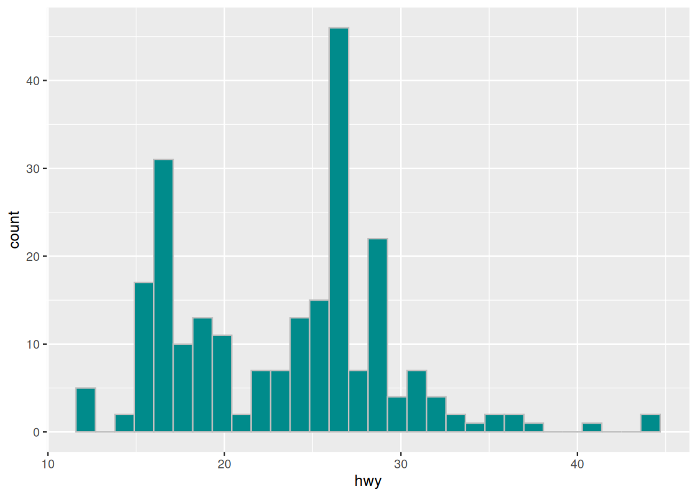{.framed width="88%"}

[One variable → its distribution]{.detail}
:::

::: {.column width="50%"}
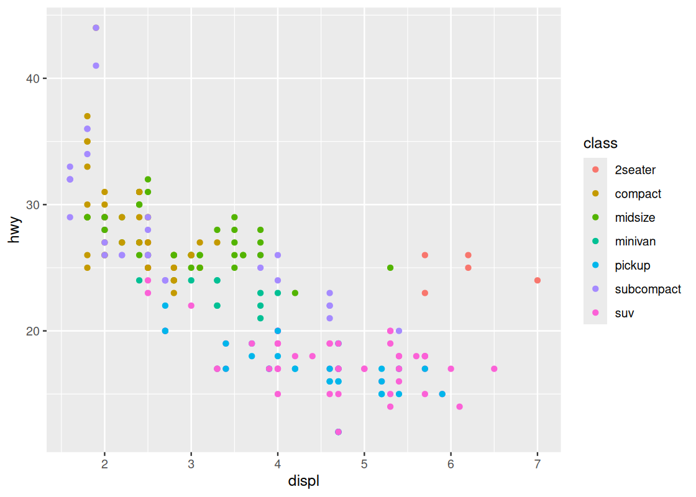{.framed width="88%"}

[Two variables + a group → relationships]{.detail}
:::
:::::

::: footer
Plots from [ds4world.cs.miami.edu](https://ds4world.cs.miami.edu/data-visualization#case-study-exploring-the-us-census){target="_blank"}
:::

## Using data visualizations for exploration {.smaller}

[**Exploratory visualizations can also be beautiful**]{.lead}

[When the goal is to have the receiver explore and understand the data.]{.muted}

::::: columns
::: {.column width="50%"}
[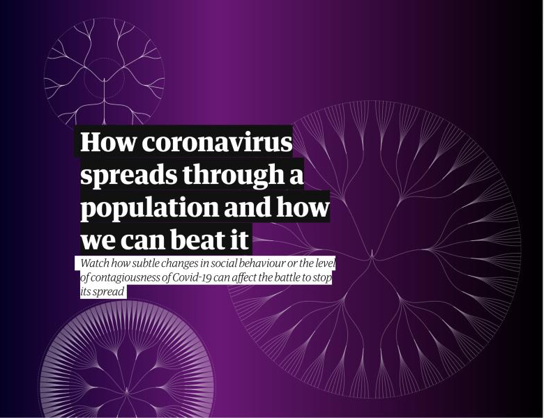{.framed .nolightbox height="330px"}](https://www.theguardian.com/world/datablog/ng-interactive/2021/sep/09/how-contagious-delta-variant-covid-19-r0-r-factor-value-number-explainer-see-how-coronavirus-spread-infectious-flatten-the-curve){target="_blank"}

[The Guardian: How coronavirus spreads ↗]{.detail}
:::

::: {.column width="50%"}
[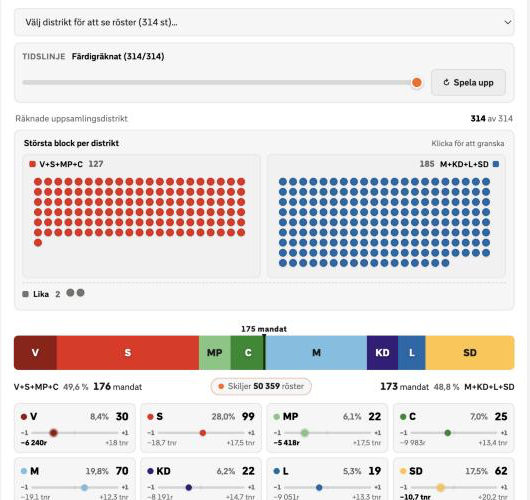{.framed .nolightbox height="330px"}](https://www.svt.se/nyheter/folj-onsdagsrosterna-live){target="_blank"}

[SVT: Replay the 2026 Swedish election count ↗]{.detail}
:::
:::::

::: footer
NYT also offers very good examples of [enaging data journalism](https://www.nytimes.com/interactive/2015/05/28/upshot/you-draw-it-how-family-income-affects-childrens-college-chances.html). <br>
[Check out The Upshot](https://www.nytimes.com/section/upshot)
:::

## Adding interactivity 🎮

::: statement
💬 [**Why use interactive visualizations?**]{.lead}
::: 
 

## Adding interactivity 🎮

➡️ [**`ggplotly()`**](../worksheets/ggplotly-handout.html){target="_blank"}


*  Two main ways to creating a **plotly** object in R:

    1.   Convert a ggplot2 object with `ggplotly()`
    2.   Directly initialize a plotly object with `plot_ly()`


## Adding interactivity 🎮

[**Additional functionality with** `plot_ly()`]{.lead}

-   [Adding custom controls](https://plotly.com/r/#controls)
-   [Animations](https://plotly.com/r/#animations)

## Adding interactivity 🎮 {.smaller}

| ✅&nbsp; Advantages | ⚠️&nbsp; Disadvantages |
|----------------------------------|----------------------------------|
| Explore data dynamically | Harder to include in static formats (papers, print) |
| Zoom, pan, and hover for details | Accessibility issues (screen readers, non colorblind-friendly defaults) |
| Reveal extra information without clutter | Can overwhelm the audience if overused |
| Enhance engagement in presentations and reports | Larger file sizes, slower rendering |
| Useful for exploratory analysis and dashboards | Requires additional packages (e.g., `{plotly}`) |

: {tbl-colwidths="[50,50]"}

## Adding interactivity 🎮 

::: statement
Interactivity enhances, but does not replace, the fundamentals of good data visualization
:::

::: footer
‼️ **Beware!** [Hack your way into scientific glory](https://stats.andrewheiss.com/hack-your-way/)
:::

## Using AI for Data Exploration 🤖 

::: statement
💬 [**What about using AI for data exploration in visualization?**]{.lead}
::: 
 
 
## Using AI for Data Exploration 🤖 {.smaller}

::: spaced
1.  **AI lets you explore wider** <br> [Use it for an efficient overview of the available data]{.muted}
2.  **But, every plot hides decisions** <br> [Ask the AI to list every transformation it made]{.muted}
3.  **More plots = more chances of false positives** <br> [Treat exploratory findings as a lead to continue checking, not a result]{.muted}
4.  **You bring the meaning** <br> [what does a variable measure? does the pattern make sense?]{.muted}
5.  **Give the AI all the context you can** <br> [e.g. codebooks, background information]{.muted}
6.  **Evaluate, evaluate, evaluate!** <br> [Before prompting, decide how you will verify the results yourself]{.muted}
:::

::: notes
- You can get a distribution of every variable, and every relationship you're curious about, in a few minutes. So use that! Look at more than you normally would. And remember, these plots don't have to be pretty, they're just for you.
- every plot you get back already has choices baked into it. Which variables did it pick, did it take a mean or a median, did it filter anything out? The AI makes these choices without telling you. 
- More plots, more false patterns: If you can make 50 versions of a plot in a minute, one of them is going to show you something interesting, just by chance. So anything you find while exploring is a lead, not a result. You still have to check it.
- You bring the meaning: the AI can make the plot, but it doesn't know what your variables actually measure, or whether the pattern makes any sense in the real world. That part is your job. If you can't judge whether the answer is right, the AI's answer isn't going to help you.
- Give the AI all the context you can: the more it knows, the less it has to guess. So don't just give it the column names, give it the codebook, the background of the data, what your research question is. And a nice trick: ask it to describe the data back to you first. Where it gets it wrong, correct it, and now you also know where its understanding stops.
- Evaluate, evaluate, evaluate!: decide *before* you prompt how you're going to check the result, otherwise the AI's output becomes the standard you judge it by. Simple checks: how many schools went in, and how many ended up in the plot? Can you reproduce one number from the plot yourself? Does the pattern still hold with a median instead of a mean? Keeping an AI log will also help with this. 
:::

## Using AI for Data Exploration 🤖 

<br><br>
[Try it yourself!](../worksheets/working-with-ai.html)

## Submitting Assignment 2, Part 1 {.smaller}

-  [The assignment is **complete** if:]{.lead} 

    1.  it contains multiple plots: show that you analysed your variable from at least 2 different perspectives.  
    2.  Has a theme and color-scheme. Although not necessary for exploratory viz, this gives me a chance to give feedback on your styling choices for Part 2.  
    3.  it highlights some interesting data points, for example using color or text. While this is also not necessary for exploratory viz, do this to show me the direction you will take your final visualization in, so I can give feedback. 
    5.  it contains a short description outlining your workflow: what exploration choices led to this visualization? did you use AI? if so, how and with which model? what did you learn about the data and how can you use this to inform the final, explanatory data visualization?  
    4.  your code runs, and the html can be downloaded and viewed on any laptop.  
    5.  your code is lintr-proof.  
    
## Now {.smaller}
::::: columns
::: {.column width="40%"}
[**In your groups:**]{.lead}

[**AI worksheet, part 1**. This should help set you up for your assignment. In 30 minutes we have a short discussion about your findings]{.muted}

[**Continue with Assignment 2, part 1.**]{.muted}
:::
::: {.column width="60%"}
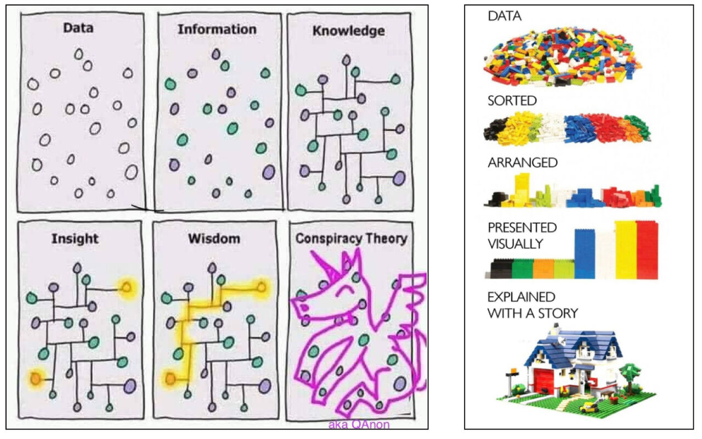{height="380px" fig-align="center"}
:::
:::::

::: footer
Image: [LinkedIn](https://www.linkedin.com/posts/ross-waring_victormair-gapingvoid-andreasvonderheydt-share-7201616137380376576-D7mq/){target="_blank"}
:::

# {.session-title .center background-color="#343a40"}

[Session 3]{.session-number}
[Tuesday, Oct. 6]{.session-date}
[Explanatory Data Visualization]{.session-name}

## Today

[**Better plots 🥇**]{.lead}

-  General feedback assignments
-  Going from exploratory to explanatory
-  Advanced DV features 
-  Using AI for explanatory DVs

## Feedback on Assignment 2, Part 1 {.smaller}

::: spaced
-   **Use informative titles**: state your conclusion in the title or subtitle in a declarative manner
-   **Text: Increase font size, use bold-face in main statements**  
-   **Visualize reliability**: show sample size, confidence intervals, etc. Especially if using bins/groupings.  
-   **What is the added value of a boxplot?**
-   **Go from exploratory to explanatory!** <br>the audience should get the main conclusion without reading the description
:::

## Use point size to your advantage {.smaller}

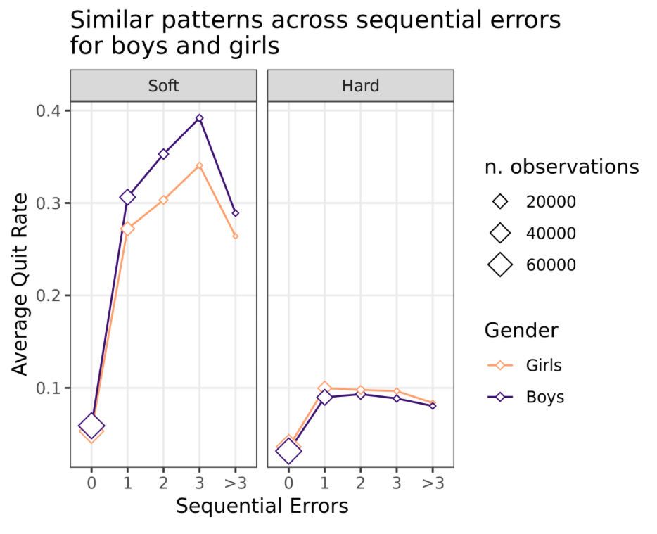{width="75%"}

## Boxplots {.smaller}

](images/boxplot.png)

::: footer
The flaw of boxplots: read more about it [here](https://www.r-bloggers.com/2024/06/why-you-shouldnt-use-boxplots/) and [here](https://nightingaledvs.com/ive-stopped-using-box-plots-should-you/).
:::

## Exploratory versus explanatory {.smaller}

::::: columns
::: {.column width="50%"}
**Exploratory**

{.framed width="100%"}
:::

::: {.column width="50%"}
::: fragment
**Explanatory**

{.framed width="100%"}
:::
:::
:::::

[Source: [storytellingwithdata.com](https://www.storytellingwithdata.com/blog/2014/04/exploratory-vs-explanatory-analysis)]{.detail}


## Making an explanatory DV

::: spaced
1.  Start from your conclusion 
2.  Adapt it to your audience 
3.  Choose a chart type that fits the conclusion and the data
4.  Highlight your main conclusion
:::

::: notes
- These four steps are the structure for the rest of today's lecture.
- 1: what is the main thing you learned from the data, that you want to show in the DV?
- 2: how do you say that to your audience, so they understand it?
- 3: different chart types are more or less appropriate depending on context.
- 4: there are more advanced techniques to make the details, and your main point, clear to the audience.
:::

## Step 1: Start from your conclusion {.smaller}

[**What is the main thing you learned from the data?**]{.lead}

::: spaced
-   **Pick one main statement.**
-   **Write down how you got there.** <br>[Which inferential or modeling choices led to this conclusion?]{.muted}
-   **Justify** <br>[Why is this relevant, and why do you think it is correct? <br>How confident are you in the validity, reliability, and robustness of the results?]{.muted}
:::

::: notes
- Pick one main statement that you want the DV to show. Everything else in the plot is there to support that one statement.
- Write down which inferential/modeling choices led to this conclusion: which schools did you keep, how did you handle missing values, mean or median, which comparison.
- Why do you think it is relevant, and why do you think it is correct? If you can't answer that, go back to exploring.
:::

## Step 2: Adapt it to your audience {.smaller}

[**Formulate your conclusion so your audience understands it.**]{.lead}

::: spaced
-   **Who are they?** <br>[Each research question has a target audience: a municipal officer, policymakers, newspaper readers, school boards...]{.muted}
-   **Which details do they need?** <br>[Pick the inferential/modeling details you want to show, and explain how they were derived.]{.muted}
-   **Can they get it without reading your report?** <br>[Use the title and labels to carry the message.]{.muted}
:::

::: notes
- Choose a formulation of your conclusion that is understandable to your audience. A municipal officer wants to see at a glance which schools are behind; a newspaper reader needs one clear message.
- Pick which inferential/modeling details you want to display to the audience, and make sure you include an explanation of how those were derived (e.g. in a subtitle or caption).
:::

## Step 2: Adapt it to your audience {.smaller}

[**Use your title and caption to do the explaining**]{.lead}

::::: columns
::: {.column width="45%"}
::: spaced
-   **Title:** [descriptive or declarative (state your conclusion!)]{.muted}
-   **Methods:** [keep it brief, if needed at all]{.muted}
-   **Results:** [only if not (fully) captured in the title]{.muted}
-   **Definitions** [of colors, line types, error bars, etc.]{.muted}
-   **Data source** [if external]{.muted}
-   **Date and name** [for crediting]{.muted}
:::
:::

::: {.column width="55%"}
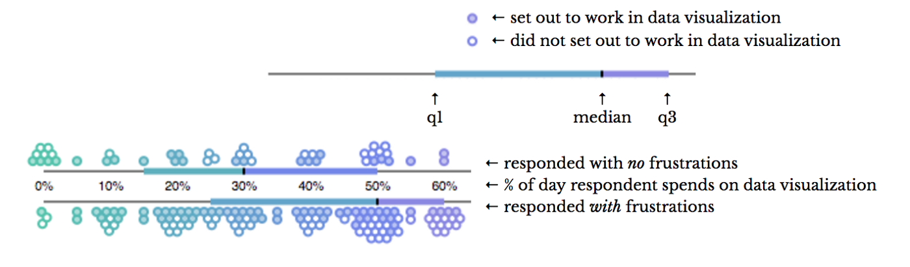{.framed width="100%"}

[Source: [datasketch.es](https://www.datasketch.es/project/655-frustrations-doing-data-visualization)]{.detail}
:::
:::::

::: footer
Resources: [clauswilke.com](https://clauswilke.com/dataviz/figure-titles-captions.html){target="_blank"}
:::

## Step 2: Adapt it to your audience {.smaller}


```{r s2-lineplot-titled}
#| echo: true
#| eval: false
#| code-fold: true
# lineplot = the original plot from Assignment 1
title_text <- paste(
  "LIB has the highest percentage of students reaching the target level,",
  "and Route8 the lowest. This gap holds even when accounting for the",
  "socio-economic status of schools."
)

caption_text <- paste0(
  "Data: DUO Open Onderwijsdata, doorstroomtoets results and reference ",
  "levels, school year 2024-2025;\n",
  "Inspectie van het Onderwijs, schoolweging 2024-2025.\n",
  "Chart: Annie Johansson | ",
  format(Sys.Date(), "%e %B %Y") |> str_trim()
)

legend_labels_oneline <- setNames(
  paste0(
    provider_n$provider,
    " (n = ", format(provider_n$n_pupils, big.mark = ",", trim = TRUE), ")"
  ),
  provider_n$provider
)

lineplot_titled <- lineplot +
  scale_color_manual(
    values = provider_colors,
    breaks = highlighted_providers, # legend in the same order as the lines
    labels = legend_labels_oneline,
    name = "Test provider"
  ) +
  scale_y_continuous(
    limits = c(0, 100),
    breaks = seq(0, 100, 25),
    labels = \(x) paste0(x, "%"),
    expand = expansion(mult = c(0, 0.02))
  ) +
  labs(
    title = str_wrap(title_text, width = 62),
    y = "Students reaching target level",
    caption = caption_text
  ) +
  theme(
    plot.title = element_text(
     face = "bold", size = 18, lineheight = 1.1,
     margin = margin(b = 12)
    ),
    plot.title.position = "plot",
    plot.caption = element_text(
      color = "grey40", size = 10, hjust = 0, lineheight = 1.2,
      margin = margin(t = 14)
    ),
    plot.caption.position = "plot",
    axis.title = element_text(color = "grey25", size = 13),
    axis.title.x = element_text(margin = margin(t = 8)),
    axis.title.y = element_text(margin = margin(r = 8)),
    axis.text = element_text(color = "grey35", size = 12),
    axis.line.x = element_line(color = "grey60", linewidth = 0.4),
    panel.grid.major.x = element_blank(),
    panel.grid.major.y = element_line(color = "grey90", linewidth = 0.4),
    legend.justification = "left",
    legend.title = element_text(face = "bold", size = 12.5),
    legend.text = element_text(size = 12),
    legend.margin = margin(b = 0),
    plot.margin = margin(16, 20, 12, 16),
    plot.background = element_rect(fill = "white", color = NA)
  )
```

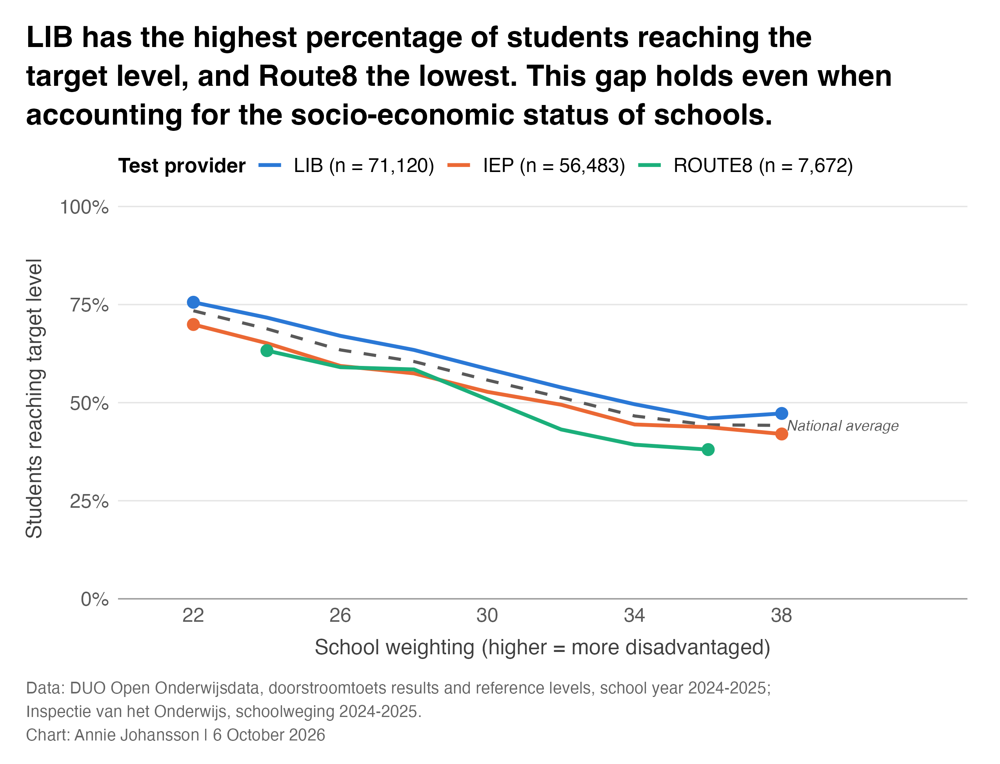{fig-align="center" height="480px"}


## Step 3: Choose a chart type {.smaller}

[**One dataset, many visualizations**]{.lead}

::::: columns
::: {.column width="50%"}
```{r s3-pizza-table}
#| echo: true
#| code-fold: true
data("pizzaplace")
pizza_top <- pizzaplace |>
  mutate(size = factor(size, levels = c("S", "M", "L"))) |>
  count(name, type, size, price, sort = TRUE) |>
  top_n(n = 5)
pizza_top |>
  gt() |>
  tab_header(title = "Pizza Top 5", subtitle = "2015") |>
  fmt_currency(columns = price, currency = "USD") |>
  tab_source_note(
    source_note = md(paste0(
      "Source: [pizzaplace dataset]",
      "(https://gt.rstudio.com/articles/gt-datasets.html#pizzaplace)"
    ))
  ) |>
  opt_stylize(style = 6)
```
:::

::: {.column width="50%"}
```{r s3-pizza-scatter, warning=FALSE}
#| echo: true
#| code-fold: true
pizza_top |>
  ggplot(aes(x = reorder(name, n, decreasing = TRUE), y = n)) +
  geom_point(aes(color = type, size = size)) +
  geom_text(aes(label = price), nudge_y = -30) +
  labs(title = "Pizza Top 5", subtitle = "2015", x = "name")
```
:::
:::::

::: notes
- The same data can be shown as a table or as a plot. Which one is better depends on what you want your audience to take away.
:::

## Step 3: Choose a chart type {.smaller}

[**One dataset, many visualizations**]{.lead}

::::: columns
::: {.column width="50%"}
```{r s3-pizza-season-bars, fig.height=5}
#| echo: true
#| code-fold: true
pizza_season <- pizzaplace |>
  mutate(month = lubridate::month(date, label = TRUE)) |>
  group_by(month) |>
  count(type)

fig_season_1 <- pizza_season |>
  ggplot(aes(x = month, y = n, group = type)) +
  geom_bar(aes(fill = type), stat = "identity") +
  labs(
    title = "Pizza Season",
    subtitle = "2015",
    y = "Number of pizzas sold",
    x = "Month"
  )
fig_season_1
```
:::

::: {.column width="50%"}
::: fragment
```{r s3-pizza-season-lines, fig.height=5}
#| echo: true
#| code-fold: true
fig_season_2 <- pizza_season |>
  ggplot(aes(x = month, y = n, group = type)) +
  geom_line(aes(linetype = type)) +
  labs(
    title = "Pizza Season",
    subtitle = "2015",
    y = "Number of pizzas sold",
    x = "Month"
  )
fig_season_2
```
:::
:::
:::::

::: notes
- Stacked bars: you can see the total per month, but its hard to compare one pizza type over time (only the bottom one has a common baseline, remember the speed dates!).
- Lines: good for comparing the types over time. Harder to see the total.
- Which one you choose depends on your conclusion.
:::

## Step 3: Choose a chart type

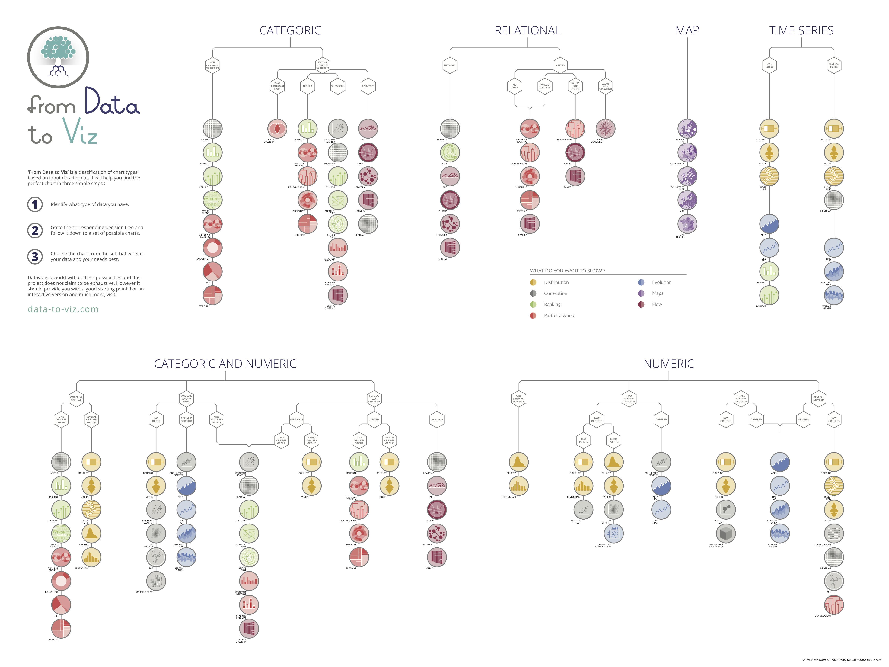{height="520px" fig-align="center"}

::: footer
[from data to viz](https://www.data-to-viz.com/){target="_blank"}
:::

## Step 3: Choose a chart type

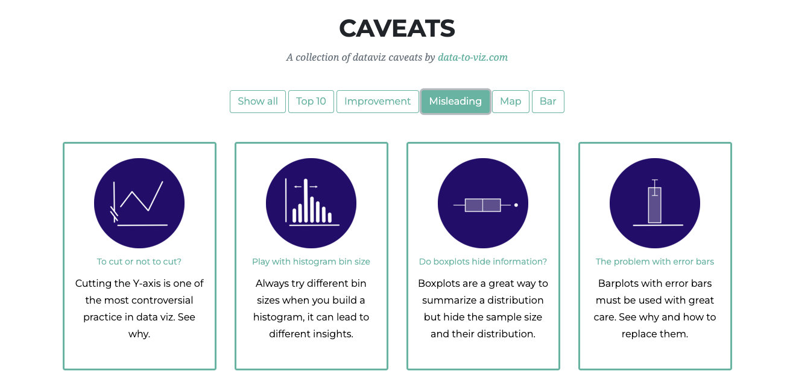{height="520px" fig-align="center"}

::: footer
[from data to viz](https://www.data-to-viz.com/){target="_blank"}: also check the caveats for each chart type!
:::

## Step 4: Highlight your main conclusion {.smaller}

::::: columns
::: {.column width="30%"}
-  Decide **where** you want the viewer to look first. 
-  Use visual elements (colors, arrows, highlights) to guide that. 
:::
::: {.column width="70%"}
](images/highlight-conclusion.png)
:::
:::::
## Step 4: Highlight your main conclusion {.smaller}

[**Advanced DV features**]{.lead}

[There are more advanced techniques available to you to make certain details, and your main point, clear to the audience.]{.muted}

::: spaced
-   **Declutter** [remove what doesn't add information]{.muted}
-   **Themes, facets, layouts** [for structure and consistency]{.muted}
-   **Color** [e.g., gray-scale with one accent color]{.muted}
-   **Typography and annotation** [guide the eye to your conclusion]{.muted}
-   **Uncertainty** [show how sure you are]{.muted}
:::

::: footer
Also revisit the [guiding principles](#/tips-for-the-best-viz) from session 1.
:::

## Chart junk

::: {layout-ncol="3"}
](images/chart_junk.png){group="chart-junk-gallery" fig-align="center"}

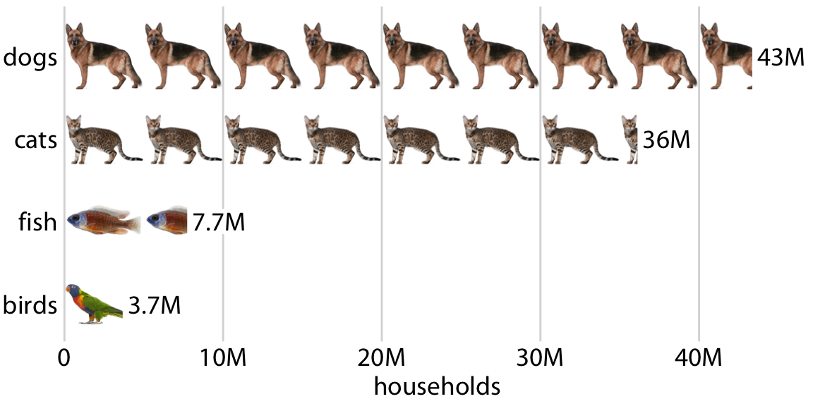{group="chart-junk-gallery" fig-align="center"}

](images/chart-junk3.png){group="chart-junk-gallery" fig-align="center"}
:::

## Chart junk

[You can try it yourself with `geom_image()` from `ggimage`]{.muted}

```{r s3-chart-junk, message=FALSE, fig.height=4, fig.width=10}
#| echo: true
#| code-fold: true
library(ggimage)
# aggregate to totals
pizza_totals <- pizza_season |>
  group_by(type) |>
  summarise(total = sum(n), .groups = "drop") |>
  mutate(n_icons = round(total / 1000)) # 1 pizza = 1000 sales

# expand data: one row per pizza icon
# this is a trick so that each pizza icon can be plotted separately (essentially
# using geom_point but appearing as a bar)
chart_junk_data <- pizza_totals |>
  rowwise() |>
  mutate(icon_id = list(1:n_icons)) |>
  unnest(icon_id)

# plot with 🍕
pizza_plot <- ggplot(chart_junk_data, aes(x = icon_id, y = type)) +
  geom_image(aes(image = "images/pizza.png"), size = 0.2) +
  # add white rectangle to cover up excess icons (taken from pizza_totals data)
  geom_rect(
    data = pizza_totals,
    aes(
      xmin = total / 1000, xmax = total / 1000 + 2,
      ymin = as.numeric(factor(type)) - 0.5,
      ymax = as.numeric(factor(type)) + 0.5
    ),
    inherit.aes = FALSE,
    fill = "white"
  ) +
  labs(
    title = "Total Pizza Sales in 2015",
    x = "Sales (Scale 1:1000)",
    y = NULL
  ) +
  theme_minimal(base_size = 14) +
  theme(
    panel.grid.minor.y = element_blank(),
    panel.grid.major.y = element_blank(),
    panel.grid.minor.x = element_blank(),
    axis.ticks = element_blank()
  )

pizza_plot
```

## Themes

::::: columns
::: {.column width="50%"}
```{r s3-themes-cowplot}
#| echo: true
#| code-fold: true
fig_season_2 +
  theme_cowplot()
```
:::

::: {.column width="50%"}
```{r s3-themes-custom}
#| echo: true
#| code-fold: true
my_theme <- theme_cowplot() +
  theme(
    panel.grid.major = element_line(color = "gray90"),
    axis.ticks = element_line(color = "gray20"),
    axis.text = element_text(color = "gray20", face = "italic", size = 16),
    axis.title = element_text(color = "gray20", face = "bold", size = 16),
    plot.title = element_text(hjust = 0.5, size = 20, face = "bold"),
    plot.subtitle = element_text(hjust = 0.5, size = 18),
    legend.position = "top",
    legend.title = element_text(size = 16, face = "bold"),
    legend.text = element_text(size = 16)
  )
fig_season_2 + my_theme
```
:::
:::::

## Facets {.smaller}

-   `theme_cowplot` and `theme_bw()` format facets nicely.
-   Change facet format manually with `theme(strip.text = element_text(...))` and `theme(strip.background = element_rect(...))`.

:::::: columns
::: {.column width="50%"}
```{r s3-facets}
#| echo: true
#| code-fold: true
fig_season_2 +
  facet_wrap(~type) +
  theme_bw(12) +
  theme(legend.position = "none")
```
:::

:::: {.column width="50%"}
::: fragment
```{r s3-facets-2}
#| echo: true
#| code-fold: true
fig_season_2 +
  geom_line(linetype = "solid", color = "gray30", linewidth = 0.5) +
  facet_wrap(~type) +
  theme_minimal(12) +
  theme(
    legend.position = "none",
    strip.text = element_text(face = "bold", color = "plum4"),
    strip.background = element_rect(fill = "thistle2", color = NA)
  ) # fill for background; color for border
```
:::
::::
::::::

## Combining plots: `patchwork` {.smaller}

::::: columns
::: {.column width="35%"}
::: spaced
-   Combine plots with `+`
-   Add a shared title, subtitle, and caption with `plot_annotation()`
-   Style them with `plot_annotation(theme = theme(...))`
:::
:::

::: {.column width="65%"}
```{r s3-patchwork, warning=FALSE, message=FALSE, fig.height=4.5}
#| echo: true
#| code-fold: true
library(patchwork)
p1 <- ggplot(mtcars, aes(x = hp, y = mpg)) +
  geom_point(color = "steelblue", size = 3, alpha = 0.7) +
  theme_minimal() +
  labs(title = "Fuel efficiency vs Horsepower")

p2 <- ggplot(mtcars, aes(x = factor(cyl), y = mpg)) +
  geom_boxplot(fill = "steelblue", alpha = 0.7) +
  theme_minimal() +
  labs(title = "MPG by Number of Cylinders")

p1 + p2 +
  plot_annotation(
    title = "Analysis of mtcars dataset",
    caption = "Data source: mtcars",
    theme = theme(plot.title = element_text(face = "bold", size = 16))
  )
```
:::
:::::

::: footer
[patchwork package](https://r-graph-gallery.com/package/patchwork.html){target="_blank"}
:::

## Color scales {.smaller}

:::::: columns
::: {.column width="33%"}
```{r s3-colors-qual}
#| echo: true
#| code-fold: true
fig_quarter <- pizza_season |>
  mutate(quarter = case_when(
    month %in% c("Jan", "Feb", "Mar") ~ "Q1",
    month %in% c("Apr", "May", "Jun") ~ "Q2",
    month %in% c("Jul", "Aug", "Sep") ~ "Q3",
    month %in% c("Oct", "Nov", "Dec") ~ "Q4"
  )) |>
  ggplot(aes(x = quarter, y = n, group = type)) +
  geom_bar(aes(fill = type), stat = "identity", position = "dodge") +
  labs(title = "Pizza Season", y = "Number of pizzas sold", x = "")

fig_quarter +
  labs(subtitle = "Qualitative color scale") +
  scale_fill_brewer(type = "qual")
```

**qualitative**\
[categorical data]{.muted}
:::

::: {.column width="33%"}
```{r s3-colors-seq}
#| echo: true
#| code-fold: true
fig_quarter +
  labs(subtitle = "Sequential color scale") +
  scale_fill_brewer(type = "seq")
```

**sequential**\
[ordered data, from low to high]{.muted}
:::

::: {.column width="33%"}
```{r s3-colors-div}
#| echo: true
#| code-fold: true
fig_quarter +
  labs(subtitle = "Diverging color scale") +
  scale_fill_brewer(type = "div")
```

**diverging**\
[ordered data with a critical midpoint, e.g. 0]{.muted}
:::
::::::

::: footer
🎨 Check out this [color picker tool](https://projects.susielu.com/viz-palette) by Susie Lu.
:::

## Color blindness {.smaller .scrollable}

```{r s3-colorblindness, fig.height=5}
#| echo: true
#| code-fold: true
# colorblindr is installed from GitHub (clauswilke/colorblindr)
colorblindr::cvd_grid(fig_quarter)
```

[The package `MetBrewer` has many colorblind-friendly palettes, e.g. `scale_fill_manual(values = MetBrewer::met.brewer("VanGogh3", n = 4))`]{.muted}

::: footer
Packages: [khroma](https://packages.tesselle.org/khroma/), [viridis](https://sjmgarnier.github.io/viridis/), [MetBrewer](https://github.com/BlakeRMills/MetBrewer), [rijkspalette](https://vankesteren.github.io/rijkspalette/), [colorblindr](https://github.com/clauswilke/colorblindr). Or check it yourself with a [simulator](https://www.color-blindness.com/coblis-color-blindness-simulator/).
:::

## Typography {.smaller}

::::: columns
::: {.column width="30%"}
-   Learn everything about [typography](https://practicaltypography.com/).
-   Choose a font for [data visualizations](https://nightingaledvs.com/choosing-fonts-for-your-data-visualization/).
-   Pick good [font combinations](https://fontjoy.com/).
-   Or just use [arial or helvetica](https://pubs.acs.org/doi/10.1021/acs.chemmater.6b00306).
:::

::: {.column width="70%"}
Change fonts with package `showtext` and function `font_add_google()`. [Browse Google Fonts](https://fonts.google.com/)

```{r s3-typography, fig.width=8, fig.height=4.5}
#| echo: true
#| code-fold: true
library(showtext)
sysfonts::font_add_google("Lekton")
showtext::showtext_auto()

fig_season_2 +
  theme_cowplot() +
  theme(text = element_text(family = "Lekton", size = 20))
```
:::
:::::

## Show uncertainty {.smaller}

[**How sure are you of your conclusion? Show it.**]{.lead}

::: spaced
-   **Sample size** [how many schools (or students) is each group based on?]{.muted}
-   **Spread:** [is it informative to show the distribution, or error bars / intervals, not just the mean?]{.muted}
-   **Missing data** [how did you handle them, and does it matter? If yes, add a note in the caption.]{.muted}
-   **Confidence intervals** [(+ explain them in a way your audience understands.)]{.muted}
:::

::: footer
Read more: [clauswilke.com](https://clauswilke.com/dataviz/visualizing-uncertainty.html){target="_blank"} (visualizing uncertainty)
:::

::: notes
- Polished charts tend to hide uncertainty. But your audience needs to know how sure you are.
- This is also part of your report: how robust are your findings?
:::

## Putting it together {.smaller}

[**Consider your audience:**]{.lead}

```{r s3-audience-1, fig.height=3.8, fig.width=10}
#| echo: true
#| code-fold: true
pizza_plot
```

## Putting it together {.smaller}

[**Consider your audience:**]{.lead}

```{r s3-audience-2, fig.height=3.8, fig.width=10}
#| echo: true
#| code-fold: true
sysfonts::font_add_google("Lobster")
sysfonts::font_add_google("Lexend")
showtext::showtext_auto()

pizza_plot +
  # add a geom_rect element with opacity on top of pizza bars, to highlight the
  # biggest bar
  geom_rect(
    data = pizza_totals |>
      mutate(highlight = ifelse(type == "classic", TRUE, FALSE)),
    aes(
      xmin = 0, xmax = total / 1000,
      ymin = as.numeric(factor(type)) - 0.5,
      ymax = as.numeric(factor(type)) + 0.5,
      alpha = highlight
    ),
    inherit.aes = FALSE,
    fill = "white"
  ) +
  scale_alpha_manual(values = c("TRUE" = 0, "FALSE" = 0.3), guide = "none") +
  labs(
    title = "The classic is a classic for a reason.",
    subtitle = "Total Pizza Sales in 2015",
    caption = "Source: pizzaplace dataset"
  ) +
  theme(
    text = element_text(family = "Lexend", color = "gray30"),
    plot.title = element_text(family = "Lobster", size = 20, color = "tomato3"),
    plot.subtitle = element_text(family = "Lexend", size = 16),
    axis.title.x = element_text(family = "Lobster", size = 16),
    axis.text.y = element_text(family = "Lobster", size = 16, color = "tomato3")
  )
```

## Putting it together {.smaller}

[**Consider your audience:**]{.lead}

```{r s3-audience-3, fig.height=3.8, fig.width=10}
#| echo: true
#| code-fold: true
max_sales <- max(pizza_totals$total)
best_seller <- pizza_totals$type[pizza_totals$total == max_sales]

plot_data <- pizza_totals |>
  mutate(is_max = total == max_sales) |>
  mutate(type = forcats::fct_reorder(type, total, .desc = TRUE))

# the best seller is colored in the subtitle, like its bar (needs ggtext)
main_conclusion <- paste0(
  "The <span style='color:tomato3;'>", best_seller, " pizza</span> ",
  "is the clear leader with ", scales::comma(max_sales), " units sold."
)

ggplot(plot_data, aes(x = type, y = total, fill = is_max)) +
  geom_col(width = 0.7) +
  geom_text(
    aes(label = scales::comma(total)),
    vjust = -0.5,
    size = 4,
    fontface = "bold"
  ) +
  # highlight color for the best seller, neutral gray for the rest
  scale_fill_manual(
    values = c("TRUE" = "tomato3", "FALSE" = "grey70"),
    guide = "none"
  ) +
  labs(
    title = "Total Sales by Pizza Type",
    subtitle = main_conclusion,
    x = "Pizza Type",
    y = "Total Units Sold"
  ) +
  theme_cowplot() +
  theme(
    plot.title.position = "plot",
    plot.title = element_text(size = 16, face = "bold"),
    plot.subtitle = ggtext::element_markdown(size = 16, color = "grey30"),
    # the values are already on the bars, so the y-axis can go
    axis.line.y = element_blank(),
    axis.ticks.y = element_blank(),
    axis.text.y = element_blank(),
    axis.title.y = element_blank()
  ) +
  scale_y_continuous(expand = expansion(mult = c(0, 0.15)))
```

::: notes
- Same data, three plots. The first is chart junk; the second is fun and highlights the winner (fine for a pizza menu!); the third states the conclusion in the subtitle, highlights it with color, and removes everything that doesn't help.
- Which one is right depends on your audience.
:::

## Final considerations

-  Are all visual elements necessary? (borders, gridlines, etc.) 
-  Are names informative and adapted to the audience? 
-  Is text big enough and legible at all plot sizes? 
-  Can the plot render nicely on a presentation screen? 

:::footer
**Color Accuracy:** Print-proof, [monitor/beamer-proof](https://www.benq.com/en-us/knowledge-center/knowledge/how-to-maintain-color-consistency-on-different-monitors.html), colorblind-proof?, [color-coding](https://en.wikipedia.org/wiki/Color_coding_in_data_visualization)<br>**File format:** resizing [vector vs. bitmap/raster](https://www.lifewire.com/vector-and-bitmap-images-1701238). For bitmap images, set the plot resolution: *dpi = c("retina", "print", "screen")*
:::


## Some good examples 🏆

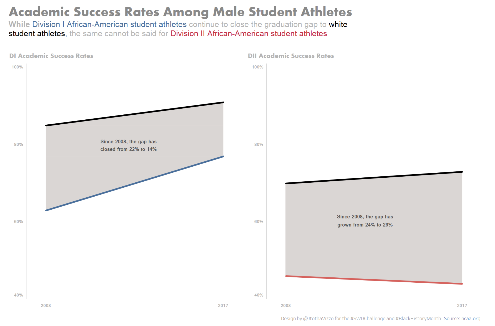{height="560px" fig-align="center"}

## Some good examples 🏆

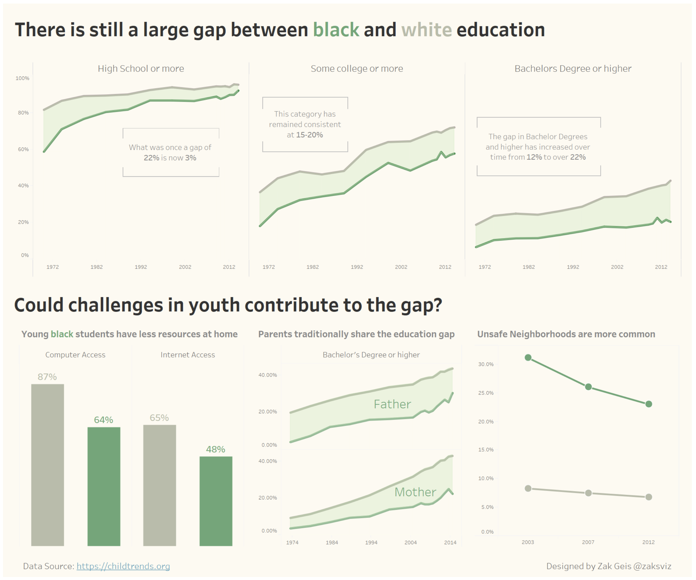{height="560px" fig-align="center"}

## Continue learning {.smaller}

::::: columns
::: {.column width="50%"}
Viz types and examples: [From Data to Viz](https://www.data-to-viz.com/#explore), [The R Graph Gallery](https://r-graph-gallery.com/), [clauswilke.com](https://clauswilke.com/dataviz/directory-of-visualizations.html)

Extensions: [ggplot2 Extensions Gallery](https://exts.ggplot2.tidyverse.org/gallery/)

Books: [Fundamentals of Data Visualization](https://clauswilke.com/dataviz/)

NYT: [What's going on in this graph?](https://www.nytimes.com/column/whats-going-on-in-this-graph)

Data: [Statistics Netherlands](https://edwindj.github.io/cbsodataR/) or `data()`
:::

::: {.column width="50%"}
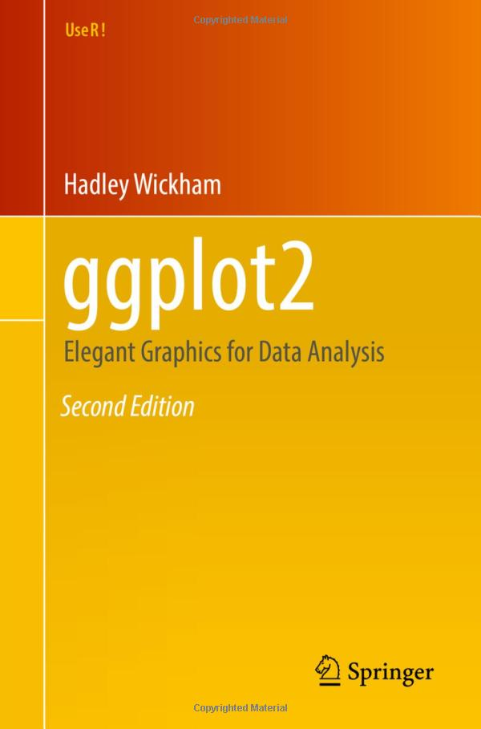{fig-align="left" width="50%"}
:::
:::::

## Get inspiration {.smaller}

::::: columns
::: {.column width="50%"}
Podcasts: [Data Stories](https://datastori.es/), [Explore Explain](https://www.visualisingdata.com/podcast/), [Data Viz Today](https://dataviztoday.com/)

Blogs: [FlowingData](https://flowingdata.com/)

Journals: [Nightingale](https://nightingaledvs.com/)

Comics: [Matt-Heun Hong](https://medium.com/@MattIanHong), [Martin Telefont](https://twitter.com/martintelefont/status/1147737522182742017), [Natalia Kiseleva](https://eolay.tilda.ws/datavizcomics/en)

Generative art: [Clause O. Wilke](https://clauswilke.com/art/), [Danielle Navarro](https://art.djnavarro.net/), [Thomas Lin Pedersen](https://www.data-imaginist.com/art)

Awards: [Information is Beautiful](https://www.informationisbeautifulawards.com/showcase?action=index&controller=showcase&page=1&pcategory=winner&type=awards)

Interactive visualizations: [R Psychologist](https://rpsychologist.com/viz)

Explorable explanations: [Nicky Case](https://ncase.me/), [Setosa](https://setosa.io/)
:::

::: {.column width="50%"}
](images/becoming_2.jpg){fig-align="left" height="500"}
:::
:::::

## Using AI for explanatory DVs 🤖 {.smaller}

::: spaced
1.  **Write your conclusion first, without AI** <br> [The AI should help you show your conclusion, not choose it]{.muted}
2.  **Let it do the technical work** <br> [Annotations, highlighting, themes, layouts, color palettes]{.muted}
3.  **Ask for alternatives** <br> [3–4 different designs for the same message; then choose and justify]{.muted}
4.  **Criticize everything it adds** <br> [Does it make the conclusion clearer, or only decorate? Check the title for causal language]{.muted}
5.  **Use it as a critic, carefully** <br> [Ask for a skeptical review; you decide which critiques are valid]{.muted}
6.  **Test with a naïve reader** <br> [What do they conclude? Is that conclusion true?]{.muted}
:::

::: notes
- For explaining, AI is mostly useful for the technical features: all the things from the previous slides, it can write that code for you quickly.
- But also experiment with using it for feedback, and for alternative visualizations of the same message.
:::

## Using AI for explanatory DVs 🤖

<br><br>
[Try it yourself!](../worksheets/working-with-ai.html)

## AI: Final note

](images/ai-slop.png)

::: footer
Sibinga, E. (2026). [Critically evaluating LLMs](https://nightingaledvs.com/critically-evaluating-llms/). *Nightingale*.
:::

## Pitches: Friday, Oct. 9 {.smaller}

[**Bring a first draft of your final visualization**]{.lead}

[Render it in an html or pdf file and upload it to Canvas. The draft is not graded, but the further along it is, the more useful the feedback. No slides needed!]{.muted}

::: spaced
-   **4-5 minutes pitch** <br>[research question, approach, conclusion, open questions]{.muted}
-   **3-4 minutes discussion** <br>[bring the questions you would like input on]{.muted}
-   **AI use** <br>[how did you use it, what did you learn, which obstacles or risks did you run into?]{.muted}
:::

## Handing in Assignment 2, Part 2 {.smaller}

[**Deadline: Sunday, October 11th, 23:59**]{.lead} 

**Hand in, on Canvas:**

::: spaced
1.   **The link** to your group's (public) GitHub repository, with all your code pushed
-   Your report, as: 
    2.  **`.Rmd`** <br>with all code (lintr-proof!) to produce your final DV and report. <br>(A quarto document as `.qmd` is also fine.)
    3.   **`.html`** <br>compiles only the final DV and report text. <br>Hide your code by setting `code_folding = TRUE` in the preamble. <br>make sure it knits correctly; we will not compile your `.Rmd` for you
:::

**And make sure I can clone your Github repo and completely reproduce your results.**

## Handing in Assignment 2, Part 2 {.smaller}

[**Grading**]{.lead}

| | |
|-----------------------|---------------------------------------------------------------|
| Aesthetics [30%]{.muted} | Clear and legible, no unnecessary clutter; color, labels and scales enhance readability |
| Communication [30%]{.muted} | Can the main point be understood quickly, with minimal explanation? |
| Description [20%]{.muted} | Research question, what you wanted to communicate, why this visualization, what you can conclude. AI statement |
| Creativity and Complexity [10%]{.muted} | ex. Going beyond a default chart type, where it adds value without obscuring the message; adding consistent themes and styling matching the target audience / context. |
| Code Quality and Styling [10%]{.muted} | Runs without errors, readable, lintr-proof |

: {tbl-colwidths="[30,70]"}

::: footer
Full instructions: [Assignment 2](../assignments/assignment-2.html){target="_blank"}
:::

## Final report formatting {.smaller}

[You do not need to display all your code.]{.lead}

::::: columns
::: {.column width="50%"}
Hide or fold all code in your preamble:

```yaml
---
title: "example rmd"
output:
  html_document:
    code_folding: hide
---
```
:::

::: {.column width="50%"}
Or per code chunk:

```` r
```{{r}}
#| echo: false

# your code here
```
````
:::
:::::

## Now 

[**In your groups:**]{.lead}

::: spaced
1.  **AI worksheet, part 2** 
2.  **Continue with Assignment 2, part 2**
:::

[Ask questions and consult me when needed!]{.muted}
