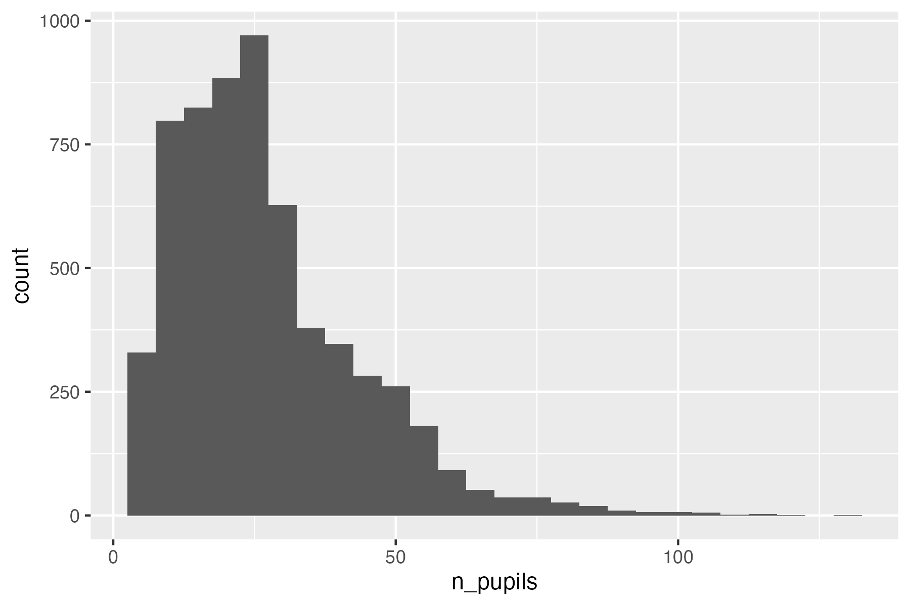
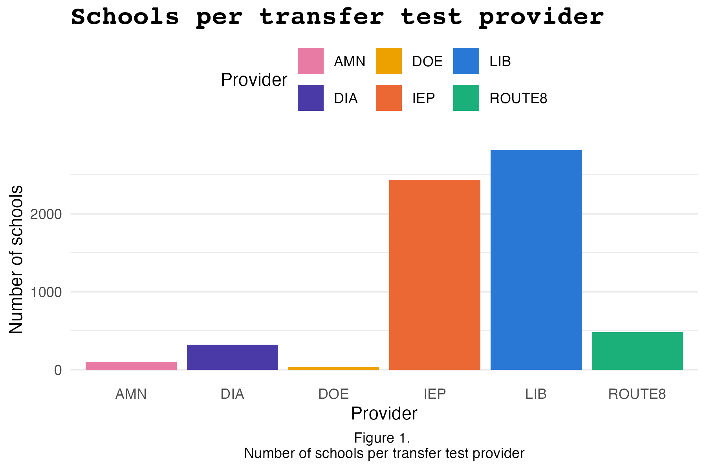
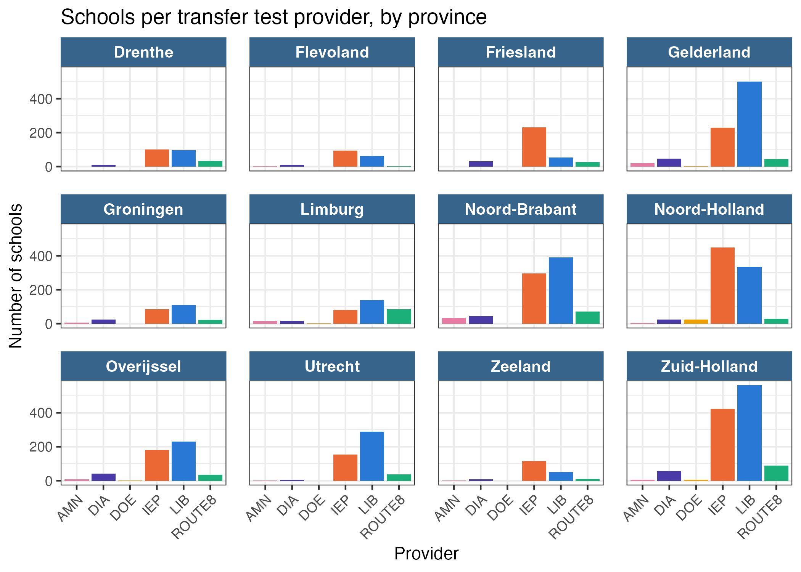
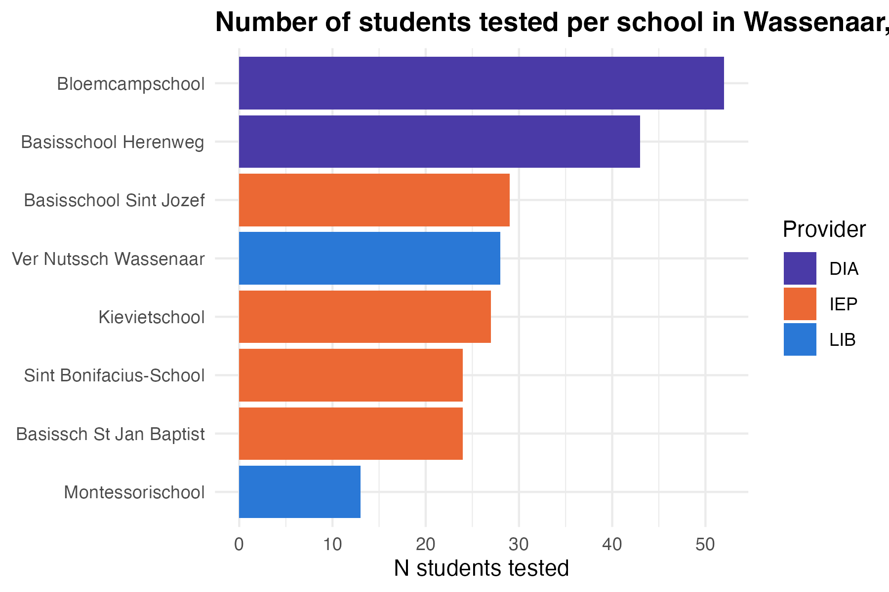

::: {.callout-note}
This worksheet is meant to get you started with the DUO data you'll be working with throughout this module. Use the worksheet to get acquainted with the data, and refresh your ggplot skills. Solutions are already provided. 
:::

## Setup

This module uses **DUO's open onderwijsdata**. This data is public, from the Dutch government. The necessary code to load in the data is available in the github repository:

1.  Download this course's GitHub repository: go to [github.com/ann1ejohansson/data-visualization-2026](https://github.com/ann1ejohansson/data-visualization-2026), click the green **Code** button, and choose **Download ZIP** (no git needed — if you're already comfortable with git, cloning works too). Unzip it and open `data-visualization-2026.Rproj` in RStudio.  
2.  You'll need the folders `data/` and `templates/`. Copy these into your own, local folder to work in.  
3.  The script you need to load in the data is `data/get-data.R`. Run it once — it downloads four DUO source files into `data/raw/`. Skim the comments at the top of that script first; they explain what each file is and why it's there.  
4.  Read background information about the data [here](). 


## Part 1 — Load and inspect the data

We'll focus on one of those four files, `eindscores`. This shows the average transfer test score per primary school, broken down by which of the six test providers (IEP, Route8, DIA, AMN, DOE, LIB) that school used.

```{r}
#| eval: false
library(tidyverse)

eindscores <- read_delim(
  "data/raw/eindscores_2024-2025.csv",
  delim = ";",                                 # DUO's files are ;-separated
  locale = locale(decimal_mark = ",", encoding = "UTF-8"), # NL uses , as decimal point
  show_col_types = FALSE
)
```

Run `glimpse(eindscores)` yourself and notice the shape: **one row per school**, with a separate pair of columns *per provider* — `IEP_AANTAL`/`IEP_GEM`, `ROUTE8_AANTAL`/`ROUTE8_GEM`, and so on (`AANTAL` = number of pupils tested, `GEM` = their average score). Most schools use exactly one provider, so five of those six `AANTAL` columns will be `0` for any given row.

## Part 2 — Tidy it 

To plot "which provider did each school use," we need one provider column instead of six. `pivot_longer()` does this by taking a set of columns and stacking them into rows: it moves each column's name into one new column (`names_to`) and each column's value into another new column (`values_to`). You tell it which columns to stack with `cols =` — here, the six `*_AANTAL` columns. 

```{r}
#| eval: false
school_provider <- eindscores |>
  # keep just the ID/label columns, plus the six *_AANTAL columns
  select(INSTELLINGSCODE, VESTIGINGSCODE, INSTELLINGSNAAM_VESTIGING,
         GEMEENTENAAM, PROVINCIE, SOORT_PO, ends_with("_AANTAL")) |>
  # stack the six AANTAL columns into two: which provider, how many pupils
  pivot_longer(
    cols = ends_with("_AANTAL"),
    names_to = "provider",
    values_to = "n_pupils"
  ) |>
  mutate(
    provider = sub("_AANTAL$", "", provider),  # "IEP_AANTAL" -> "IEP"
    # DUO writes "<5" instead of an exact count when it's under 5 (privacy
    # rule) - as.numeric() turns those into NA, which we then drop below
    n_pupils = as.numeric(n_pupils)
  ) |>
  filter(!is.na(n_pupils), n_pupils > 0) |>           # drop unused/suppressed providers
  group_by(INSTELLINGSCODE, VESTIGINGSCODE) |>
  slice_max(n_pupils, n = 1, with_ties = FALSE) |>    # handles rare mixed-provider schools
  ungroup()
```

`school_provider` now has one row per school: its name, municipality, and which single provider it used. This is the shape `ggplot2` wants.

## Part 3 — ggplot basics

Every `ggplot2` plot answers three questions: **what data**, **which variables map to which visual properties** (`aes()`), and **what shape represents each observation** (a `geom`, added with `+`).

```{r}
#| eval: false
ggplot(data = <DATASET>, mapping = aes(<AESTHETIC MAPPINGS>)) +
  geom_<SOMETHING>()
```

### Exercise 1 — Your first plot

`geom_bar()` counts rows for you automatically — perfect for "how many schools use each provider?"

::: {.panel-tabset}

## Try it

```{r}
#| eval: false
ggplot(school_provider, aes(x = ____)) +
  geom_____()
```

## Plot

{width="70%"}

## Solution

```{r}
#| eval: false
ggplot(school_provider, aes(x = provider)) +
  geom_bar()
```

:::

### Exercise 2 — Mapping vs. setting

An aesthetic **mapped** to a variable goes *inside* `aes()` and varies per observation; an aesthetic just **set** to a fixed value goes *outside* `aes()`. Fix the mistake below (it's trying to make every bar steelblue, but puts the color where a mapping would go), then extend it to map `fill` to `provider` instead.

::: {.panel-tabset}

## Try it

```{r}
#| eval: false
ggplot(school_provider, aes(x = provider, fill = "steelblue")) +
  geom_bar()
```

## Plot

{width="70%"}

## Solution

```{r}
#| eval: false
# fix: "steelblue" must be set, not mapped
ggplot(school_provider, aes(x = provider)) +
  geom_bar(fill = "steelblue")

# extended: fill mapped to a variable instead
ggplot(school_provider, aes(x = provider, fill = provider)) +
  geom_bar()
```

:::

### Picking a geom for the question you're asking

| Question | Reach for |
|---|---|
| How do two continuous variables relate? | `geom_point()` |
| How does a value compare across categories? | `geom_col()` / `geom_bar()`* |
| How is a continuous variable distributed? | `geom_histogram()` |
| How does a distribution differ across groups? | `geom_boxplot()` |

*`geom_bar()` counts rows for you; `geom_col()` expects you to already have a column of heights to plot (like `n_pupils`).

### Exercise 3 — A different geom

Plot the distribution of `n_pupils` across all schools with a histogram.

::: {.panel-tabset}

## Try it

```{r}
#| eval: false
ggplot(school_provider, aes(x = ____)) +
  geom_____()
```

## Plot

{width="70%"}

## Solution

```{r}
#| eval: false
ggplot(school_provider, aes(x = n_pupils)) +
  geom_histogram(binwidth = 5)
```

:::

### Labels, themes, colors

-   `labs()` controls *text*: title, axis titles, legend title.  
-   `scale_fill_manual()` / `scale_color_manual()` control *colors*: here, I show you how to map specific values to specific colors with a named vector. You can also do this with pre-defined color scaling, with functions such as `scale_fill_viridis()` (try it with `scale_fill_viridis_d()`!)
-   `theme_*()` controls *overall look*: `theme_minimal()`, `theme_bw()`, etc.
-    Inside `theme()` you can also tweak your own styling. I've added a few common features in the code below.  

```{r}
#| eval: false
# one fixed color per provider, so it stays the same across every plot you make
provider_colors <- c(
  LIB = "#2a78d6", IEP = "#eb6834", ROUTE8 = "#1baf7a",
  DIA = "#4a3aa7", AMN = "#e87ba4", DOE = "#eda100"
)

ggplot(school_provider, aes(x = provider, fill = provider)) +
  geom_bar() +
  scale_fill_manual(values = provider_colors) +
  labs(title = "Schools per transfer test provider",
       x = "Provider",
       y = "Number of schools",
       fill = "Provider",
       caption = "Figure 1. \nNumber of schools per transfer test provider") +
  theme_minimal() +
  theme(plot.caption = element_text(hjust = 0.5), # ggplot right-aligns captions by default - this centers it
        plot.title = element_text(size = 16, face = "bold", family = "courier"), # change font sizes and family with the element_text() argument
        legend.position = "top", # use legend.postion = "none" to remove the legend 
        panel.grid.major.x = element_blank()) # remove grid lines in background
```

{width="70%" fig-align="center"}

### Facets

-   `facet_wrap()` splits one plot into a panel per category of a variable — instead of cramming every group into one plot with color, you get a small multiple per group, each with its own axes.
-   `facet_grid()` does something similar, but arranges panels into a fixed grid (rows × columns) instead of wrapping them into however many rows/columns fit.
-   Once each panel is already labeled by the variable, a color legend for that same variable is redundant — `theme(legend.position = "none")` drops it.
-   The facet labels themselves (the little strip above each panel) are also styled through `theme()`: `strip.text` for the label text, `strip.background` for the strip behind it, and `panel.spacing` for the gap between panels. For an easy option, using `theme_bw()` already styles facets nicely. 

```{r}
#| eval: false
ggplot(school_provider, aes(x = provider, fill = provider)) +
  geom_bar() +
  scale_fill_manual(values = provider_colors) + # the same named vector from above
  facet_wrap(~ PROVINCIE) + # use scales = "free_x", "free_y, or "free" to rescale the axis per facet
  labs(x = "Provider", y = "Number of schools",
       title = "Schools per transfer test provider, by province") +
  # theme_bw() already styles facets nicely, in my opinion. but see options in theme() below for how to customize it yourself!
  theme_bw() + 
  theme(legend.position = "none",
        axis.text.x = element_text(angle = 45, hjust = 1),
        strip.text = element_text(face = "bold", size = 10, color = "white"), # facet label text
        strip.background = element_rect(fill = "steelblue4", color = NA),  # facet label background
        panel.spacing = unit(1, "lines"))                              # space between panels
```

{width="70%" fig-align="center"}

## Part 4 — Put it together

Now make your own plot. **Plot the number of students per school, colored by the provider that school used**. To keep it readable, plot this for one municipality (e.g., "Wassenaar").  
*  School variable is `INSTELLINGSNAAM_VESTIGING`. 
*  Order the x axis by amount of students, so that we see the schools from largest to smallest.  
*  Flip the axes, so that bars lay horizontally (tip: `coord_flip`).  
*  Change the colors and theme.  
*  Title should be boldface. Code the title such that if the municipality changes, the title also changes. 

::: {.panel-tabset}

## Try it

```{r}
#| eval: false
school_provider |>
  filter(GEMEENTENAAM == "Wassenaar") |>
  ggplot()
```

## Plot

e.g., for Wassenaar: 

{width="70%"}

## Solution

```{r}
#| eval: false
municipality <- "Wassenaar" 

school_provider |>
  filter(GEMEENTENAAM == municipality) |>
  #filter(n_pupils > 50) |> # use this filter if plots get crowded with large municipalities 
  ggplot(aes(x = reorder(INSTELLINGSNAAM_VESTIGING, n_pupils), y = n_pupils, fill = provider)) +
  geom_col() +
  scale_fill_manual(values = provider_colors) + # the same named vector from above
  coord_flip() +                     # horizontal bars so school names stay legible
  labs(
    title = paste0("Number of students tested per school in ", municipality, ", by provider"), # updates with municipality
    x = NULL, y = "N students tested", fill = "Provider"
  ) +
  theme_minimal() +
  theme(plot.title = element_text(face = "bold"))
```

:::

Swap `"Wassenaar"` for another municipality of interest. Some are large enough that the bar chart gets crowded — if that happens, try `facet_wrap(~ provider)` instead of `fill`.

::: {.callout-tip}
Save any plot with `ggsave("path-to-your-plot/filename.png", width = 6, height = 4, dpi = 300)`. 
Change width and height to match your desired dimensions. 
:::


## More practice

-   Kieran Healy, [*Data Visualization: A Practical Introduction*, ch. 3](https://socviz.co/03-ggplot-basics.html)
-   Kieran Healy, [*Data Visualization: A Practical Introduction*, ch. 8](https://socviz.co/08-polishing.html)
-   OSU Code Club's ggplot series: [part 1](https://osu-codeclub.github.io/posts/S09E01_ggplot_01/), [part 2](https://osu-codeclub.github.io/posts/S09E02_ggplot_02/), [part 3](https://osu-codeclub.github.io/posts/S09E03_ggplot_03/)  
-   [A curated list of all ggplot packages, tutorials, etc. ](https://github.com/erikgahner/awesome-ggplot2)
-   [ggplot cheatsheet](https://rstudio.github.io/cheatsheets/html/data-visualization.html)