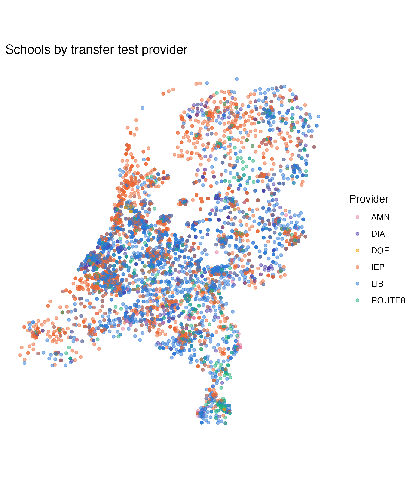

This handout shows a way to use `ggplotly()` to build an **interactive map**: one point per school, colored by which transfer test provider it used, and a hover tooltip. Here, the `ggplotly()` mechanics are applied to coordinates. In assignment 1, you'll apply it to simple x/y points on a scatter plot. 

```{r setup, message=FALSE, warning=FALSE}
library(tidyverse)
library(plotly)    # turns a ggplot into an interactive widget
```

## Getting the data

You already have `eindscores` if you've done the ggplot recap worksheet - see its Setup section for `data/get-data.R`. For this map we need one more thing DUO doesn't give us directly: **coordinates**. `eindscores` only has each school's postcode (`POSTCODE_VESTIGING`), not a latitude/longitude.

We'll use [4PP](https://github.com/bobdenotter/4pp) (MIT licensed), an open lookup table of the centroid coordinates for every Dutch 4-digit postcode area. Download it once:

```{r}
#| eval: false
download.file(
  "https://raw.githubusercontent.com/bobdenotter/4pp/master/4pp.csv",
  destfile = "data/raw/postcodes_pc4.csv", # where to save it locally, alongside the other course data
  mode = "wb"                              # "write binary" - avoids a corrupted file on Windows
)
```

## Prepare the data

Same `school_provider` shape as the ggplot recap worksheet, but this time we keep `POSTCODE_VESTIGING` around so we have something to join the coordinates on. DUO's postcodes are 6 characters (e.g. `"2716PH"`); the coordinate lookup only goes down to the first 4 digits (a postcode *area*, not an exact address) - close enough to place a school on a map of the whole country.

```{r}
#| eval: false
eindscores <- read_delim(
  "data/raw/eindscores_2024-2025.csv",
  delim = ";",                                              # DUO's files are ;-separated, not comma-separated
  locale = locale(decimal_mark = ",", encoding = "UTF-8"),  # NL uses , as the decimal point
  show_col_types = FALSE
)

postcodes <- read_csv("data/raw/postcodes_pc4.csv", show_col_types = FALSE) |>
  distinct(postcode, .keep_all = TRUE) |> # a few postcodes appear more than once in this file - keep just one row per postcode
  select(postcode, latitude, longitude)   # we only need these three columns for the join below

school_provider <- eindscores |>
  # keep just the school identifiers/labels, the postcode, and the six
  # *_AANTAL columns (number of pupils tested, per provider)
  select(INSTELLINGSCODE, VESTIGINGSCODE, INSTELLINGSNAAM_VESTIGING,
         GEMEENTENAAM, PROVINCIE, POSTCODE_VESTIGING, ends_with("_AANTAL")) |>
  # stack the six AANTAL columns into two: which provider, how many pupils -
  # turns "one row per school, six provider columns" into "one row per
  # (school, provider), with n_pupils telling us how many pupils it tested"
  pivot_longer(cols = ends_with("_AANTAL"), names_to = "provider", values_to = "n_pupils") |>
  mutate(
    provider = sub("_AANTAL$", "", provider),                 # "IEP_AANTAL" -> "IEP"
    n_pupils = as.numeric(n_pupils),                          # DUO writes "<5" for small counts -> this becomes NA
    postcode = as.numeric(str_sub(POSTCODE_VESTIGING, 1, 4))  # keep only the numeric part: "2716PH" -> 2716
  ) |>
  filter(!is.na(n_pupils), n_pupils > 0) |>           # drop the providers a school didn't actually use
  group_by(INSTELLINGSCODE, VESTIGINGSCODE) |>        # group the rows back up by school...
  slice_max(n_pupils, n = 1, with_ties = FALSE) |>    # ...and keep only its single largest provider (most schools use just one anyway)
  ungroup()

# join the coordinates onto each school by matching postcode -> postcode.
# inner_join() only keeps rows that find a match in BOTH tables, so a
# school whose postcode isn't in the lookup table gets dropped here - in
# practice this matches ~99.9% of schools, so barely any are lost
school_map <- school_provider |>
  inner_join(postcodes, by = "postcode")
```

## Build the plot

Here, we make a very simple map visualization with points. To do this, we use `coord_fixed()` with a latitude correction. Real map projections usually use polygon boundaries (country/province outlines); to make these more complex map visualizations, `coord_map()` or `geom_sf()` can be used. However `ggplotly()`'s support for `geom_sf()` is known to be inconsistent (tooltips and rendering can break). Here, `coord_fixed()` gets us a correctly-proportioned map with none of that risk. The ratio below (`1 / cos(latitude)`) corrects for the Netherlands' latitude, so the country doesn't look horizontally stretched.

Feel free to explore more complex map visualizations on your own, with more complex interactive viz tools such as [`leaflet`](https://rstudio.github.io/leaflet/) (the standard for interactive maps in R - real basemaps, polygons, markers, popups) or plotly's own native mapping functions (`plot_ly(type = "choroplethmapbox")`, `plot_geo()`).

```{r}
#| eval: false
provider_colors <- c(
  LIB = "#2a78d6", IEP = "#eb6834", ROUTE8 = "#1baf7a",
  DIA = "#4a3aa7", AMN = "#e87ba4", DOE = "#eda100"
)

nl_map <- ggplot(school_map, aes(x = longitude, y = latitude, color = provider)) +
  geom_point(alpha = 0.5, size = 1.2) +             # alpha < 1 so overlapping points show up as darker patches
  scale_color_manual(values = provider_colors) +    
  coord_fixed(ratio = 1 / cos(52.1 * pi / 180)) +   # keep the map's proportions correct - NL sits at ~52.1°N
  labs(title = "Schools by transfer test provider", color = "Provider", x = NULL, y = NULL) +
  theme_minimal() +
  theme(
    axis.text = element_blank(),  # hide the lat/long numbers - not meaningful to a reader
    axis.ticks = element_blank(),
    panel.grid = element_blank()  # hide gridlines 
  )

nl_map
```

```{r}
#| eval: false
#| include: false
ggsave("map-static.png", plot = nl_map, height = 7, width = 6, dpi = 300)
```

{width="60%" fig-align="center"}

## Make it interactive

Same pattern as the other `ggplotly()` example: add a `text` aesthetic with whatever you want the tooltip to show, then wrap the plot in `ggplotly(..., tooltip = "text")`.

```{r}
#| eval: false
nl_map_interactive <- ggplot(
  school_map,
  aes(
    x = longitude, y = latitude, color = provider,
    # build the tooltip text ourselves, one string per row - this is what
    # shows up when someone hovers over a point. <b> and <br> are HTML tags
    # plotly understands, for bold text and line breaks
    text = paste0(
      "<b>", INSTELLINGSNAAM_VESTIGING, "</b>",
      "<br>", GEMEENTENAAM, ", ", PROVINCIE,
      "<br>Provider: ", provider,
      "<br>Pupils tested: ", n_pupils
    )
  )
) +
  geom_point(alpha = 0.5, size = 1.2) +
  scale_color_manual(values = provider_colors) +
  coord_fixed(ratio = 1 / cos(52.1 * pi / 180)) +
  labs(title = "Schools by transfer test provider", color = "Provider", x = NULL, y = NULL) +
  theme_minimal() +
  theme(axis.text = element_blank(), axis.ticks = element_blank(), panel.grid = element_blank())

# convert the static ggplot into an interactive plotly widget;
# tooltip = "text" shows our custom text column on hover
ggplotly(nl_map_interactive, tooltip = "text")
```

```{r}
#| eval: false
#| include: false
# save the interactive widget as its own standalone HTML file, so it can be
# embedded in the worksheet page with an <iframe> (see below)
int_plot <- ggplotly(nl_map_interactive, tooltip = "text")
htmlwidgets::saveWidget(int_plot, "map-interactive.html", selfcontained = TRUE)
```

<iframe src="images/map-interactive.html" width="100%" height="700px" frameborder="0">

</iframe>

Zoom, pan, and hover over a few points - notice how the providers cluster regionally rather than being scattered evenly across the country.
