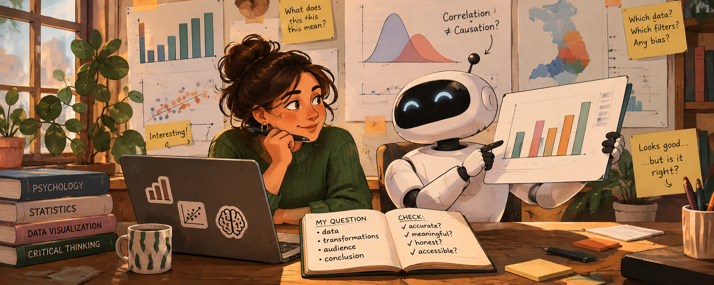

## Introduction

AI can now make a polished chart in seconds. Since this is no longer hard to make, the hard part is knowing whether it is right: whether the data means what the chart suggests, and whether the conclusion holds.

This also means that your role as a data scientist changes from only building static visualizations to curating its generative system. Although the AI can build your product, you set its parameters (the question, the data, the transformations, the audience, the claim) and you judge what it produces. **Remember that you are responsible for every chart you hand in (in class and in your future work), including the ones AI made.**

Importantly, a visualization carries a message about data to people who usually don't have access to, or the skills to understand, the raw data used to produce it. This makes data literacy more important than ever. As behavioral data scientists, you bring something the AI does not have: knowledge of psychology, statistics, and the data at hand.

### Five guiding principles

#### 1. You are the data scientist; the AI is your assistant

The AI can write code and produce charts. It cannot tell you whether any of it makes sense. That depends on conceptual knowledge only you can bring:

-   **Meaning:** what does this variable actually measure? What does it represent, and what does it not?
-   **Validity:** does this data suit the real-world phenomenon it is supposed to represent? 
-   **Conclusion:** is this visualization leading to a conclusion that is understandable, meaningful, and applicable?

If you can't answer these questions yourself, the AI's answer won't help you. 

#### 2. Choices matter

Every chart starts with decisions about the data, made before any plotting ([read more](https://filwd.substack.com/p/shape-the-data-shape-the-thinking)):

-   **Variable selection:** which columns are in, which are left out?
-   **Summary statistics:** counts, means, medians? Means over what?
-   **Filtering and ranges:** which schools or years are dropped, and why?
-   **Granularity:** pupil, school, municipality, province?

AI makes these decisions silently and confidently, and each one affects what your reader will conclude. **Ask the AI to list every transformation it made, and check each one.**

> *DUO example:* the `*_AANTAL` columns contain the string `"<5"` for privacy reasons. An AI that runs `as.numeric()` turns these into `NA` and drops them without telling you. What does that do to small schools, and to which providers?

#### 3. Beware the illusion of causality

A clean chart with two variables that move together looks like an explanation. AI can now make confident, polished-looking plots without having any idea about the true meaning behind the variables. This can easily fool you, and your readers, into reading a correlation as causation. 

> *DUO example:* "Schools using test provider X have higher average scores." Is that the test, or the kind of schools that choose that test? 

Ask of every chart: **what is the claim a naïve reader would take away, and do I actually have evidence for it?**

#### 4. Don't mistake polish for substance

Because a polished chart takes only one prompt, making a *good* chart seems simple. But polish is not substance: a chart can look finished while the data or analysis behind it is hollow. AI can also produce visual hallucinations: trends, clusters, or correlations that come from a data filtering or coding mistake, not from the data.

-   Don't add elements (gradients, icons, annotations, 3D, interactivity) just because they are now cheap. Add them when they improve the clarity of the message you want to get across.   
-   A plain chart that is correct beats a beautiful chart that is wrong.  
-   Check how robust the trend is by creating several visualizations of the same data. Also check it's robustness across different data decisions (item 2).   

#### 5. Curate, don't just prompt

Define the parameters of the system *before* you ask it to build:

-   What is my question? What is my one conclusion?
-   Who is my audience, and what do they already know?
-   Which data, which transformations, and which comparison?
-   Which encodings, colors, and constraints (colorblind-safe, fits the report)?

Then evaluate what comes back against those parameters. 

### Guidelines: working with AI. 
We encourage you to make use of AI tools in your data visualizations in this course. To guide you in that process, we've put together a checklist of important concepts to keep in mind. 

::: {.callout-tip icon="false"}
### A checklist for AI-assisted data visualization

Use this checklist whenever you use AI for your assignments. It is adapted from [Eva Sibinga (Nightingale, 2026)](https://nightingaledvs.com/critically-evaluating-llms/). We added a fourth section, *Meaning*, for data thinking.

#### ✔️ Accuracy
-   Am I working in a defined universe (I give it the data, the codebook, and an example) or an open one (it answers from the web or its "memory")?
-   Have I set up boundaries against sycophancy? For example, ask it to point out problems, and don't say which answer I'm hoping for.
-   Can I verify the result? Did I verify it? (Row counts, a few values checked by hand, the code read line by line.)
-   Do I know enough about this topic to tell whether the answer makes sense?
-   …and whether it is smart, not just technically correct?

#### 🔒 Security

-   Am I working with private data, mine or someone else's?
-   Am I working with unpublished intellectual property, mine or someone else's?

#### ✍️ Sovereignty

-   Am I handing off a part of the process I actually want to learn, or would enjoy?
-   Will I lose an opportunity to find the answer myself and understand it?
-   Is this question worth the resources it uses?
-   Would I be comfortable disclosing that I used AI for this part?
-   Does it add value, especially for text?
-   Is it up to my standards?
-   Am I erasing my own voice or opinion?

#### 🧠 Meaning (data thinking)

-   Do I know what each variable measures, and what it doesn't?
-   Does the data validly represent the real-world phenomenon I am making claims about?
-   Which transformations (selection, summaries, filters, granularity) shape this chart, and did I choose them deliberately?
-   Does the chart suggest a causal story that the data can't support?
-   Is the uncertainty visible? (Sample sizes, suppressed values, spread.)
-   Would a reader without data literacy reach a conclusion that is correct?
:::

## Part 1: AI for exploring (Session 2)

**What AI is good at here:** speed and breadth. It can map distributions and relationships in minutes, describe an unfamiliar dataset, and suggest questions and views you hadn't thought of ([Bertini, *Things you can now ask an AI*](https://filwd.substack.com/p/things-you-can-now-ask-an-ai-when)).

**Guiding points**

1.  **Give it context, not just columns.** Paste the codebook (in this project, use e.g., [data resources](../documents/data-resources.qmd)) along with the structure of the data (or the data itself, if privacy rules allow). This puts the AI in a defined universe.
2.  **Ask it to describe the data back to you first.** Then check its description against the codebook. Where it is wrong, correct it. You now know where its limits of understanding are. 
3.  **Go wide and fast.** Ask for many quick views: distributions of every variable of interest, raw and grouped by any grouping structures available in the data. Exploratory plots can be ugly; their job is to help *you* understand.
4.  **Verify the pipeline.** How much data went in, and how much turned up on the visualization? How were missing values, or groups with very few values, handled? What other filtering or transformation mechanisms were needed to end up with a clean visualization? How would the outcome change if these mechanisms were changed? 
5.  **Brainstorm research questions.** You can ask the AI for potential questions to explore with this data, but judge them yourself. Which of the suggested questions are meaningful given what you know about the data and its context? Which can this data actually answer?
6.  **Keep an AI log.** Record what you asked, what you kept, and what you checked or corrected.

### Exercise 1 

Individually (max. 15 minutes), ask an AI for three exploratory plots of `eindscores`. Run the code the AI gives you. Then check:

*  Input vs. output: how many schools went in, and how many ended up in the plot?  
*  How were the `"<5"` values handled? Were they turned into `NA` or transformed? Were they noticed at all?  
*  Transformations: which variables were selected, how was "provider" derived, which summary statistics were used, if any? Was any filtering made, and at which level (school, municipality, province)? 
*  Verification: Pick one value from one of the exploratory plots (a count, a mean) and reproduce it with your own code.

Log your prompts, the outcome, and what you learned from it. Then, 

In your group (max. 20 minutes), compare the results:

*  Do transformations differ, how do the plots agree or disagree?  
*  Do differences in plots come from data transformations, data selection, or chart types?  
*  Which plots might be useful for your research question? What would you plot next?  
*  (How) would you refine your prompt next time?  

Discuss these questions with your group, then write down guidelines for the team:  

1.  Context: what will you always give the AI when prompting? Consider keeping a shared context file in your repo (e.g. `ai-context.md`) with your research question, the codebook, known data quirks, and your code style (e.g. lintr-styling). Check the Security questions in the checklist: what should not go in there?  
2.  Constraints: what will you tell the AI to do or not do? For example: types of plots, specific variables, filtering or statistical choices. Always ask it to list every transformation and assumption it made, and to flag data-quality issues or things it is otherwise unsure about before plotting. 
3.  Verification: how will you, as a team, check that AI-generated results are correct and robust? Some starting points: comparing row counts, a teammate reproducing a result independently, running the same prompt in a different model, checking values against the ranges in the codebook, and seeing whether results change when different data selection decisions are applied.

**Commit your guidelines to your group repo** (e.g. in the README). You'll use them again in Part 2.

## Part 2: AI for explaining (Session 3)

**What AI is good at here:** technical execution and generating alternatives. For example: annotations, highlighting a key group, `ggtext`, multiple-plot layouts, custom themes, colorblind-safe palettes, `plotly` tooltips, and many design options in a short time. Research shows LLMs are good at quickly producing diverse design options but weaker at contextual nuance ([Kim et al., 2025](https://dl.acm.org/doi/10.1145/3745768)), reflecting what data scientists prefer when working with AI tools ([Li et al., 2023](https://arxiv.org/abs/2304.08366)).

**Guiding points**

1.  **Write your conclusion first, without AI.** The AI should help you show this conclusion, but not choose it.  
2.  **Ask for alternatives, then choose and justify.** Request 3–4 different designs for the same message, keep a log and reason to yourself why you chose one.  
3.  **Criticize added elements.** For each thing the AI adds, ask whether it makes the conclusion clearer or only decorates the chart.  
4.  **Check the title.** Is it using unjustified causal language? Is it meaningful and does it support your conclusion? 
5.  **Show uncertainty and sample size.** Polished charts tend to hide these; you have to ask for them explicitly.
6.  **Use AI as a critic, carefully.** You can ask AI to critique your chart as a skeptical reviewer, but you decide which critiques are valid.
7.  **Test with a naïve reader.** Show the chart to someone outside the course for five seconds. What do they conclude? Is that conclusion true?

### Exercise 2

Discuss with your group:  

-   Which stages of your project (question, cleaning, exploring, designing, writing) would you hand to AI, and which would you not? Why?
-   AI slop is a real problem. Who is responsible when a "cheap chart" misleads people?  
-   [AI consumes resources](https://news.un.org/en/story/2026/06/1167658). How will you approach this responsibly?  

As a group, decide on a disclosure statement for your use of AI tools. Write a short "AI use" section in your final report. List what tools you used, what they were used for, and how this output was checked. This section is a requirement for your final report. 

## Sources

-   Sibinga, E. (2026). [Critically evaluating LLMs](https://nightingaledvs.com/critically-evaluating-llms/). *Nightingale*.
-   Bertini, E. (2023). [Shape the data, shape the thinking](https://filwd.substack.com/p/shape-the-data-shape-the-thinking). *Filwd*.
-   Bertini, E. (2025). [Things you can now ask an AI when analyzing data](https://filwd.substack.com/p/things-you-can-now-ask-an-ai-when). *Filwd*.
-   Ciuccarelli, P. (2026). [Beyond the prompt: Data visualization in the age of AI](https://thevisualagency.com/tva-blog-articles/beyond-the-prompt-data-visualization-in-the-age-of-ai/). *The Visual Agency*.
-   Kim, N. W., Ahn, Y., Myers, G., & Bach, B. (2025). [How good is ChatGPT in giving advice on your visualization design?](https://dl.acm.org/doi/10.1145/3745768) *ACM Transactions on Computer-Human Interaction*.
-   Li, H., Wang, Y., Liao, Q. V., & Qu, H. (2023). [Why is AI not a panacea for data workers? An interview study on human-AI collaboration in data storytelling](https://arxiv.org/abs/2304.08366). *IEEE TVCG*.
